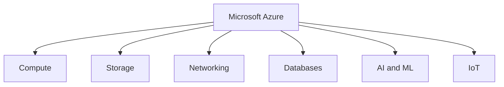

# What is Azure?

**Microsoft Azure** is Microsoft's public cloud computing platform. It provides a comprehensive suite of cloud services, including compute, analytics, storage, networking, and security. Users can select and configure these services to build, scale, and run new applications or run existing applications in the cloud.

📺 **Watch Video Reference:** [Microsoft Azure Fundamentals Video](https://youtu.be/YfZ0zk5Zzcw?si=9kpZKd_kR4p14nkp)

---

# Introduction to Microsoft Azure Fundamentals

Microsoft Azure is a cloud computing platform with an ever-expanding set of services to help you build solutions that meet your technical goals. Azure services support everything from simple to complex. You can host simple web services for internet-facing apps, run fully virtualized computers for custom software solutions, or use cloud-based services like remote storage, database hosting, and centralized account management. Azure also offers capabilities in artificial intelligence (AI) and Internet of Things (IoT).

In this series, you cover cloud computing basics, get introduced to some of the core services provided by Microsoft Azure, and learn more about the governance and compliance services that you can use.

---

## What is Azure Fundamentals?

Azure Fundamentals is a series of three learning paths that familiarize you with Azure and its many services and features, plus one learning path that gives you a chance to explore Azure and build solutions to realistic IT challenges.

* Whether you're interested in compute, networking, or storage services; learning about cloud security best practices; or exploring governance and management options, think of Azure Fundamentals as your curated guide to Azure.
* Azure Fundamentals includes guided content and knowledge checks that reinforce key concepts.
* Technical IT experience isn't required; however, having general IT knowledge will help you get the most from your learning experience.

---

## Why Should I Take Azure Fundamentals?

If you're just beginning to work with the cloud, or if you already have cloud experience, Azure Fundamentals provides you with everything you need to get started.

No matter your goals, Azure Fundamentals has something for you. You should take this course if you:
* Have a general interest in Azure or in cloud computing
* Want to earn an official certification from Microsoft (**AZ-900**)

### Exam AZ-900: Knowledge Domain Areas

The Azure Fundamentals learning path series can help you prepare for **Exam AZ-900: Microsoft Azure Fundamentals**. This exam includes three knowledge domain areas:

| AZ-900 Domain Area | Weight |
| :--- | :--- |
| **Describe cloud concepts** | 25–30% |
| **Describe Azure architecture and services** | 35–40% |
| **Describe Azure management and governance** | 30–35% |

Each domain area maps to a learning path in Azure Fundamentals. The percentages shown indicate the relative weight of each area on the exam. The higher the percentage, the more questions that part of the exam will contain. Be sure to read the exam page for specifics about what skills are covered in each area.

> **Note:** This training helps you develop a broad understanding of Azure.
