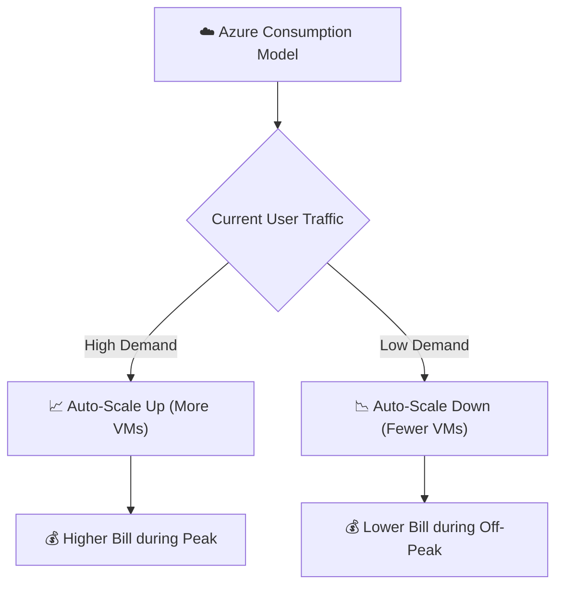

# Topic 6: Consumption-Based Model (CapEx vs OpEx)

## Overview

The **Consumption-Based Model** means you pay only for the cloud computing resources you actually use, instead of purchasing and building physical infrastructure in advance.

> 💡 **Utility Analogy:**  
> Think of cloud computing like household electricity:  
> - **Use more electricity** → ⚡ Pay more  
> - **Use less electricity** → 💡 Pay less  
> - **Turn off switches** → 💰 Pay $0 for unused power  

---

## 💰 Traditional IT vs Cloud

### 🏢 Traditional IT (CapEx)
In a traditional datacenter model, a company must buy all servers, network hardware, storage racks, and cooling equipment upfront before running any software applications.

> **Example:**  
> A company predicts 1,000 active users, so they purchase 10 physical servers. If only 200 users actually show up, 8 servers sit completely idle—yet the company already spent 100% of the money upfront.

* **CapEx (Capital Expenditure):** Money spent upfront to purchase physical assets and hardware infrastructure.
* **Examples of CapEx:**
  - Physical Datacenter buildings
  - Server hardware racks
  - Network switches & routers
  - Power generators & HVAC cooling systems
  - SAN/NAS physical storage arrays

---

### ☁️ Cloud Computing (OpEx)
With Microsoft Azure, you don't need to buy physical servers upfront. You provision cloud resources on demand and pay according to your actual consumption and subscription tier.

> **Example (Online Retail Store):**
> * **Normal Days:** Run 2 Virtual Machines (VMs) → Pay only for 2 VMs.
> * **Festival / Black Friday Sale:** Automatically scale up to 10 VMs → Pay for 10 VMs during peak hours.
> * **After Sale:** Scale back down to 2 VMs → Costs automatically drop back down.

```text
Normal Days:
  ☁️ Azure ──► 2 VMs running ──► Low Cost 💰

Festival Sale:
  ☁️ Azure ──► 10 VMs running (Scaled Up) ──► Higher Cost 💰💰💰

After Sale:
  ☁️ Azure ──► 2 VMs running (Scaled Down) ──► Low Cost 💰
```

* **OpEx (Operational Expenditure):** Ongoing operational spending on services, subscription fees, and utilities consumed over time.
* **Examples of OpEx:**
  - Azure VM hourly/per-second compute costs
  - Cloud storage per-GB consumption
  - SaaS monthly software subscriptions (Microsoft 365)
  - PaaS service usage

---

## 📈 Capacity Planning: Traditional vs Cloud

Capacity planning is the process of estimating how much computing power and storage capacity your business needs.

### 🔴 Traditional Capacity Planning
```text
Predict Future Demand ──► Buy Hardware ──► Wait for Shipping ──► Install in Datacenter ──► Deploy
```
* **Risk 1 (Over-provisioning):** Buying too much hardware wastes money on unused capacity.
* **Risk 2 (Under-provisioning):** Buying too little hardware causes servers to crash during unexpected traffic spikes.

---

### 🟢 Cloud Capacity Planning
```text
Low Demand (2 VMs) ──► Traffic Spike ──► Scale Up (10 VMs) ──► Traffic Normalizes ──► Scale Down (2 VMs)
```
* **Benefit:** You adjust capacity instantly based on real-time application telemetry and demand.

---

## 💳 Pay-As-You-Go Model

Cloud providers offer a flexible **Pay-As-You-Go** pricing model:
* Create resources instantly when needed.
* Delete or stop resources when no longer required to stop billing immediately.

---

## 🔑 Key Terms Summary

| Term | Definition | Primary Example |
| :--- | :--- | :--- |
| **CapEx** *(Capital Expenditure)* | Money spent upfront on physical, long-term capital assets. | Buying ₹10 Lakhs worth of physical servers for an on-premises datacenter. |
| **OpEx** *(Operational Expenditure)* | Ongoing operational costs for services consumed over time. | Paying a monthly Azure bill for cloud compute, storage, and database services. |

---

## 🎯 Why is the Consumption-Based Model Useful?

1. **Zero Upfront Cost ($0 CapEx):** No need to build expensive physical datacenters or buy server racks.
2. **Pay Only for What You Use:** Avoid wasting money on idle infrastructure.
3. **Instant Auto-Scaling:** Add compute power during peak hours and remove it during off-peak hours.
4. **Business Agility & Flexibility:** Rapidly launch new products without waiting months for server delivery.
5. **No Hardware Maintenance:** Microsoft Azure handles physical server repairs, power, cooling, and hardware replacement.

---

## 📐 Summary Flowchart

```text
                     ☁️ AZURE CLOUD
                          │
                Consumption-Based Model
                          │
         ┌────────────────┴────────────────┐
         ↓                                 ↓
   Demand Increases                 Demand Decreases
         ↓                                 ↓
   Add Resources (Scale Up)         Remove Resources (Scale Down)
         ↓                                 ↓
   💰 Pay More                       💰 Pay Less
```



---

## 🔑 AZ-900 Exam Points to Remember

1. **CapEx:** Buying physical infrastructure upfront ($0 elasticity, upfront capital).
2. **OpEx:** Paying for cloud services as an ongoing operating expense.
3. **Consumption-Based Model:** Paying only for resources consumed (CPU, RAM, Storage, Bandwidth).
4. **No Unused Capacity:** Eliminates paying for idle hardware through scaling capabilities.

---

## 📺 Video Tutorial

Watch this video for a detailed explanation of the Consumption-Based Model & CapEx vs OpEx:  
👉 [Consumption-Based Model Video Tutorial](https://youtu.be/NdqncsMtryY?si=_RsWrcE6gwKxaozG)

