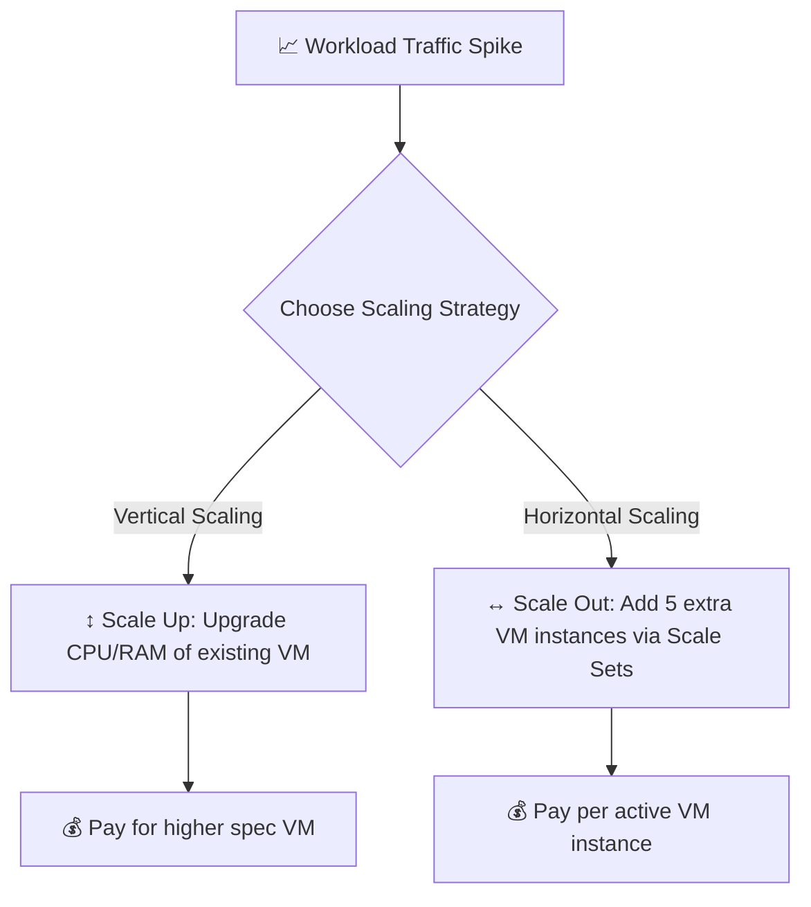

# Topic 1: High Availability and Scalability in the Cloud

When building or deploying cloud solutions, two of the most critical architectural considerations are **High Availability (HA)** (ensuring maximum uptime) and **Scalability** (adjusting resources to meet demand).

---

## ⚡ 1. High Availability (HA)

### What is High Availability?
**High Availability (HA)** focuses on ensuring that an application or service remains operational, accessible, and accessible to users with minimal downtime, even during unexpected hardware failures, network outages, or datacenter disruptions.

> 💡 **Core Principle:**  
> High availability is achieved by eliminating single points of failure through hardware redundancy, automated failover systems, and geographical distribution.

---

### 📜 Azure Service Level Agreements (SLAs)
Microsoft Azure provides formal Service Level Agreements (SLAs) that guarantee specific uptime percentages for cloud services.

| Availability SLA | Uptime % | Allowed Downtime per Year | Allowed Downtime per Month |
| :--- | :---: | :---: | :---: |
| **3 Nines** | 99.9% | ~8.76 Hours | ~43.8 Minutes |
| **4 Nines** | 99.99% | ~52.6 Minutes | ~4.38 Minutes |
| **5 Nines** | 99.999% | ~5.26 Minutes | ~26.3 Seconds |

---

### How Azure Delivers High Availability
* **Redundant Hardware:** Multiple power supplies, network switches, and RAID storage inside datacenters.
* **Availability Zones:** Physically isolated datacenters within an Azure region with independent power and cooling.
* **Load Balancing:** Automatically routing incoming user traffic away from unhealthy servers to healthy ones.

---

## 📈 2. Scalability in the Cloud

### What is Scalability?
**Scalability** is the ability of a cloud infrastructure to increase or decrease computing resources automatically or manually in response to changing workload demand.

> 💡 **Cost Efficiency:**  
> Because Azure uses a **consumption-based model**, scalability ensures you only pay for what you actually use. When demand rises, you scale up resources; when demand drops, you scale down to save money.

---

### ↕️ Vertical Scaling (Scale Up & Scale Down)

**Vertical Scaling** focuses on modifying the capacity and computing power of an **existing single resource** (such as a Virtual Machine).

* **Scale Up:** Upgrading a VM by adding more CPU cores, RAM, GPU power, or faster SSD storage to handle heavier workloads.
* **Scale Down:** Lowering CPU cores or RAM specifications when an application requires fewer resources.

> **Example:**  
> Upgrading an Azure VM from `2 vCPUs + 8 GB RAM` to `8 vCPUs + 32 GB RAM` to run a memory-intensive database query.

---

### ↔️ Horizontal Scaling (Scale Out & Scale In)

**Horizontal Scaling** focuses on adjusting the **number of server instances** running your application.

* **Scale Out:** Adding more identical VM instances or container nodes to distribute incoming traffic during high demand.
* **Scale In:** Removing extra server instances when user traffic normalizes.

> **Example:**  
> An e-commerce web app running 2 VM instances automatically adds 8 additional VMs (scaling out to 10 VMs total) during a Flash Sale, and then reduces back to 2 VMs (scaling in) after the sale ends.

---

## 📊 Comparison: Vertical vs. Horizontal Scaling

| Feature | ↕️ Vertical Scaling (Scale Up / Down) | ↔️ Horizontal Scaling (Scale Out / In) |
| :--- | :--- | :--- |
| **Action** | Changes hardware specs of a single server. | Adds or removes the number of server instances. |
| **Resource Change** | Increases/decreases CPU cores, RAM, or Disk size. | Increases/decreases total instance count (e.g., 2 VMs ➔ 10 VMs). |
| **Downtime Risk** | May require a brief VM reboot to apply new hardware specs. | Zero downtime (seamlessly handles traffic via Load Balancers). |
| **Automation** | Often manual or scheduled. | Highly automated via **Azure Virtual Machine Scale Sets**. |
| **Limit** | Constrained by maximum physical hardware limits of a single host server. | Virtually unlimited scaling across cloud infrastructure. |

---

## 📐 Visual Scaling Diagrams

### Vertical Scaling (Scale Up)
```text
  [ 🖥️ Small VM ]               [ 🖥️ XL VM ]
  • 2 vCPUs                     • 16 vCPUs
  • 8 GB RAM      ──── Scale Up ➔ • 64 GB RAM
  • 100 GB SSD                  • 1 TB NVMe SSD
```

### Horizontal Scaling (Scale Out)
```text
  Low Demand:                    High Demand (Scale Out):
  [ 🖥️ VM 1 ]                     [ 🖥️ VM 1 ]  [ 🖥️ VM 2 ]  [ 🖥️ VM 3 ]
  [ 🖥️ VM 2 ]     ──── Scale Out ➔ [ 🖥️ VM 4 ]  [ 🖥️ VM 5 ]  [ 🖥️ VM 6 ]
                                 [ 🖥️ VM 7 ]  [ 🖥️ VM 8 ]  [ 🖥️ VM 9 ]
```



---

## 🔑 AZ-900 Exam Points to Remember

1. **High Availability:** Ensures services remain operational with minimal downtime (guaranteed via Azure SLAs).
2. **Scalability:** Ability to adjust resources based on demand (connected to consumption-based pricing).
3. **Vertical Scaling (Scale Up/Down):** Adding or removing CPU, RAM, or storage to a single server instance.
4. **Horizontal Scaling (Scale Out/In):** Adding or removing identical server instances (VMs/containers).
5. **Elasticity:** Automatic scaling out/in in real-time based on live demand spikes.
