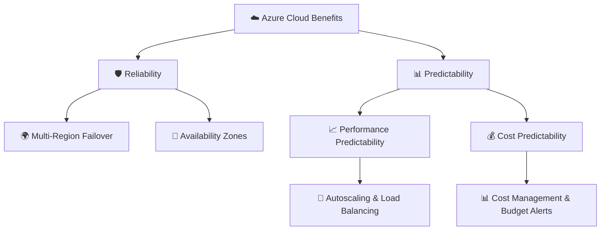

# Topic 2: Describe the Benefits of Reliability and Predictability in the Cloud

**Reliability** and **Predictability** are two core cloud benefits that enable organizations to build trusted applications and confidently plan for future operations and financial growth.

* 🛡️ **Reliability** → The ability of a system to recover from failures and continue functioning seamlessly.
* 📊 **Predictability** → The ability to anticipate, measure, and control both **Performance** and **Cost**.

---

## 🛡️ 1. Reliability in the Cloud

### What is Reliability?
**Reliability** means that a system is resilient to disruptions—it can automatically detect failures, recover from outages, and continue providing service to users with minimal or zero downtime.

> 💡 **Core Principle:**  
> Cloud providers build datacenters across geographically separated **Regions** and **Availability Zones**. By deploying applications across multiple locations, your solution can survive localized physical failures, natural disasters, or power outages.

---

### When is Reliability Essential?
Reliability is mission-critical for applications where downtime causes financial loss, safety issues, or reputational damage:
* 🏦 Banking and financial payment gateways
* 🛒 E-commerce checkout systems
* 🏥 Healthcare medical record systems
* ✈️ Flight booking and navigation systems

---

### 🌐 Real-Life Multi-Region Failover Example

#### Single-Region Deployment (Vulnerable)
```text
  👤 Users ──► ☁️ Azure Region 1 (Datacenter Outage ❌) ──► 💥 Application Down
```

#### Multi-Region Reliable Deployment (Resilient)
```text
                       👤 Users
                           │
                 ┌─────────┴─────────┐
                 ↓                   ↓
          ☁️ Azure Region 1     ☁️ Azure Region 2
         (Datacenter Outage ❌)   (Active & Running ✅)
                                     ↓
                          Application Continues Working! 🎉
```

---

## 📊 2. Predictability in the Cloud

**Predictability** ensures that an organization can operate with confidence by eliminating surprises in system performance and billing. It is divided into two key pillars: **Performance Predictability** and **Cost Predictability**.

---

### 📈 Pillar 1: Performance Predictability

**Performance Predictability** means your system can consistently deliver the expected user experience and speed, even when user demand fluctuates unexpectedly.

#### How Azure Ensures Performance Predictability:
* **Autoscaling:** Dynamically adds server instances during traffic spikes and scales down when traffic drops.
* **Load Balancing:** Automatically distributes incoming web traffic across healthy server instances to prevent individual bottlenecks.
* **High Availability (HA):** Ensures redundant instances are ready to handle user requests.

#### Real-Life Performance Scenario:
```text
Normal Traffic (1,000 users)  ──►  [ 🖥️ VM 1 ]  [ 🖥️ VM 2 ]

Flash Traffic (100,000 users) ──►  Autoscales to: 
                                   [ 🖥️ VM 1 ]  [ 🖥️ VM 2 ]  [ 🖥️ VM 3 ]  [ 🖥️ VM 4 ]  [ 🖥️ VM 5 ]

Traffic Normalizes            ──►  Scales back to 2 VMs (Maintains baseline speed)
```

---

### 💰 Pillar 2: Cost Predictability

**Cost Predictability** means being able to forecast, monitor, and control your cloud spending so there are no unexpected surprises on your monthly invoice.

#### How Azure Delivers Cost Predictability:
* **Azure Pricing Calculator:** Estimate costs before deploying resources.
* **Azure Cost Management & Billing:** Track live spending, analyze cost trends, and set budget alerts.
* **Resource Tags:** Categorize costs by department, environment (Dev/Test/Prod), or project.
* **Reserved Instances:** Commit to 1-year or 3-year plans for predictable workloads to save up to 72%.

#### Cost Management Flow:
```text
Track Current Usage ──► 📊 Azure Cost Management ──► 💰 Forecast Monthly Spend ──► ⚙️ Set Budget Alerts
```

---

## 🧠 Reliability vs. Predictability Comparison

| Cloud Benefit | Core Focus | Key Enabling Technologies | Real-World Goal |
| :--- | :--- | :--- | :--- |
| 🛡️ **Reliability** | Recovering from failures | Multi-region deployment, Availability Zones, Backups | Keep application working when hardware fails. |
| 📈 **Performance Predictability** | Maintaining speed under load | Autoscaling, Azure Load Balancer, Traffic Manager | Keep application fast when user demand spikes. |
| 💰 **Cost Predictability** | Forecasting & controlling bill | Azure Pricing Calculator, Cost Management, Budgets | Prevent bill shock and optimize cloud spending. |

---

## 📐 Overview Architecture Diagram

```text
                        ☁️ CLOUD BENEFITS
                                │
               ┌────────────────┴────────────────┐
               ↓                                 ↓
        🛡️ RELIABILITY                     📊 PREDICTABILITY
               │                                 │
     Recover from Failures             ┌─────────┴─────────┐
               │                       ↓                   ↓
      Multi-Region & Zones     📈 Performance            💰 Cost
                                       │                   │
                                   Autoscale          Pricing Calculator
                                 Load Balancers        Cost Management
```



---

## 🧠 AZ-900 Memory Trick & Key Points

* 🛡️ **Reliability Question:** *"What happens if a datacenter fails?"*  
  👉 **Answer:** Reliability ensures traffic redirects to another region/zone so service continues.

* 📈 **Performance Predictability Question:** *"What happens if 100k users hit the website at once?"*  
  👉 **Answer:** Autoscaling adds resources to maintain expected speed.

* 💰 **Cost Predictability Question:** *"How do we avoid unexpected cloud bills?"*  
  👉 **Answer:** Cost Predictability tools (Pricing Calculator, Cost Management, Budgets).
