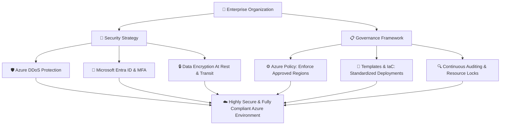

# Topic 3: Describe the Benefits of Security and Governance in the Cloud

As organizations grow and deploy hundreds of cloud resources across multiple teams, managing **Security** (protecting resources) and **Governance** (controlling and standardizing resources) becomes crucial for operational success and regulatory compliance.

* 🔐 **Security** → Protecting your data, applications, accounts, and infrastructure from unauthorized access, cyberattacks, and data breaches.
* 📋 **Governance** → Establishing rules, policies, and automated controls to ensure all cloud resources are created and maintained in compliance with company standards and legal regulations.

---

## 🔐 1. Security in the Cloud

### What is Cloud Security?
Cloud security involves implementing technologies, controls, and policies to protect cloud-based systems, data, and infrastructure from internal and external threats.

> 💡 **Core Principle:**  
> In the cloud, security is a **Shared Responsibility Model** between Microsoft Azure and the customer. Azure secures the physical infrastructure and underlying foundation, while you configure and maintain access controls, data protection, and application security based on your chosen service model (**IaaS**, **PaaS**, or **SaaS**).

---

### When Do We Use Cloud Security?
Security controls must always be active across all stages of cloud operations:
* 🗄️ **Data Protection:** Storing customer records, financial transactions, and proprietary business data (encryption at rest and in transit).
* 👤 **Identity & Access Management:** Controlling user authentication, multi-factor authentication (MFA), and permissions.
* 🌐 **Perimeter & Network Defense:** Protecting APIs, virtual networks, and endpoints against malicious intrusions.
* 🛡️ **Threat Detection:** Identifying malware, abnormal access patterns, and vulnerabilities in real time.

---

### 🛡️ Real-Life Security Flow: Multi-Layered Protection (Defense in Depth)

```text
    👤 User / Client
           │
           ▼
    🔐 Identity Layer      ──►  Microsoft Entra ID (MFA & Authentication)
           │
           ▼
    🛡️ Perimeter Layer     ──►  Azure DDoS Protection & Azure Firewall
           │
           ▼
    🌐 Network Layer       ──►  Network Security Groups (NSGs) & Subnets
           │
           ▼
    🖥️ Compute Layer       ──►  OS Security Hardening & Endpoint Protection
           │
           ▼
    ⚙️ Application Layer   ──►  Web Application Firewall (WAF) & API Security
           │
           ▼
    🗄️ Data Layer          ──►  Azure Storage Encryption (SSE) & SQL TDE
```

#### Real-Life Example: Employee Management API
Suppose an enterprise hosts an Employee Management system:
1. An employee authenticates using **Microsoft Entra ID** with Multi-Factor Authentication (MFA).
2. Network traffic passes through **Azure Firewall** to block unauthorized IP addresses.
3. The API validates the user's role before querying the **Employee Database**.
4. The database is encrypted with **Transparent Data Encryption (TDE)**, ensuring unauthorized users or attackers cannot steal sensitive employee details.

---

## 📋 2. Governance in the Cloud

### What is Cloud Governance?
**Governance** is the framework of rules, processes, and automated guardrails that an organization enforces to maintain control over its cloud environment. It ensures that cloud adoption follows corporate policies, budgetary limits, and compliance mandates (e.g., ISO, GDPR, HIPAA).

> 💡 **Core Principle:**  
> Cloud governance prevents **Resource Sprawl** (uncontrolled creation of untracked resources) and ensures that developers have the freedom to innovate within predefined organizational guardrails.

---

### When Do We Need Governance?
Governance is essential when an organization has:
* 👥 Multiple teams, developers, and departments deploying resources simultaneously.
* 🏢 Large-scale environments with hundreds of subscriptions, resource groups, and services.
* 📜 Industry regulations and data residency laws requiring data to stay inside specific geographical borders.
* 💰 Strict cost-control requirements to prevent unexpected spending.

---

### ⚙️ How Azure Enforces Governance

| Azure Governance Tool | What It Does | Real-World Example |
| :--- | :--- | :--- |
| **Azure Policy** | Enforces rules and evaluates resource compliance. | Automatically blocks VMs created outside approved regions (e.g., allows only `East US`). |
| **Azure RBAC** (Role-Based Access Control) | Manages *who* can perform *what* actions on resources. | Grants developers permission to manage VMs, but prevents them from modifying billing or deleting networks. |
| **Resource Locks** | Prevents accidental deletion or modification of critical assets. | Adds a `CanNotDelete` lock on production databases. |
| **Azure Resource Tags** | Applies metadata (key-value pairs) for organization and billing. | Tags resources with `Environment: Production` and `CostCenter: Marketing`. |
| **Management Groups** | Organizes subscriptions in a hierarchy to apply policies globally. | Applies a single security policy across 20 subscriptions under the `Enterprise-Root` group. |

---

### 🏢 Real-Life Governance Scenario: Region Restriction Policy

```text
                     🏢 Company Governance Rule:
              "Production workloads must ONLY run in East US"
                                  │
                                  ▼
                         ⚙️ Azure Policy Engine
                                  │
                  ┌───────────────┴───────────────┐
                  ▼                               ▼
    Developer deploys VM in:        Developer deploys VM in:
         📍 East US                      📍 West Europe
                  │                               │
                  ▼                               ▼
         ✅ Deployment Allowed           ❌ Deployment Denied
            (Compliant)                    (Violates Policy)
```

---

## 📐 3. Templates (Infrastructure as Code - IaC)

### What are Cloud Templates?
**Templates** allow organizations to define their infrastructure declaratively in reusable code files (such as **Azure Resource Manager (ARM) Templates**, **Azure Bicep**, or **Terraform**). 

Instead of configuring servers manually through the Azure Portal, templates automate the deployment of standardized, pre-approved configurations.

---

### Key Benefits of Using Templates:
* 🔄 **Consistency & Standardization:** Guarantees that every environment (Dev, Test, Staging, Prod) has identical settings and security baselines.
* ⚡ **Speed & Repeatability:** Deploy complex multi-tier architectures in minutes with a single command.
* 🛠️ **Error Reduction:** Eliminates human configuration mistakes during manual setup.
* 📜 **Version Control:** Track infrastructure modifications over time using Git repositories.

---

### 📋 Real-Life Example: Enterprise VM Deployment Template

```text
               📋 Pre-Approved Enterprise Template
              (Defined with Security & OS Baselines)
                               │
            ┌──────────────────┼──────────────────┐
            ▼                  ▼                  ▼
       [ 🖥️ VM 1 ]        [ 🖥️ VM 2 ]        [ 🖥️ VM 3 ]
       • East US          • East US          • East US
       • Encrypted OS     • Encrypted OS     • Encrypted OS
       • Corporate Tag    • Corporate Tag    • Corporate Tag
       • Patch Auto-ON    • Patch Auto-ON    • Patch Auto-ON
```

---

## 🔍 4. Auditing and Compliance Monitoring

### What is Auditing?
**Auditing** is the continuous process of inspecting, logging, and evaluating cloud resources to verify that they conform to company policies, industry benchmarks, and security requirements.

* **Detect Violations:** Quickly spots misconfigured resources (e.g., publicly accessible storage buckets or unencrypted disks).
* **Audit Trail:** Records *who* performed *what* action and *when* it happened across the cloud environment.
* **Remediation:** Provides recommendations or triggers automated workflows to fix non-compliant resources.

---

### 🛠️ Key Azure Auditing Tools:
1. **Azure Activity Log:** Tracks subscription-level control-plane events (e.g., resource creation, updates, and deletions).
2. **Microsoft Defender for Cloud:** Continuously scans resources for security vulnerabilities and provides a **Secure Score**.
3. **Azure Policy Compliance Dashboard:** Shows a percentage breakdown of compliant vs. non-compliant resources in your subscription.

---

### 📊 Real-Life Auditing Scenario: Storage Encryption Audit

```text
                         🏢 Corporate Policy:
              "All Storage Accounts must have Encryption Enabled"
                                  │
                                  ▼
                     🔍 Azure Policy Audit Scan
                                  │
                  ┌───────────────┴───────────────┐
                  ▼                               ▼
       Storage Account Alpha             Storage Account Beta
      🔐 Encryption: ON                 🔓 Encryption: OFF
                  │                               │
                  ▼                               ▼
         ✅ Status: Compliant             ❌ Status: Non-Compliant
                                                  │
                                                  ▼
                                       🚨 Alert Sent & Auto-Remediated
```

---

## 🔄 5. Management, Patches, and Updates (Service Models)

Moving to the cloud significantly reduces hardware maintenance overhead. However, the level of responsibility for software patching and OS updates depends on the cloud service model:

| Cloud Model | You Manage | Azure Manages | Maintenance Level |
| :--- | :--- | :--- | :--- |
| **IaaS** *(Infrastructure as a Service)* | • Operating System updates & security patches<br>• Application code & runtimes<br>• Database configurations | • Physical servers & host hardware<br>• Datacenter power & cooling<br>• Physical network infrastructure | ⚠️ **High Maintenance** (You have full OS control) |
| **PaaS** *(Platform as a Service)* | • Application code & business logic<br>• Data & user access settings | • OS patching & security updates<br>• Runtime/Framework maintenance<br>• Physical servers & storage | ⚡ **Low Maintenance** (Azure handles the OS) |
| **SaaS** *(Software as a Service)* | • User accounts & access permissions<br>• Application settings & data entry | • Entire software application<br>• Feature updates & security fixes<br>• Underlying infrastructure | 🟢 **Minimal Maintenance** (Provider handles everything) |

---

### 💡 Summary Rule for Maintenance:
* **IaaS (e.g., Azure VMs):** You get maximum control, but you must manually schedule and apply OS patches.
* **PaaS (e.g., Azure App Service, Azure SQL):** Azure automatically applies OS updates and security patches with zero manual effort from your team.
* **SaaS (e.g., Microsoft 365):** The software is completely managed and updated by Microsoft.

---

## 🛡️ 6. DDoS Protection (Distributed Denial of Service)

### What is a DDoS Attack?
A **Distributed Denial of Service (DDoS)** attack occurs when an attacker floods a target web application or server with an overwhelming volume of malicious network traffic from thousands of infected machines (botnets), causing the service to crash or become unresponsive to legitimate customers.

```text
       🤖 Botnet 1 ──┐
       🤖 Botnet 2 ──┼──►  🌊 Massive Malicious Traffic Flood
       🤖 Botnet 3 ──┤               │
       🤖 Botnet 4 ──┘               ▼
                             ☁️ Web Application ──► 💥 Server Crashes (Denial of Service)
```

---

### How Azure Protects Against DDoS:
Azure provides built-in, global DDoS mitigation systems that monitor network traffic 24/7:

1. **Continuous Traffic Analysis:** Compares incoming traffic against normal baseline patterns.
2. **Adaptive Real-Time Mitigation:** Instantly absorbs and scrubs volumetric attack traffic at Azure’s network edge before it reaches your virtual network.
3. **No Downtime for Legitimate Traffic:** Legitimate user requests pass through smoothly while malicious packets are discarded.

```text
   🌊 Malicious Traffic Flood ──┐
                                 ├──► [ 🛡️ Azure DDoS Protection ] ──► 🗑️ Malicious Packets Dropped
   👤 Legitimate Users ─────────┘               │
                                                ▼
                                    ☁️ Your Azure Application
                                       (100% Online & Fast ✅)
```

---

## ⚖️ Comprehensive Comparison: Security vs. Governance

| Attribute | 🔐 Security | 📋 Governance |
| :--- | :--- | :--- |
| **Primary Focus** | Protecting assets from threats and unauthorized access. | Controlling, standardizing, and organizing cloud resources. |
| **Core Question** | *"Is my application and data safe from cyberattacks?"* | *"Are my cloud resources following company policies & laws?"* |
| **Main Objective** | Prevent data breaches, identity theft, and downtime. | Enforce cost limits, naming conventions, and compliance. |
| **Key Azure Tools** | • Microsoft Entra ID (Identity & MFA)<br>• Azure DDoS Protection<br>• Azure Firewall / NSGs<br>• Microsoft Defender for Cloud | • Azure Policy<br>• Azure RBAC<br>• Resource Locks & Tags<br>• Azure Management Groups |
| **Key Action** | **Protect & Defend** | **Control & Enforce** |

---

## 🧠 Master Architecture: Security & Governance Working Together



---

## ⭐ AZ-900 Exam Quick Reference & Memory Shortcuts

| Concept | Exam Keyword / Trigger | Quick Rule to Remember |
| :--- | :--- | :--- |
| **🔐 Security** | *"Protect data, stop attacks, authenticate users"* | **Protect it** from bad actors and unauthorized access. |
| **📋 Governance** | *"Enforce rules, company standards, compliance"* | **Control it** with policies, locks, and guardrails. |
| **📐 Templates (IaC)** | *"Standardized, repeatable, consistent deployments"* | **Standardize it** using code instead of manual clicks. |
| **🔍 Auditing** | *"Find non-compliant resources, track changes"* | **Check it** using Azure Policy scans and Activity Logs. |
| **🛡️ DDoS Protection** | *"Overwhelming malicious traffic, volumetric attack"* | **Filter it** at the cloud edge to keep apps online. |
| **🔄 IaaS vs PaaS/SaaS** | *"Who applies operating system security patches?"* | **IaaS = You patch OS**, **PaaS/SaaS = Azure patches OS**. |
