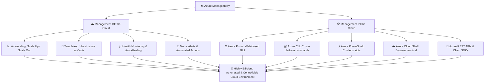

# Topic 5: Describe the Benefits of Manageability in the Cloud

**Manageability** in cloud computing refers to how easily, efficiently, and reliably you can configure, operate, monitor, automate, and scale your cloud resources.

Instead of requiring systems administrators to manually configure hardware or monitor servers 24/7 in a physical datacenter, Azure provides intelligent automation tools, centralized management planes, and multiple interaction interfaces.

For the **AZ-900 exam**, manageability is divided into **two core categories**:

* ☁️ **Management OF the Cloud** → Managing the resources themselves (automation, autoscaling, self-healing, templates, and monitoring).
* 🛠️ **Management IN the Cloud** → The tools and interfaces you use to control and interact with Azure (Portal, CLI, PowerShell, Cloud Shell, APIs).

---

## ☁️ 1. Management OF the Cloud

### What is Management OF the Cloud?
**Management OF the cloud** focuses on how cloud resources are automatically provisioned, scaled, monitored, maintained, and self-healed based on predefined rules without requiring constant human intervention.

> 💡 **Core Principle:**  
> Management **OF** the cloud is about **"What is running inside the cloud and how it automates itself."** It reduces administrative overhead, eliminates manual errors, and optimizes performance and costs dynamically.

---

### 🔑 Key Capabilities of Management OF the Cloud:

| Capability | How It Works | Real-World Benefit |
| :--- | :--- | :--- |
| **📈 Automatic Scaling** *(Autoscaling)* | Dynamically adds or removes VM instances or compute power based on live CPU, memory, or network demand. | Handles flash sales smoothly and automatically cuts server costs when traffic drops. |
| **📐 Pre-configured Templates** | Deploys entire multi-tier architectures using declarative code files (**ARM Templates / Azure Bicep**). | Guarantees identical, consistent environments across Dev, Test, and Production. |
| **🩺 Continuous Health Monitoring** | Continuously tracks system uptime, CPU usage, memory leaks, and response latency (**Azure Monitor**). | Identifies and alerts engineers about performance bottlenecks before users experience downtime. |
| **🔄 Self-Healing & Auto-Replacement** | Automatically detects unresponsive server nodes or failed containers and spins up healthy replacements. | Ensures high availability and zero manual downtime for server crashes. |
| **🚨 Metric & Log Alerts** | Triggers automated actions (e.g., sending emails, invoking Azure Functions, or running runbooks) when thresholds are crossed. | Instantly notifies the on-call DevOps team when error rates exceed 5%. |

---

### 📊 Real-Life Scenario: Autoscaling and Auto-Healing Workflow

```text
    [ Normal Traffic: 1,000 Users ]
          🖥️ VM 1    🖥️ VM 2
                 │
                 ▼ (Flash Sale Traffic Spike: 100,000 Users)
    ⚙️ Autoscaling Triggered (CPU > 75%)
                 │
                 ▼
    [ Scaled Out: High Demand ]
          🖥️ VM 1    🖥️ VM 2    🖥️ VM 3    🖥️ VM 4    🖥️ VM 5
                 │
                 ▼ (VM 3 Experiences Hardware Glitch ❌)
    🩺 Health Monitor detects failure ──► 🔄 Auto-Replaces with new Healthy VM 3 ✅
                 │
                 ▼ (Traffic Normalizes after Sale)
    ⚙️ Autoscaling Scales In back to baseline:
          🖥️ VM 1    🖥️ VM 2
```

---

## 🛠️ 2. Management IN the Cloud

### What is Management IN the Cloud?
**Management IN the cloud** refers to the various interfaces, tools, and programmatic channels that engineers, developers, and administrators use to manage, configure, and control Azure resources.

> 💡 **Core Principle:**  
> Management **IN** the cloud is about **"How you interact with and give instructions to Azure."** Azure provides flexibility so you can manage resources through a web browser, a terminal command line, automated scripts, or programmatic APIs.

---

### 🧰 The 5 Main Azure Management Tools:

```text
                                  ☁️ AZURE PLATFORM
                                          │
            ┌────────────────┬────────────┴───────────┬────────────────┐
            ▼                ▼                        ▼                ▼
     🌐 Azure Portal    💻 Azure CLI           ⚡ PowerShell      🔌 REST APIs & SDKs
     (Web Browser UI)   (Cross-Platform CLI)   (Scripting Engine) (Programmatic Code)
```

---

### 🌐 1. Azure Portal
* **What is it?** A web-based graphical user interface (GUI) accessible from any web browser (`portal.azure.com`) or via the **Azure Mobile App**.
* **Best For:** Visual navigation, viewing dashboards, exploring new Azure services, and performing initial configurations.
* **Workflow:**
  ```text
  Web Browser / Mobile App ──► 🌐 Azure Portal ──► Create / Monitor / Configure Resources
  ```

---

### 💻 2. Azure CLI (Command-Line Interface)
* **What is it?** A cross-platform command-line tool using the `az` command syntax that runs on Windows, macOS, and Linux.
* **Best For:** Developers and system administrators who prefer Bash or command-line scripting to automate repetitive tasks quickly.
* **Example Command:**
  ```bash
  az vm create --resource-group MyRG --name MyVM --image Ubuntu2204
  ```

---

### ⚡ 3. Azure PowerShell
* **What is it?** A task automation framework using PowerShell cmdlets (e.g., `New-AzVM`, `Get-AzResourceGroup`) running on Windows PowerShell or PowerShell 7 (cross-platform).
* **Best For:** Windows system administrators, IT engineers, and enterprise scripting workflows.
* **Example Command:**
  ```powershell
  New-AzResourceGroup -Name "Production-RG" -Location "EastUS"
  ```

---

### ☁️ 4. Azure Cloud Shell
* **What is it?** A browser-accessible, pre-authenticated terminal hosted directly inside the Azure Portal.
* **Key Features:**
  * Requires no local software installation on your PC.
  * Lets you choose between **Bash** (with Azure CLI) and **PowerShell** (with Azure PowerShell modules).
  * Automatically persists your files and scripts in attached Azure Storage.

---

### 🔌 5. Azure REST APIs and SDKs
* **What is it?** Direct HTTPS endpoints and client libraries for programming languages (C#, Python, Java, JavaScript, Go).
* **Best For:** Integrating cloud provisioning into custom enterprise software, CI/CD deployment pipelines, and internal tools.
* **Workflow:**
  ```text
  Custom Software / CI/CD Pipeline ──► 🔌 Azure REST API ──► Azure Resource Manager (ARM)
  ```

---

## ⚖️ Comprehensive Comparison: Management OF vs. Management IN

| Comparison Metric | ☁️ Management OF the Cloud | 🛠️ Management IN the Cloud |
| :--- | :--- | :--- |
| **Core Meaning** | Managing the **lifecycle and behavior** of cloud resources. | Managing Azure using **tools, interfaces, and scripts**. |
| **Core Question** | *"What automated actions happen to my resources?"* | *"How do I send commands and configure my resources?"* |
| **Primary Mechanism** | • Autoscaling & Scale Sets<br>• ARM/Bicep Templates (IaC)<br>• Proactive Health Checks<br>• Metric Alert Rules | • Azure Portal (GUI)<br>• Azure CLI (`az`)<br>• Azure PowerShell (`Az`)<br>• Azure Cloud Shell<br>• REST APIs & SDKs |
| **Human Effort** | **Automated** (Rules execute autonomously). | **Direct / Interactive** (Executed by human or custom code). |
| **Primary Goal** | Operational efficiency, resilience, and elasticity. | Developer flexibility, control, and automation accessibility. |

---

## 📐 Unified Master Architecture



---

## ⭐ AZ-900 Exam Quick Reference & Memory Tricks

### 🧠 The "OF vs. IN" Shortcut:
* ☁️ **Management OF = What happens to resources**  
  👉 *(Autoscaling, Self-Healing, Templates, Performance Monitoring)*
* 🛠️ **Management IN = How you talk to Azure**  
  👉 *(Azure Portal, Azure CLI, Azure PowerShell, Cloud Shell, APIs)*

---

### 🎯 Key Exam Triggers:
* **"Deploy identical resources repeatedly with no human error"** ➔ **Templates / IaC (Management OF)**
* **"Automatically add virtual machines when CPU exceeds 80%"** ➔ **Autoscaling (Management OF)**
* **"Replace a crashed node without manual intervention"** ➔ **Auto-Healing / High Availability (Management OF)**
* **"Manage Azure graphically from any browser"** ➔ **Azure Portal (Management IN)**
* **"Cross-platform command-line tool for Linux, macOS, and Windows"** ➔ **Azure CLI (Management IN)**
* **"Windows-friendly scripting language with cmdlets"** ➔ **Azure PowerShell (Management IN)**
* **"Run CLI commands in the browser without installing anything locally"** ➔ **Azure Cloud Shell (Management IN)**
* **"Automate Azure operations from inside a custom Python or C# app"** ➔ **Azure REST APIs / SDKs (Management IN)**
