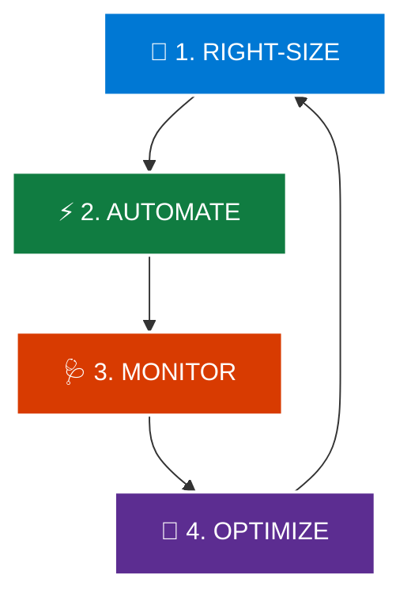

# Topic 6: Describe Sustainability Considerations in the Cloud

**Sustainability** in cloud computing refers to designing, deploying, and managing cloud workloads in a way that minimizes environmental impact, reduces carbon emissions, decreases energy consumption, and eliminates physical hardware waste.

Cloud computing inherently supports sustainability goals because hyper-scale providers like Microsoft operate with massive **economies of scale**, superior energy efficiency, and renewable power sourcing. However, achieving true sustainability requires **active customer optimization**.

---

## 🌍 1. Why the Cloud is More Sustainable than On-Premises

Traditional on-premises corporate datacenters often suffer from low server utilization, outdated cooling systems, and high electricity waste. Moving workloads to Azure provides immediate sustainability advantages:

| Sustainability Factor | 🏢 Traditional On-Premises Datacenter | ☁️ Microsoft Azure Cloud |
| :--- | :--- | :--- |
| **Server Utilization** | **Low (10% – 20%):** Servers sit idle 24/7 waiting for occasional traffic peaks. | **High (60% – 85%+):** Multi-tenant sharing maximizes physical server efficiency. |
| **Power Usage Effectiveness (PUE)** | **Poor (~1.5 – 2.0):** Significant energy wasted on legacy fans and cooling units. | **Excellent (Close to 1.1):** Advanced cooling, AI temperature management, and liquid cooling. |
| **Energy Sourcing** | Reliant on standard local fossil-fuel grid electricity. | Committed to **100% renewable energy** (wind, solar, hydro). |
| **Hardware Lifecycle & E-Waste** | Obsolete servers often end up in landfills. | Circular datacenter centers reuse, refurbish, and recycle up to **90%+ of hardware**. |

> 💡 **Key Insight:**  
> Studies by Microsoft show that moving on-premises workloads to the Azure cloud can be up to **98% more carbon efficient** and up to **93% more energy efficient** than traditional enterprise datacenters.

---

## 🤝 2. The Shared Responsibility Model for Sustainability

Just like security, sustainability in the cloud is a shared commitment between Microsoft and the customer:

```text
                           🌱 CLOUD SUSTAINABILITY
                                     │
          ┌──────────────────────────┴──────────────────────────┐
          ↓                                                     ↓
  🏢 Microsoft's Responsibility                         👤 Customer's Responsibility
   (Sustainability OF the Cloud)                         (Sustainability IN the Cloud)
          │                                                     │
  • Building energy-efficient datacenters               • Right-sizing CPU, RAM & Storage
  • 100% Renewable energy transition                    • Auto-scaling based on demand
  • Advanced liquid cooling & AI airflow                • Auto-shutting down Dev/Test VMs
  • Recycling server hardware & zero waste              • Deleting unused data & disks
```

* **Microsoft is responsible for Sustainability OF the cloud:** Physical infrastructure, datacenters, cooling, renewable energy sourcing, and hardware supply chain recycling.
* **Customers are responsible for Sustainability IN the cloud:** How applications are architected, how resources are sized, and ensuring unused workloads are not left running.

---

## 🔄 3. The 4-Pillar Sustainability Optimization Cycle

To maximize environmental efficiency and minimize cloud waste, organizations should follow the continuous **Sustainability Optimization Cycle**:



---

### 📏 Pillar 1: Right-Size (Eliminate Overprovisioning)
* **What it means:** Matching computing power, memory, and storage specifications to actual application needs rather than buying oversized hardware for "worst-case" scenarios.
* **Best Practice:** If a virtual machine only uses 15% CPU during peak times, downscale it from a 16-core VM to a 4-core VM.
* **Benefit:** Reduces direct server energy consumption and saves cloud costs.

---

### ⚡ Pillar 2: Automate (Eliminate Idle Resource Waste)
* **What it means:** Configuring automated schedules, policies, and scaling rules to turn off or deallocate resources when not in use.
* **Real-World Scenario: Development Environments**
  ```text
  Monday – Friday (8:00 AM – 6:00 PM)  ──► 🟢 Dev VMs Running (Team Working)
  Nights (6:00 PM – 8:00 AM) & Weekends ──► 🔴 Auto-Shutdown (Zero Power Consumed)
  ```
* **Impact:** Automatically shutting down non-production servers outside business hours reduces energy consumption and cost by **over 65%**.

---

### 🩺 Pillar 3: Monitor (Track Carbon & Efficiency Metrics)
* **What it means:** Continuously inspecting resource utilization trends, orphaned resources, and greenhouse gas emissions.
* **Key Azure Tools:**
  * **Microsoft Emissions Impact Dashboard:** Quantifies direct (Scope 1, Scope 2) and supply-chain (Scope 3) carbon emissions associated with your Azure usage.
  * **Azure Advisor:** Automatically flags underutilized virtual machines, idle public IPs, and unattached storage disks.
  * **Azure Monitor:** Tracks live CPU, memory, and network throughput across your fleet.

---

### 🔄 Pillar 4: Optimize (Adopt Modern Cloud-Native Architectures)
* **What it means:** Transitioning from traditional virtual machines (IaaS) to modern serverless and Platform-as-a-Service (PaaS) solutions.
* **Why Serverless is Greener:**
  * **Traditional VM (IaaS):** Consumes electricity 24/7, even when waiting for requests.
  * **Serverless (e.g., Azure Functions):** Compute resources spin up *only* during the milliseconds code executes, and instantly shut down. Zero electricity is wasted on idle servers.

---

## 🛠️ Summary of Green Cloud Best Practices

```text
                             🌱 SUSTAINABLE CLOUD PRACTICES
                                            │
        ┌───────────────────┬───────────────┴───────────────┬───────────────────┐
        ↓                   ↓                               ↓                   ↓
  📉 Dynamic Scaling   ⏱️ Auto-Shutdown               🗄️ Data Lifecycle     ☁️ PaaS / Serverless
  (Scale down when    (Turn off Dev/Test              (Archive or delete    (Run code on demand
   traffic drops)      on nights & weekends)           unneeded data)        with zero idle waste)
```

1. **Autoscaling:** Automatically add instances during traffic peaks and scale down to zero/minimum when demand subsides.
2. **Scheduled Deallocation:** Use Azure Automation / VM Auto-shutdown on development, staging, and QA environments.
3. **Data Lifecycle Policies:** Automatically move cold, rarely accessed data to **Blob Cold/Archive Storage** or set expiration rules on log files.
4. **Delete Orphaned Disks:** Identify and remove unattached managed disks, unused public IP addresses, and obsolete backups.
5. **Choose Energy-Efficient Azure Regions:** Deploy workloads into Azure regions powered by local renewable energy grids.

---

## 🏢 Microsoft’s Global Sustainability Commitments

Microsoft has set some of the most aggressive environmental targets in the technology industry:

* 🌿 **Carbon Negative by 2030:** Microsoft will remove more carbon from the atmosphere than it emits across all direct and supply-chain operations.
* 💧 **Water Positive by 2030:** Microsoft will replenish more water than its datacenters consume.
* ♻️ **Zero Waste by 2030:** Divert 90%+ of datacenter solid waste away from landfills through circular recycling centers.
* ⚡ **100% Renewable Energy by 2025:** 100% of electricity consumption in Azure datacenters will be matched by green energy contracts (wind, solar, hydro).
* 🌳 **By 2050:** Remove all historical carbon emissions Microsoft has produced since its founding in 1975.

---

## ⭐ AZ-900 Exam Quick Reference & Memory Shortcuts

| Concept | Key Question / Trigger | Quick Rule to Remember |
| :--- | :--- | :--- |
| **🌱 Cloud Sustainability** | *"How does cloud computing reduce environmental impact?"* | **High server utilization, renewable power, and reduced e-waste.** |
| **🤝 Shared Responsibility** | *"Who is responsible for right-sizing and shutting down idle VMs?"* | **The Customer** (Sustainability *IN* the cloud). |
| **⚡ Auto-Shutdown** | *"How to minimize waste for a Dev environment used 9 to 5?"* | **Schedule automated shutdown overnight and on weekends.** |
| **📏 Right-Sizing** | *"How to prevent overprovisioning and unnecessary energy use?"* | **Match VM compute/RAM specs to actual real-world workload demand.** |
| **📊 Emissions Dashboard** | *"Which tool tracks carbon emissions of your Azure workloads?"* | **Microsoft Emissions Impact Dashboard.** |
| **🔄 4-Pillar Cycle** | *"What are the core operational habits for sustainability?"* | **Right-size ➔ Automate ➔ Monitor ➔ Optimize.** |
