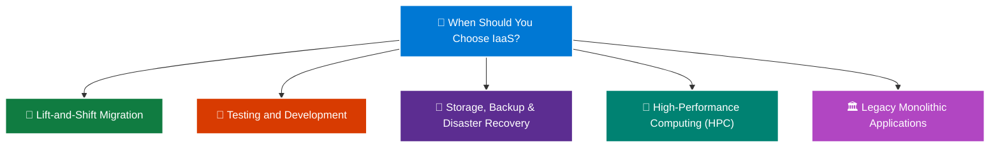

# Topic 1: Describe Infrastructure as a Service (IaaS)

**Infrastructure as a Service (IaaS)** is the most flexible and fundamental category of cloud computing services. It provides the **maximum amount of control** over your cloud resources, closely mimicking traditional on-premises physical hardware environments.

> 💡 **Core Analogy:**  
> With IaaS, you are essentially **renting bare-metal hardware, storage, and networking** in Microsoft's hyper-scale datacenters. Microsoft takes care of the physical building, power, and hardware, but **what you install, run, configure, and secure on top of that hardware is completely up to you.**

---

## 🧱 1. What is IaaS?

In an IaaS model, the cloud provider delivers instant access to foundational computing infrastructure—such as virtual servers, data storage, and networking capabilities—over the internet on a **pay-as-you-go (consumption-based)** model.

```text
    ┌─────────────────────────────────────────────────────────┐
    │  👤 CUSTOMER MANAGES (Full Control & Responsibility):   │
    │  • Data & Identity Access                               │
    │  • Applications & Custom Code                           │
    │  • Runtimes & Middleware                                │
    │  • Operating System (OS Configuration & Patching)       │
    │  • Virtual Network Security & Firewall Rules            │
    ├─────────────────────────────────────────────────────────┤
    │  ☁️ MICROSOFT AZURE MANAGES:                            │
    │  • Hypervisor & Physical Virtualization                 │
    │  • Physical Servers & Host Hardware                     │
    │  • Physical Datacenter Networking                       │
    │  • Datacenter Facilities (Power, Cooling, Security)     │
    └─────────────────────────────────────────────────────────┘
```

---

## 🤝 2. The Shared Responsibility Stack for IaaS

Under the **Shared Responsibility Model**, IaaS gives you the largest operational responsibility compared to PaaS or SaaS:

| Infrastructure Layer | Who Manages It in IaaS? | Details & Responsibilities |
| :--- | :---: | :--- |
| **Data & Information** | 👤 **You (Customer)** | Encrypting databases, backups, user permissions, and compliance. |
| **Applications** | 👤 **You (Customer)** | Installing, updating, testing, and debugging your custom software. |
| **Runtime & Middleware** | 👤 **You (Customer)** | Installing .NET, Java, Python, Node.js, web servers (IIS, Apache, NGINX). |
| **Operating System (OS)** | 👤 **You (Customer)** | Applying Windows/Linux security updates, OS patches, and antivirus. |
| **Virtual Network (VNet)** | 👤 **You (Customer)** | Configuring subnets, routing tables, and Network Security Groups (NSGs). |
| **Hypervisor / Virtualization** | ☁️ **Azure (Provider)** | Isolating tenant VMs on the physical host machine. |
| **Compute & Server Hardware** | ☁️ **Azure (Provider)** | Replacing failed CPUs, motherboards, RAM, and hard drives. |
| **Physical Networking** | ☁️ **Azure (Provider)** | Physical fiber optics, datacenter routers, and ISP connectivity. |
| **Datacenter Facilities** | ☁️ **Azure (Provider)** | Physical security guards, biometric locks, backup generators, cooling. |

---

## 🛠️ 3. Core Azure IaaS Services

```text
                           ☁️ AZURE IaaS PORTFOLIO
                                      │
         ┌───────────────────┬────────┴──────────┬───────────────────┐
         ↓                   ↓                   ↓                   ↓
  🖥️ Compute          🗄️ Storage          🌐 Networking       🛡️ Access & Security
  • Azure VMs         • Azure Disks       • Virtual Network   • Azure Bastion
  • VM Scale Sets     • Azure Blob        • NSGs & Subnets    • VPN Gateway
```

* 🖥️ **Azure Virtual Machines (VMs):** On-demand, scalable computing instances running Windows Server or Linux distributions.
* 📈 **Azure Virtual Machine Scale Sets (VMSS):** Automatically deploy and manage a group of identical, load-balanced VMs for auto-scaling.
* 🌐 **Azure Virtual Network (VNet):** Enables secure communication between Azure resources, the internet, and on-premises networks.
* 🗄️ **Azure Managed Disks:** Block-level storage volumes attached to Azure VMs (Ultra SSD, Premium SSD, Standard SSD/HDD).
* 🛡️ **Azure Bastion:** Secure, seamless RDP/SSH connectivity to your virtual machines directly through the Azure Portal without exposing public IP addresses.

---

## 💼 4. Common Real-World Scenarios for IaaS



---

### 🚚 1. Lift-and-Shift Migration (Rehosting)
* **Scenario:** An enterprise wants to migrate out of its aging physical datacenter into Azure quickly without rewriting any application code.
* **Why IaaS:** You create Azure VMs that match your existing on-premises server configurations and simply move the workloads over (known as *rehosting*).

---

### 🧪 2. Testing and Development (Dev/Test Environments)
* **Scenario:** Developers need to spin up realistic, multi-server testing environments with specific OS configurations, test a new build, and tear down the infrastructure immediately.
* **Why IaaS:** VMs can be provisioned in minutes with templates, tested, and deleted when finished so you only pay for the active hours.

---

### 💾 3. Storage, Backup, and Disaster Recovery (DR)
* **Scenario:** An organization needs secondary replicas of its business servers in a remote region in case the primary datacenter fails.
* **Why IaaS:** Azure allows setting up cold or warm standby VMs and replica disks in another Azure region at a fraction of the cost of building a second physical datacenter.

---

### 🚀 4. High-Performance Computing (HPC)
* **Scenario:** Scientific research, financial modeling, 3D rendering, or weather simulation workloads requiring supercomputer performance.
* **Why IaaS:** Azure provides specialized GPU-enabled and high-core VMs (e.g., HB-series, N-series) that can be spun up on demand to solve complex mathematical calculations.

---

### 🏛️ 5. Legacy & Monolithic Enterprise Software
* **Scenario:** Hosting custom software that depends on specific legacy operating system versions (e.g., Windows Server 2012 R2, custom Linux kernels) or requires low-level OS kernel configurations that PaaS environments do not permit.
* **Why IaaS:** You have complete administrator (root) access to configure the OS registry, drivers, and services as needed.

---

## ⚖️ Advantages and Trade-Offs of IaaS

### ✅ Key Advantages (Pros):
1. **Maximum Flexibility & Control:** You choose the operating system, runtime versions, disk partitioning, and network security rules.
2. **No Upfront Capital Expense (CapEx):** Avoid multimillion-dollar investments in physical servers, routers, and datacenter cooling.
3. **Rapid Provisioning:** Spin up hundreds of servers across global Azure regions in minutes.
4. **Consumption-Based Billing:** Pay only for compute seconds and allocated storage while VMs are running; stop or deallocate VMs when idle to stop compute charges.

---

### ⚠️ Trade-Offs & Operational Overhead (Cons):
1. **Highest Maintenance Overhead:** You are responsible for scheduling and installing OS security patches, updating drivers, and maintaining antivirus software.
2. **Configuration Complexity:** Setting up high availability, load balancers, backups, and firewalls requires dedicated systems engineering effort.
3. **Cost of Idle Resources:** If developers leave IaaS VMs running 24/7 without automated shutdown rules, billing costs accumulate continuously.

---

## 🧠 Master Architectural Flow: On-Premises vs. IaaS

```text
    🏢 TRADITIONAL ON-PREMISES                       ☁️ AZURE IaaS CLOUD
  ┌─────────────────────────────┐               ┌─────────────────────────────┐
  │ 👤 Applications             │               │ 👤 Applications             │
  │ 👤 Data & Access            │               │ 👤 Data & Access            │
  │ 👤 Runtime & Middleware     │               │ 👤 Runtime & Middleware     │
  │ 👤 Operating System         │               │ 👤 Operating System         │
  │ 👤 Hypervisor               │               ├─────────────────────────────┤
  │ 👤 Physical Servers         │               │ ☁️ Hypervisor & Physical Host│
  │ 👤 Datacenter Network       │               │ ☁️ Physical Datacenter Net  │
  │ 👤 Physical Facilities (AC) │               │ ☁️ Physical Power & Cooling │
  └─────────────────────────────┘               └─────────────────────────────┘
   (You manage 100% of stack)                    (Azure manages physical base)
```

---

## ⭐ AZ-900 Exam Quick Reference & Memory Shortcuts

| Exam Question Concept | Correct Trigger / Choice | Memory Shortcut |
| :--- | :--- | :--- |
| **"Which cloud service model offers the MAXIMUM control over OS?"** | **IaaS (Infrastructure as a Service)** | **IaaS = Maximum Control** |
| **"Moving on-premises servers to Azure with MINIMAL code changes?"** | **Lift-and-Shift (Rehosting) via IaaS** | **Lift-and-Shift ➔ IaaS** |
| **"Who is responsible for applying OS security updates on an Azure VM?"** | **The Customer** | **IaaS OS = Your Responsibility** |
| **"Who is responsible for physical server hardware replacement?"** | **Microsoft Azure** | **Hardware = Azure Responsibility** |
| **"Which model is most suitable for Dev/Test environments?"** | **IaaS (Virtual Machines)** | **Rapid spin-up & tear-down** |
