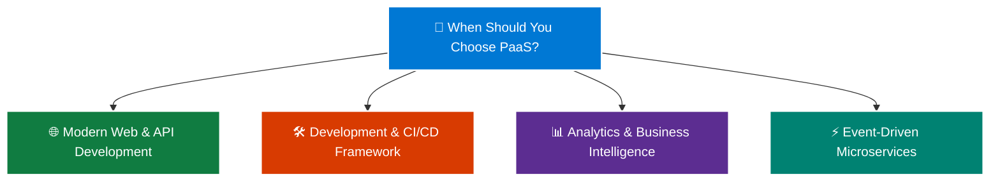

# Topic 2: Describe Platform as a Service (PaaS)

**Platform as a Service (PaaS)** is the **"middle ground"** cloud service model that sits between renting bare-metal/virtualized infrastructure (**IaaS**) and using a finished, ready-to-use software application (**SaaS**).

In a PaaS environment, the cloud provider provides and manages a **complete, ready-to-use development and deployment platform**—including physical servers, networking, operating systems, database engines, middleware, software licenses, and development runtimes.

> 💡 **Core Analogy:**  
> If **IaaS** is like renting an unfurnished apartment (where you must bring your own furniture, appliances, and paint the walls), **PaaS** is like renting a fully furnished apartment or staying in a hotel where utilities, housekeeping, and maintenance are handled for you—**you just bring your luggage (your application code and data).**

---

## 🧱 1. What is PaaS?

In a PaaS model, you are freed from the operational burden of managing physical servers, operating systems, antivirus software, and security patches. Instead, developers can dedicate **100% of their focus to writing code, building features, and managing application data.**

```text
    ┌─────────────────────────────────────────────────────────┐
    │  👤 CUSTOMER RESPONSIBILITY:                            │
    │  • Application Code & Business Logic                    │
    │  • Databases & Customer Data                            │
    │  • User Authentication & Access Permissions             │
    ├─────────────────────────────────────────────────────────┤
    │  ☁️ MICROSOFT AZURE MANAGES (Fully Automated):          │
    │  • Operating System (Windows / Linux) & OS Patching     │
    │  • Runtimes & Frameworks (.NET, Java, Python, Node.js)  │
    │  • Web Servers & Middleware (IIS, Apache, NGINX)        │
    │  • Automatic Scaling & Load Balancing                   │
    │  • Hypervisor, Physical Servers, Power & Cooling        │
    └─────────────────────────────────────────────────────────┘
```

---

## 🤝 2. The Shared Responsibility Stack for PaaS

Under the **Shared Responsibility Model**, PaaS transfers the entire underlying platform and infrastructure layer to Microsoft:

| Infrastructure Layer | Who Manages It in PaaS? | Details & Responsibilities |
| :--- | :---: | :--- |
| **Data & Information** | 👤 **You (Customer)** | Managing customer data, database schemas, records, and encryption keys. |
| **Applications** | 👤 **You (Customer)** | Writing, deploying, updating, and debugging your custom software/APIs. |
| **User Identity & Access** | 👤 **You (Customer)** | Defining roles, MFA, and access control via Microsoft Entra ID. |
| **Networking & Firewall** | 🤝 **Shared** | You configure custom domains, CORS, and SSL; Azure manages load balancing and DDoS. |
| **Runtime & Middleware** | ☁️ **Azure (Provider)** | Azure installs, configures, and maintains .NET, Java, Python, Node.js, and web servers. |
| **Operating System (OS)** | ☁️ **Azure (Provider)** | Azure applies all OS security patches, updates, and kernel configurations automatically. |
| **Virtualization & Hypervisor** | ☁️ **Azure (Provider)** | Azure isolates tenant workloads seamlessly. |
| **Server & Storage Hardware** | ☁️ **Azure (Provider)** | Azure manages physical host CPUs, RAM, SSD arrays, and network cards. |
| **Datacenter Facilities** | ☁️ **Azure (Provider)** | Physical building security, redundant power supplies, backup generators, and cooling. |

---

## 🛠️ 3. Core Azure PaaS Services

```text
                           ☁️ AZURE PaaS PORTFOLIO
                                      │
         ┌───────────────────┬────────┴──────────┬───────────────────┐
         ↓                   ↓                   ↓                   ↓
   🌐 Web & Apps      ⚡ Serverless        🗄️ Databases        📊 Analytics & BI
  • Azure App Service • Azure Functions   • Azure SQL DB      • Azure Synapse
  • Static Web Apps   • Azure Logic Apps  • Azure Cosmos DB   • Azure Databricks
```

* 🌐 **Azure App Service:** A fully managed HTTP-based service for hosting web applications, RESTful APIs, and mobile app backends in C#, Java, Node.js, Python, or PHP without managing VM infrastructure.
* ⚡ **Azure Functions (Serverless Compute):** An event-driven serverless platform that lets developers run small blocks of code in response to events (e.g., HTTP triggers, database changes, timer schedules) without provisioning any servers.
* 🗄️ **Azure SQL Database:** A fully managed relational database engine with automated backups, built-in high availability, automatic patching, and AI-powered performance tuning.
* 🔄 **Azure Logic Apps:** A low-code/no-code cloud service to automate workflows and integrate apps, data, and services across enterprise systems.
* 📊 **Azure Synapse Analytics & Power BI:** Fully managed big data processing, data warehousing, and business intelligence reporting.

---

## 💼 4. Common Real-World Scenarios for PaaS



---

### 🌐 1. Modern Web & API Development
* **Scenario:** A software company wants to launch a new customer-facing e-commerce web portal and mobile backend REST API.
* **Why PaaS:** Developers push code directly from GitHub into **Azure App Service**. Azure automatically provisions the SSL certificate, enables global CDN acceleration, configures automated scaling, and handles zero-downtime deployment slots.

---

### 🛠️ 2. Development Framework (Rapid Innovation)
* **Scenario:** A startup needs to build and iterate on a cloud application quickly with a small engineering team without hiring dedicated systems administrators.
* **Why PaaS:** PaaS provides built-in software components, pre-configured database connectors, directory services, and security frameworks so developers can build apps with significantly less code and zero infrastructure setup.

---

### 📊 3. Analytics and Business Intelligence (BI)
* **Scenario:** A retail chain wants to analyze millions of daily point-of-sale transactions to predict customer purchasing trends.
* **Why PaaS:** The company uses **Azure Synapse Analytics** and **Azure SQL Database**. The team can immediately write SQL queries and machine learning algorithms without buying physical data warehousing appliances or configuring database server clusters.

---

### ⚡ 4. Event-Driven Microservices (Serverless)
* **Scenario:** A photo-sharing platform needs to automatically generate thumbnails whenever a user uploads an image.
* **Why PaaS (Serverless):** An **Azure Function** triggers automatically upon image upload, processes the resize in 200 milliseconds, and terminates immediately. The company pays *only* for the execution milliseconds, with zero idle server cost.

---

## ⚖️ Advantages and Trade-Offs of PaaS

### ✅ Key Advantages (Pros):
1. **Faster Time-to-Market:** Developers start writing business code immediately without waiting days for server provisioning, OS installation, or database setup.
2. **Zero OS / Database Maintenance:** Microsoft automatically applies security patches, upgrades runtimes, and manages hardware failures.
3. **Built-in High Availability & Scalability:** Multi-instance scaling, traffic routing, and redundancy are configured with a few clicks or rules.
4. **Lower Operational Costs (OpEx):** Eliminates the need for specialized server administrators and physical hardware maintenance teams.

---

### ⚠️ Trade-Offs & Limitations (Cons):
1. **Less Control Over Operating System:** You cannot log in via Remote Desktop/SSH to change low-level OS kernel configurations, install custom device drivers, or edit system registries.
2. **Framework & Runtime Constraints:** Applications must conform to supported language runtime versions provided by the platform (e.g., .NET 8, Python 3.11, Node 20).
3. **Platform Lock-in Risk:** Custom cloud-native features may require refactoring if you ever decide to migrate to a different cloud provider.

---

## 📊 Comparison: IaaS vs. PaaS vs. SaaS (At a Glance)

| Service Model | What You Manage | What Cloud Provider Manages | Primary Focus | Best Example |
| :--- | :--- | :--- | :--- | :--- |
| **IaaS** | OS, Runtimes, Middleware, Apps, Data | Physical hardware, virtualization, network | **Infrastructure Control** | Azure Virtual Machines |
| **PaaS** | **Applications, Data, Access** | **OS, Runtimes, Hardware, Virtualization** | **Application Development** | **Azure App Service, Azure SQL** |
| **SaaS** | User accounts, Access, Data input | Entire application, OS, hardware, updates | **End-User Productivity** | Microsoft 365, OneDrive |

---

## ⭐ AZ-900 Exam Quick Reference & Memory Shortcuts

| Exam Question Concept | Correct Trigger / Choice | Memory Shortcut |
| :--- | :--- | :--- |
| **"Deploy an ASP.NET or Python web app WITHOUT managing OS or VM?"** | **PaaS (Azure App Service)** | **No OS management ➔ PaaS** |
| **"Who applies operating system security patches in a PaaS model?"** | **Microsoft Azure** | **PaaS Patching = Azure's Job** |
| **"Provides a development framework to build cloud applications?"** | **PaaS** | **PaaS = Developer Platform** |
| **"Which service model represents the middle ground between IaaS and SaaS?"** | **PaaS** | **Middle Ground ➔ PaaS** |
| **"Focus on application code while provider manages the platform?"** | **PaaS** | **Code & Data = Your Only Focus** |
