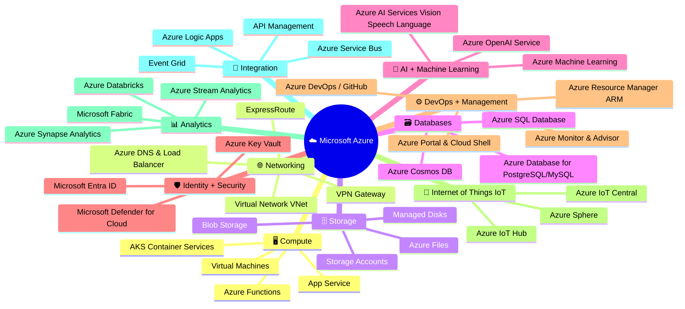
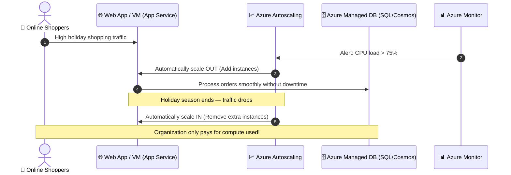

# Topic 1: What is Microsoft Azure?

**Microsoft Azure** is a continually expanding set of cloud services designed to help organizations meet current and future business and IT challenges. It provides the freedom to build, manage, and deploy applications on a massive global network using your favorite tools, open-source frameworks, and programming languages.

> 💡 **Core Definition:**  
> **Azure** is Microsoft's public cloud computing platform. It delivers on-demand compute, storage, networking, AI, databases, and analytics over the internet with pay-as-you-go pricing, backed by Microsoft's enterprise-grade global infrastructure.

---

## 🌟 1. What Does Azure Offer?

Azure empowers developers, IT professionals, and enterprises through four core value pillars:

```text
                        ☁️ THE FOUR CORE PILLARS OF AZURE
                                        │
        ┌───────────────────┬───────────┴───────────┬───────────────────┐
        ↓                   ↓                       ↓                   ↓
  🚀 Limitless        💡 Bring Ideas          🔄 Seamlessly       🛡️ Innovate on
    Innovation           to Life                 Unify                 Trust
  • Advanced AI       • Industry-leading      • Centralized        • Enterprise-grade
  • Modern tools        AI & Cloud tools        management           cybersecurity
  • Next-level ops    • Global deployment     • Unified platform   • Compliance leader
```

* 🚀 **Limitless Innovation:** Build intelligent applications and solutions with cutting-edge technology, tools, and services to elevate your operational efficiency.
* 💡 **Bring Ideas to Life:** Build on an enterprise-grade platform to advance your team's capabilities using industry-leading AI, serverless, and cloud services.
* 🔄 **Seamlessly Unify:** Efficiently manage all your infrastructure, data, analytics, and AI solutions across an integrated, single-pane-of-glass platform.
* 🛡️ **Innovate on Trust:** Rely on secure technology from a trusted partner dedicated to data privacy, ethical AI, zero-trust security, and regulatory compliance.

---

## 🗺️ 2. The 10 Core Azure Service Categories

Azure provides hundreds of modular cloud services across 10 primary architectural categories:



### 📋 Category Breakdown & Representative Services

| Category | Description | Representative Azure Services |
| :--- | :--- | :--- |
| 🖥️ **Compute** | On-demand cloud processing power, VMs, containers, and serverless code execution. | Azure Virtual Machines (VMs), App Service, Azure Functions, Azure Kubernetes Service (AKS). |
| 🌐 **Networking** | Connecting cloud resources, on-premises networks, and routing global internet traffic. | Virtual Network (VNet), VPN Gateway, ExpressRoute, Azure Load Balancer, Azure DNS. |
| 🗄️ **Storage** | Massively scalable, highly available, and secure data storage for files, disks, and unstructured data. | Azure Blob Storage, Azure Files, Azure Managed Disks, Azure Data Lake. |
| 🗃️ **Databases** | Fully managed relational, NoSQL, and in-memory databases with automated patching and backups. | Azure SQL Database, Azure Cosmos DB, Azure Database for PostgreSQL / MySQL. |
| 🧠 **AI + ML** | Pre-built cognitive AI models, generative AI foundation models, and custom ML training platforms. | Azure OpenAI Service, Azure AI Services (Vision, Speech, Language), Azure Machine Learning. |
| 🛡️ **Identity + Security** | Centralized identity management, single sign-on (SSO), key management, and threat defense. | Microsoft Entra ID (formerly Azure AD), Azure Key Vault, Microsoft Defender for Cloud, Microsoft Sentinel. |
| ⚙️ **DevOps + Management** | Tools to automate infrastructure provisioning, monitor resource health, and optimize governance. | Azure Portal, Cloud Shell, Azure Resource Manager (ARM/Bicep), Azure Monitor, Azure Policy. |
| 📡 **IoT (Internet of Things)** | Connect, monitor, and manage billions of IoT edge devices with bi-directional messaging. | Azure IoT Hub, Azure IoT Central, Azure Digital Twins. |
| 📊 **Analytics** | Big data processing, data warehousing, real-time analytics, and business intelligence. | Microsoft Fabric, Azure Synapse Analytics, Azure Databricks, Azure Data Factory. |
| 🔗 **Integration** | Connecting disparate enterprise systems, workflows, message queues, and API gateways. | Azure Logic Apps, Azure Service Bus, Azure Event Grid, Azure API Management. |

---

## 📈 3. The Cloud Modernization Journey

Organizations typically adopt Azure in stages—starting with migrating existing legacy workloads and gradually advancing toward modern cloud-native architectures:

```text
┌──────────────────────────────────────────────────────────────────────────────────┐
│                          🚀 CLOUD MODERNIZATION PATHWAY                          │
├────────────────────────────┬────────────────────────────┬────────────────────────┤
│  STEP 1: REHOST (IaaS)     │  STEP 2: REFACTOR (PaaS)   │  STEP 3: INNOVATE      │
│  "Lift-and-Shift"          │  "Managed Platforms"       │  "Cloud-Native & AI"   │
├────────────────────────────┼────────────────────────────┼────────────────────────┤
│ • Move existing on-prem    │ • Migrate to Azure App     │ • Event-driven serverless│
│   servers directly to      │   Service & Azure SQL      │   (Azure Functions)    │
│   Azure Virtual Machines   │ • Eliminate OS management  │ • Generative AI &      │
│ • Fast datacenter exit     │ • Built-in auto-scaling    │   Intelligent Bots     │
│ • Full administrative      │ • Automated backups and    │ • Microservices via    │
│   control retained         │   patching                 │   AKS & Containers     │
└────────────────────────────┴────────────────────────────┴────────────────────────┘
```

---

## 🏢 4. Practical Real-World Example: Seasonal Demand Spikes

### Scenario:
An e-commerce organization runs an internal sales application that experiences **massive spikes in customer traffic during the holiday season**, but requires modest capacity throughout the rest of the year.



### How Azure Solves This:
1. **Flexible Hosting:** Host the application on **Azure Virtual Machines** or **Azure App Service**.
2. **Managed Data:** Store product catalogs and orders in **Azure SQL Database** or **Azure Cosmos DB** without worrying about physical disk limits or manual backups.
3. **Dynamic Autoscaling:** Configure scaling rules so resources **scale out (add instances)** when traffic rises and **scale in (reduce instances)** when demand subsides.
4. **Cost Efficiency:** Under the consumption model, you **stop paying for unused server capacity** during non-peak months, eliminating wasted on-premises CapEx.
5. **Centralized Health Dashboard:** Track response times, error rates, and system uptime using **Azure Monitor**.

---

## 🤖 5. Advanced Capabilities: AI, ML, & Big Data

Azure goes beyond basic compute and storage by providing turnkey services that make building cutting-edge applications accessible:

* 🧠 **Azure OpenAI Service:** Integrate powerful generative AI models (such as GPT-4 and DALL-E) with enterprise-grade security, private networking, and responsible AI guardrails.
* 👁️ **Azure AI Services:** Add cognitive intelligence to apps—such as computer vision, speech-to-text, real-time translation, and natural language understanding—without needing custom ML models.
* 📊 **Azure Machine Learning:** End-to-end MLOps platform for data scientists to build, train, deploy, and monitor custom machine learning models at scale.
* 📈 **Elastic Storage Solutions:** Dynamically expand to store petabytes of structured and unstructured data with multi-tier lifecycle management (Hot, Cool, Cold, Archive).

---

## ⭐ AZ-900 Exam Quick Reference & Key Takeaways

| Exam Concept | Core Takeaway | Memory Trigger |
| :--- | :--- | :--- |
| **What is Microsoft Azure?** | A continually expanding public cloud platform delivering on-demand IT services globally. | **Azure = Microsoft's Global Public Cloud** |
| **Pillars of Azure** | Limitless innovation, bringing ideas to life, seamless unification, innovating on trust. | **Innovation + Unify + Trust** |
| **Modernization Approach** | Start with Lift-and-Shift (VMs), then modernize to PaaS (App Service/SQL) and AI/Serverless. | **IaaS ➔ PaaS ➔ Cloud-Native/AI** |
| **Handling Demand Spikes** | Use Azure's auto-scaling to scale up/out during peaks and scale down/in during lulls. | **Elasticity & Consumption Pricing** |
| **Turnkey AI Services** | Azure OpenAI Service and Azure AI Services allow adding AI without building models from scratch. | **Azure OpenAI & Cognitive AI** |
