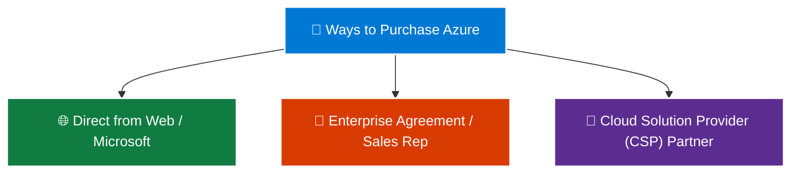

# Topic 2: Get Started with Azure Accounts and Subscriptions

To create and run services in Microsoft Azure, you need an **Azure Account** and an **Azure Subscription**. Understanding how accounts, subscriptions, and purchasing channels work is essential for organizing workloads, managing costs, and preparing for the AZ-900 exam.

> 💡 **Core Analogy:**  
> Think of your **Azure Account** as your global identity/membership card (e.g., your login credentials). Your **Azure Subscriptions** are individual billing agreements and project containers linked to that account (like having separate business and personal credit cards under one bank account).

---

## 🏛️ 1. Relationship Between Accounts, Subscriptions, and Resources

To deploy any cloud service (like a Virtual Machine, Database, or Storage Account), you must follow this foundational structural hierarchy:

```text
                           👤 AZURE ACCOUNT
                     (Sign-up / Identity Layer)
                                  │
         ┌────────────────────────┼────────────────────────┐
         ↓                        ↓                        ↓
  💳 Dev Subscription      💳 Test Subscription     💳 Prod Subscription
  (Billing & Isolation)    (Billing & Isolation)    (Billing & Isolation)
         │                        │                        │
  📦 Resource Groups       📦 Resource Groups       📦 Resource Groups
         │                        │                        │
  ☁️ Azure Resources        ☁️ Azure Resources        ☁️ Azure Resources
  (VMs, VNets, Storage)    (VMs, VNets, Storage)    (VMs, VNets, Storage)
```

### 🔑 Key Concepts:
1. **Azure Account:** Your identity (authenticated via Microsoft account, GitHub account, or Microsoft Entra ID) used to access Azure.
2. **Azure Subscription:** A logical container and **billing boundary** that links Azure resources to your Azure account.
   * You can create **multiple subscriptions** under a single account to separate environments (e.g., *Development*, *Testing*, *Production*) or departments (e.g., *Finance*, *HR*, *Engineering*).
3. **Azure Resources:** The actual instances of services you create (such as virtual machines, web apps, databases, and virtual networks) residing inside subscriptions.

---

## 🛒 2. How to Purchase Azure Access

Organizations and individuals can purchase and provision Azure access through three primary channels:



| Purchasing Channel | Description | Best Suited For |
| :--- | :--- | :--- |
| 🌐 **Web Direct (Direct from Azure Website)** | Purchase directly using a credit card or monthly invoicing via [azure.com](https://azure.microsoft.com). | Individuals, startups, dev/test exploration, small workloads. |
| 👔 **Microsoft Representative (Enterprise Agreement - EA)** | Direct contract with Microsoft sales for large enterprises committing to an annual spend with customized discounting. | Large enterprise organizations with high-volume cloud usage. |
| 🤝 **Cloud Solution Provider (CSP) Partner** | Purchased through Microsoft certified partner companies who provide bundled managed services, technical support, and unified billing. | Organizations looking for full-service managed cloud solutions and outsourced support. |

---

## 🎁 3. Free Azure Account Options for Beginners

Microsoft offers two distinct free tier options to help new learners and students get started with zero financial risk:

```text
┌──────────────────────────────────────┬──────────────────────────────────────┐
│       🎁 AZURE FREE ACCOUNT          │    🎓 AZURE FREE STUDENT ACCOUNT     │
├──────────────────────────────────────┼──────────────────────────────────────┤
│ • 12 Months free popular services    │ • 12 Months free popular services    │
│ • $200 USD credit (first 30 days)    │ • $100 USD credit (full 12 months)   │
│ • 55+ services ALWAYS free           │ • 55+ services ALWAYS free           │
│ • Requires: Credit card (ID check)   │ • Requires: School/University Email  │
│ • ❌ NO credit card is required!      │ • ✅ NO credit card needed!           │
└──────────────────────────────────────┴──────────────────────────────────────┘
```

---

### 🌟 A. The Azure Free Account
The standard free tier gives new users immediate access to explore Azure's core ecosystem.

* **What it includes:**
  1. 🗓️ **12 Months Free Access:** Free monthly allocations for popular services (such as Linux/Windows VMs, SQL Database, Blob Storage).
  2. 💵 **Credit for First 30 Days:** A initial credit (e.g., $200 USD or local equivalent) to spend on any service during your first month.
  3. ♾️ **55+ Always Free Services:** Lifelong free tier allocations for core services (like Azure App Service, Azure Functions, Event Grid, Cognitive Search).

* **Sign-Up Requirements:**
  * A **Microsoft Account (MSA)** or **GitHub Account**.
  * A valid **phone number**.
  * A **credit card or debit card** (*strictly for identity verification — your card will NOT be charged unless you explicitly choose to upgrade to a paid subscription*).

---

### 🎓 B. The Azure for Students Account
A specialized offering designed specifically for accredited students learning cloud computing.

* **What it includes:**
  1. 💵 **$100 USD Credit:** Valid for the entire **12-month period** (no 30-day expiration).
  2. 🗓️ **12 Months Free Access:** Popular Azure compute, storage, and networking services.
  3. 🛠️ **Free Developer Software:** Free access to professional tools, including Visual Studio Enterprise and GitHub Student Developer Pack.
  4. ♾️ **55+ Always Free Services.**

* **Sign-Up Requirements:**
  * Must be an active student with a valid **academic/school email address** (e.g., `.edu` or school domain).
  * 💳 **NO CREDIT CARD REQUIRED!** (Completely risk-free for students).

---

## ⚠️ 4. Essential Cost Management Best Practices for Practice Labs

When learning Azure or running hands-on labs:

```text
┌─────────────────────────────────────────────────────────────────────────────┐
│                    🛡️ LAB COST SAFETY CHECKLIST                             │
├─────────────────────────────────────────────────────────────────────────────┤
│ 1. 🛑 Stop / Deallocate VMs: When not in use, stop VMs so compute stops     │
│    billing (storage disks still incur nominal cost).                        │
│ 2. 🗑️ Delete Unused Resource Groups: Put lab resources in a dedicated lab   │
│    Resource Group; deleting the group cleans up everything inside at once. │
│ 3. 🔔 Set Up Budget Alerts: Configure Azure Cost Management budget alerts   │
│    to notify you via email if spending exceeds a specific threshold.        │
│ 4. 📊 Check Azure Advisor: Review cost optimization recommendations.        │
└─────────────────────────────────────────────────────────────────────────────┘
```

---

## ⚖️ Account & Subscription Comparison Table

| Feature / Offer | 🎁 Azure Free Account | 🎓 Azure Student Account | 💳 Pay-As-You-Go |
| :--- | :--- | :--- | :--- |
| **Initial Credit** | $200 USD | $100 USD | $0 (Direct billing) |
| **Credit Validity** | **30 Days** | **12 Months** | N/A |
| **Popular Services Free** | 12 Months | 12 Months | None (pay per use) |
| **Always Free Services** | 55+ Services | 55+ Services | 55+ Services |
| **Credit Card Required?** | **Yes** (Verification only) | **No** (Verification via .edu) | **Yes** (Billed monthly) |
| **Automatic Charges** | No (until upgrade) | No (stops when credit ends) | Yes (billed per usage) |
| **Target Audience** | General public / Beginners | University / College Students | Production / Enterprise |

---

## ⭐ AZ-900 Exam Quick Reference & Key Takeaways

| Exam Question Concept | Correct Answer / Principle | Memory Shortcut |
| :--- | :--- | :--- |
| **"What is required before you can create Azure resources?"** | An **Azure Subscription** | **Subscription = Prerequisite to build** |
| **"What serves as the billing and access boundary in Azure?"** | The **Azure Subscription** | **Subscription = Billing Boundary** |
| **"Can one Azure account have multiple subscriptions?"** | **Yes** (e.g., separate Dev, Test, Prod) | **1 Account ➔ Many Subscriptions** |
| **"What is the credit validity for the standard Free Account?"** | **30 Days** for credit, **12 Months** for popular free services | **Free Account = 30-day credit** |
| **"Can a student sign up for Azure without a credit card?"** | **Yes**, using an academic school email | **Student Account = No Credit Card** |
| **"What is a CSP in Azure purchasing?"** | **Cloud Solution Provider** (Microsoft Partner managing services) | **CSP = Partner Managed** |
