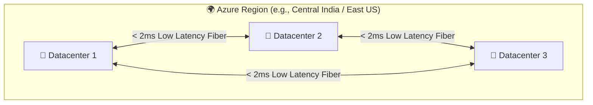

# Topic 3: Describe Azure Physical Infrastructure

Microsoft Azure runs on physical hardware housed in hyper-scale datacenters across the globe. Microsoft organizes this physical infrastructure into a structured hierarchy of **Datacenters**, **Availability Zones**, **Regions**, **Region Pairs**, and **Sovereign Regions** to deliver high performance, high availability, disaster resilience, and legal compliance.

> 💡 **Physical Hierarchy at a Glance:**  
> **Datacenter 🏢** *(Building)* ➔ **Availability Zone 🛡️** *(Independent Zone)* ➔ **Region 🌍** *(Geographical Area)* ➔ **Region Pair 🌎** *(Disaster Recovery Partner)* ➔ **Sovereign Region 🏛️** *(Isolated Government/Special Cloud)*

---

## 🗺️ Master Physical Infrastructure Architecture

```text
                                    🌍 MICROSOFT GLOBAL NETWORK
                                                 │
                  ┌──────────────────────────────┴──────────────────────────────┐
                  ↓                                                             ↓
        🏛️ COMMERCIAL AZURE CLOUD                                     🏛️ SOVEREIGN REGIONS
                  │                                            (US Gov, China 21Vianet)
     ┌────────────┴────────────┐
     ↓                         ↓
  🌍 REGION A ◄── Region ──► 🌍 REGION B
 (e.g., East US)   Pair    (e.g., West US)
     │                         │
 ┌───┼───┐                 ┌───┼───┐
 ↓   ↓   ↓                 ↓   ↓   ↓
 🛡️   🛡️   🛡️                 🛡️   🛡️   🛡️
Zone1 Zone2 Zone3         Zone1 Zone2 Zone3
 │   │   │                 │   │   │
 🏢   🏢   🏢                 🏢   🏢   🏢
Datacenters               Datacenters
```

---

## 🏢 1. Azure Datacenter

### What is a Datacenter?
A **Datacenter** is a physical, climate-controlled building containing tens of thousands of networked computer servers, data storage systems, power transformers, uninterruptible power supplies (UPS), backup generators, and cooling chillers.

```text
┌─────────────────────────────────────────────────────────────┐
│                    🏢 AZURE DATACENTER                      │
├─────────────────────────────────────────────────────────────┤
│  🖥️ Rack-Mounted Blade Servers (Compute / Memory)           │
│  🗄️ Storage Arrays (SSDs / HDDs / Disks)                   │
│  🌐 Fiber Optic High-Speed Switches & Routers               │
│  ⚡ Redundant Power Feeds & Diesel Backup Generators        │
│  ❄️ Liquid / Air HVAC Cooling Systems                       │
│  🔐 Multi-Layer Physical Security (Biometrics, Guards)     │
└─────────────────────────────────────────────────────────────┘
```

* **Customer Access:** Customers **never choose a specific physical datacenter** or server rack. Azure abstracts the physical hardware away.
* **Why it matters:** When you launch a Virtual Machine or database in Azure, it ultimately executes on physical hardware inside one of these secure facilities.

---

## 🌍 2. Azure Region

### What is an Azure Region?
An **Azure Region** is a defined geographical area on the planet that contains **at least one, but typically multiple datacenters** located nearby and networked together through a dedicated, low-latency regional fiber network.



### Why do we use Regions?
1. ⚡ **Low Latency:** Deploy services close to your end users to minimize network lag (e.g., deploying in *Central India* for users in Mumbai/Delhi).
2. 📜 **Data Residency & Compliance:** Adhere to country-specific laws (e.g., GDPR in Europe, RBI guidelines in India) by keeping data within national boundaries.
3. 📦 **Service Availability:** Most Azure services are globally available, but certain specialized VM series or newly released products roll out region-by-region.

---

## 🛡️ 3. Availability Zones (AZs)

### What is an Availability Zone?
An **Availability Zone** is a **physically separate datacenter location within an Azure Region**. Each Availability Zone is made up of one or more datacenters equipped with **independent power, independent cooling, and independent networking**.

```text
                       🌍 AZURE REGION
                              │
     ┌────────────────────────┼────────────────────────┐
     ↓                        ↓                        ↓
🛡️ ZONE 1                🛡️ ZONE 2                🛡️ ZONE 3
┌─────────────────┐      ┌─────────────────┐      ┌─────────────────┐
│ 🏢 Datacenter   │      │ 🏢 Datacenter   │      │ 🏢 Datacenter   │
│ ⚡ Power Feed A │      │ ⚡ Power Feed B │      │ ⚡ Power Feed C │
│ ❄️ Cooling A    │      │ ❄️ Cooling B    │      │ ❄️ Cooling C    │
│ 🌐 Network A    │      │ 🌐 Network B    │      │ 🌐 Network C    │
└─────────────────┘      └─────────────────┘      └─────────────────┘
         ▲                        ▲                        ▲
         └──────── High-Speed Private Fiber Optic ─────────┘
                    (< 2ms Round-Trip Latency)
```

### Key Properties of Availability Zones:
* **Isolation:** If a fire, flood, or power outage takes down **Zone 1**, **Zone 2** and **Zone 3** remain completely unaffected and operational.
* **Proximity:** Zones within a region are close enough to each other to support synchronous database replication with sub-2 millisecond latency.
* **Standard Minimum:** Enabled Azure regions feature a minimum of **3 separate Availability Zones**.

---

## ⚖️ 4. Region vs. Availability Zone: City Analogy

| Level | Real-World City Analogy | Azure Infrastructure Equivalent |
| :--- | :--- | :--- |
| **Region 🌍** | **A Metropolitan City** *(e.g., Mumbai, New York)* | A geographical cluster of datacenters. |
| **Availability Zone 🛡️** | **Separate Buildings in Different Suburbs** *(e.g., Building A in Suburb 1, Building B in Suburb 2)* | Physically isolated datacenters with separate power grids within that same city. |
| **Datacenter 🏢** | **A Specific Room / Floor in a Building** | The actual computer server hall. |

---

## 🧩 5. Azure Service Redundancy Categories

When deploying Azure resources, services are categorized based on their zone resilience:

```text
┌─────────────────────────┬─────────────────────────┬─────────────────────────┐
│   📍 ZONAL SERVICES     │ 🔄 ZONE-REDUNDANT SVCS  │  🌐 NON-REGIONAL SVCS   │
├─────────────────────────┼─────────────────────────┼─────────────────────────┤
│ • Pinned to ONE zone    │ • Replicated across     │ • Global services       │
│ • You choose the zone   │   multiple zones by     │ • Not tied to a single  │
│   (e.g., Zone 1)        │   Azure automatically   │   specific region       │
│ • e.g., Azure VM,       │ • e.g., Zone-Redundant  │ • e.g., Microsoft Entra │
│   Managed Disk, IP      │   Storage (ZRS), SQL DB │   ID, Traffic Manager   │
└─────────────────────────┴─────────────────────────┴─────────────────────────┘
```

### 1. 📍 Zonal Services (Zone-Pinned)
* You explicitly specify which Availability Zone the resource runs in (e.g., pinning VM 1 to *Zone 1* and VM 2 to *Zone 2*).
* **Examples:** Azure Virtual Machines, Managed Disks, Public IP Addresses.

### 2. 🔄 Zone-Redundant Services
* Azure automatically replicates data and instances across multiple Availability Zones without manual intervention.
* If one zone goes down, traffic fails over seamlessly to surviving zones.
* **Examples:** Zone-Redundant Storage (ZRS), Azure SQL Database (Zone-Redundant tier), Azure App Service Plan (Zone-Redundant).

### 3. 🌐 Non-Regional Services (Global Services)
* Services that are not bound to a specific Azure region or zone; they operate globally across the entire Microsoft edge network.
* Resilient to both zone-wide and region-wide catastrophic outages.
* **Examples:** Microsoft Entra ID (Azure AD), Azure DNS, Azure Traffic Manager, Azure Front Door.

---

## 🌎 6. Azure Region Pairs

### What is a Region Pair?
Each Azure Region is permanently linked with another region within the same geographic boundary (e.g., within North America, Europe, or Asia) located **at least 300 miles (approx. 480 km) apart**.

```text
         ┌─────────────────────────────────────────────────────────┐
         │             🌎 AZURE REGION PAIR (300+ Miles)           │
         ├───────────────────────────┬─────────────────────────────┤
         │  🌍 Primary Region        │  🌍 Secondary Paired Region │
         │  (e.g., East US)          │  (e.g., West US)            │
         │  ┌─────────────────────┐  │  ┌────────────────────────┐ │
         │  │ 🛡️ Zone 1 Zone 2 Zone3│  │  │ 🛡️ Zone 1 Zone 2 Zone3 │ │
         │  └─────────────────────┘  │  └────────────────────────┘ │
         └─────────────▲─────────────┴──────────────▲──────────────┘
                       └────── Cross-Region Link ───┘
```

### Benefits & Features of Region Pairs:
1. 🌪️ **Large-Scale Disaster Recovery:** Protects against massive regional events (e.g., hurricanes, earthquakes, civil power grid collapses) that could take down an entire region.
2. 🔄 **Sequential Platform Updates:** Microsoft rolls out OS and infrastructure updates to **only one region in a pair at a time**, preventing an update failure from causing global downtime.
3. 🥇 **Priority Recovery:** In the event of a catastrophic global outage, Microsoft prioritizes restoring at least one region from every pair first.
4. 📂 **Data Residency:** Paired regions reside within the same country/tax boundary to preserve compliance (exception: *Brazil South* is paired with *South Central US*).

---

## ⚔️ 7. Availability Zones vs. Region Pairs

| Feature | 🛡️ Availability Zones | 🌎 Region Pairs |
| :--- | :--- | :--- |
| **Scope of Protection** | Datacenter-level / Zone-level failures (power/fire). | Regional-scale disasters (earthquakes, floods, grid blackout). |
| **Physical Distance** | Nearby within the same metropolitan region (< 2ms latency). | Far apart (**300+ miles / 480+ km** apart). |
| **Replication Latency** | Ultra-low synchronous replication. | Asynchronous cross-region replication. |
| **Update Rollout** | May be updated together within the region. | **Sequential updates** (never updated simultaneously). |
| **Data Residency** | Always within the same region. | Always within the same geography (except Brazil South). |

---

## ⚠️ 8. Critical AZ-900 Exam Trap: Automatic Replication

> [!WARNING]
> ### 🛑 Does a Region Pair Automatically Back Up and Replicate All Resources?
> **NO!**  
> Simply creating a resource in a paired region does **NOT** automatically copy your VMs, configurations, or databases to the secondary region.
> 
> * **Automatic Geo-Replication:** Supported by specific storage tiers (e.g., GRS - Geo-Redundant Storage).
> * **Manual Configuration Required:** For Virtual Machines, VNets, and most PaaS services, **YOU** must explicitly configure disaster recovery (e.g., via Azure Site Recovery or Geo-Replicas).

---

## 🏛️ 9. Azure Sovereign Regions

Sovereign regions are **physically and logically isolated cloud instances** of Azure built specifically to meet stringent legal, defense, security, and government compliance requirements.

```text
┌──────────────────────────────────────┬──────────────────────────────────────┐
│        🇺🇸 AZURE US GOVERNMENT        │           🇨🇳 AZURE CHINA             │
├──────────────────────────────────────┼──────────────────────────────────────┤
│ • Physically isolated from global    │ • Physically isolated from global    │
│   commercial Azure                   │   commercial Azure                   │
│ • Dedicated to US Federal, State,    │ • Operated independently by          │
│   Local government, and DoD          │   21Vianet (local Chinese provider)  │
│ • Screened US personnel only         │ • Meets Chinese regulatory & data    │
│ • Examples: US Gov Virginia,         │   localization laws                  │
│   US Gov Arizona, US DoD Central     │ • Examples: China East, China North  │
└──────────────────────────────────────┴──────────────────────────────────────┘
```

1. 🇺🇸 **Azure Government (US):**
   * Accessible only to validated US federal, state, local, tribal governments, and authorized defense contractors.
   * Facilities and personnel are screened and located exclusively in the United States.
2. 🇨🇳 **Azure China (operated by 21Vianet):**
   * The first international public cloud provider in China compliant with Chinese telecommunication regulations.
   * Microsoft licenses its technology, but **21Vianet operates, manages, and delivers** the infrastructure locally.

---

## 🎯 AZ-900 Exam Quick Reference & Memory Shortcuts

| Term / Component | Core Definition | Memory Shortcut |
| :--- | :--- | :--- |
| **Datacenter 🏢** | Physical building housing servers, power, and cooling. | **Physical Building** |
| **Region 🌍** | Geographical area containing multiple datacenters connected via low-latency network. | **Geographical Area** |
| **Availability Zone 🛡️** | One or more physically isolated datacenters with independent power/cooling/network within a region. | **Isolated Datacenter within Region** |
| **Zonal Service 📍** | A resource explicitly pinned to a specific Availability Zone (e.g., VM). | **Customer selects Zone** |
| **Zone-Redundant 🔄** | Azure automatically replicates across multiple zones (e.g., ZRS). | **Azure manages multi-zone copies** |
| **Non-Regional 🌐** | Global service not bound to any specific region (e.g., Entra ID, DNS). | **Global, Region-Independent** |
| **Region Pair 🌎** | Two regions separated by 300+ miles for disaster recovery and sequential updates. | **Cross-Region DR (300+ miles)** |
| **Sovereign Region 🏛️** | Isolated Azure cloud for government and strict legal compliance (US Gov, China). | **Isolated Compliant Cloud** |
