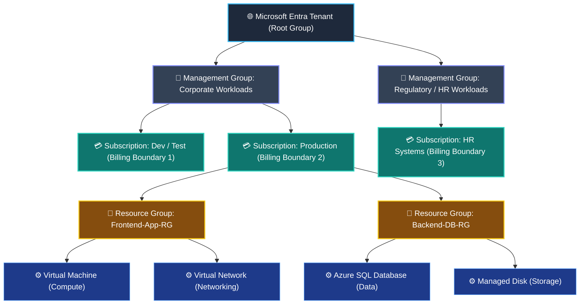
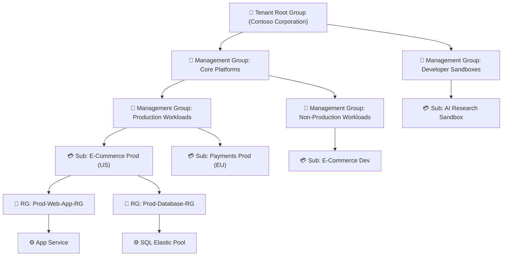

# Topic 4: Describe Azure Management Infrastructure

The **Azure Management Infrastructure** is a hierarchical organizational model designed to help organizations structure, manage, govern, and secure cloud resources at scale. As cloud adoption grows from a few virtual machines to thousands of enterprise workloads across multiple departments, this hierarchy provides centralized control over **access (RBAC)**, **compliance (Azure Policy)**, and **billing/cost management**.

> 💡 **The Core Management Hierarchy at a Glance:**  
> **Management Groups 🏢** *(Governance & Multi-Subscription Policy)* ➔ **Subscriptions 💳** *(Billing & Access Boundary)* ➔ **Resource Groups 📁** *(Logical Organization & Lifecycle Container)* ➔ **Resources ⚙️** *(Individual Cloud Services)*

---

## 🗺️ Master Azure Management Hierarchy Architecture

```text
                             🌐 MICROSOFT ENTRA TENANT
                                         │
                        👑 TENANT ROOT MANAGEMENT GROUP
                                         │
         ┌───────────────────────────────┴───────────────────────────────┐
         ↓                                                               ↓
🏢 MG: Core Business                                            🏢 MG: Enterprise IT
         │                                                               │
   ┌─────┴─────┐                                                   ┌─────┴─────┐
   ↓           ↓                                                   ↓           ↓
🏢 MG: Dev   🏢 MG: Prod                                        🏢 MG: Shared 🏢 MG: Regional
   │           │                                                   │           │
   ↓           ↓                                                   ↓           ↓
💳 Sub: Dev  💳 Sub: Prod                                       💳 Sub: Ops  💳 Sub: APAC
   │           │
   ├───────────┴───────────┐
   ↓                       ↓
📁 RG: Web-App-RG       📁 RG: Database-RG
   │                       │
   ├───────────┐           ├───────────┐
   ↓           ↓           ↓           ↓
⚙️ VM       ⚙️ VNet     ⚙️ SQL DB   ⚙️ Storage
```



---

## ⚙️ 1. Azure Resources

### What is a Resource?
A **Resource** is the basic, fundamental building block of Azure. Any cloud asset, service, or component that you create, configure, provision, or deploy in Microsoft Azure is a resource.

```text
┌────────────────────────────────────────────────────────────────────────┐
│                        ⚙️ AZURE RESOURCE EXAMPLES                      │
├───────────────────┬────────────────────┬───────────────────────────────┤
│ 🖥️ Compute        │ 🌐 Networking      │ 🗄️ Storage & Databases        │
│ • Virtual Machine │ • Virtual Network  │ • Blob Storage Account        │
│ • App Service     │ • Network Int (NIC)│ • Azure SQL Database          │
│ • Azure Function  │ • Public IP / NSG  │ • Azure Cosmos DB             │
└───────────────────┴────────────────────┴───────────────────────────────┘
```

### Key Properties of Resources:
* **Unique Resource ID:** Every resource has a globally unique Azure Resource Manager (ARM) identifier string (e.g., `/subscriptions/{sub-id}/resourceGroups/{rg-name}/providers/Microsoft.Compute/virtualMachines/{vm-name}`).
* **Target Location:** When deployed, every resource is provisioned into a specific Azure Region (or is Non-Regional/Global).
* **Tagging Support:** Resources can be tagged with custom `Key:Value` metadata pairs (e.g., `Environment:Production`, `CostCenter:Engineering`) for cost tracking and filtering.

---

## 📁 2. Azure Resource Groups

### What is a Resource Group?
A **Resource Group** is a logical container that holds related Azure resources for an application or workload. It allows you to manage, monitor, provision, and delete multiple resources as a single unified entity.

```text
                     📁 RESOURCE GROUP (Logical Container)
 ┌─────────────────────────────────────────────────────────────────────────┐
 │                                                                         │
 │   🖥️ Web Server VM        🌐 Virtual Network         🗄️ SQL Database   │
 │   (Location: East US)     (Location: East US)       (Location: West US) │
 │                                                                         │
 │   🔐 Key Vault            📊 Log Analytics          💾 Managed Disk     │
 │   (Location: East US)     (Location: East US)       (Location: East US) │
 └─────────────────────────────────────────────────────────────────────────┘
```

### 🔒 The 5 Golden Rules of Resource Groups

```text
┌─────────────────────────────────────────────────────────────────────────┐
│                      5 CRITICAL RESOURCE GROUP RULES                    │
├─────────────────────────────────────────────────────────────────────────┤
│ 1️⃣ Exactly ONE Group : A resource must belong to exactly one RG at a time.│
│ 2️⃣ NO Nesting       : Resource Groups CANNOT be nested inside other RGs.│
│ 3️⃣ NO Renaming      : Resource Groups CANNOT be renamed after creation. │
│ 4️⃣ Cascade Actions  : Deleting an RG deletes ALL resources inside it!    │
│ 5️⃣ Multi-Region OK  : Resources inside an RG can live in DIFFERENT regions│
└─────────────────────────────────────────────────────────────────────────┘
```

1. **Strict Membership (No Shared Ownership):**
   * Every resource must belong to **exactly one** resource group.
   * You **can move** supported resources between resource groups or across subscriptions, but a resource cannot exist simultaneously in two groups.
2. **Cannot Be Nested:**
   * A resource group cannot contain another child resource group (flat hierarchy inside subscriptions).
3. **Cannot Be Renamed:**
   * Once created, a resource group name is permanent. To change a name, you must create a new RG, move the resources over, and delete the old one.
4. **Cascading Lifecycle & Security Management:**
   * **Deletion:** Deleting a resource group automatically and permanently deletes **all resources contained within it**.
   * **Access Control:** Granting RBAC permissions (e.g., *Contributor*, *Reader*) on a resource group automatically grants those exact permissions to every resource inside it.
5. **Location Independence (Crucial Exam Concept):**
   * A resource group itself has a location (where its management metadata is stored).
   * However, **resources inside the resource group do NOT need to be in the same location as the resource group**, and they do NOT need to be in the same location as each other.

### 💡 Common Resource Group Structuring Strategies

* **By Application Lifecycle (Best Practice):** Group resources that share the same lifecycle together (e.g., `Dev-ECommerce-RG`, `Prod-ECommerce-RG`). When the dev project ends, deleting the single RG cleanly tears down all VMs, databases, and VNets without leaving orphaned resources.
* **By Department / Workload:** Grouping by project team (e.g., `Marketing-Campaign-RG`, `HR-Portal-RG`) to isolate administration and cost monitoring.
* **By Shared Infrastructure:** Grouping shared baseline assets (e.g., `Core-Hub-Network-RG`) managed by centralized IT teams.

---

## 💳 3. Azure Subscriptions

### What is an Azure Subscription?
An **Azure Subscription** is a fundamental unit of **management**, **billing**, and **scale**. It links an Azure account (an identity in Microsoft Entra ID) with the cloud resources deployed within Azure.

Using Azure requires at least one active subscription. An organization or account can have multiple subscriptions to isolate workloads, departments, or billing streams.

```text
                      🌐 MICROSOFT ENTRA TENANT / ACCOUNT
                                       │
            ┌──────────────────────────┴──────────────────────────┐
            ↓                                                     ↓
  💳 SUBSCRIPTION 1: PRODUCTION                         💳 SUBSCRIPTION 2: DEVELOPMENT
  • Dedicated Invoice #1001                             • Dedicated Invoice #1002
  • Strict RBAC Policies                                • Broad Developer Sandbox Access
  • Spending Limit: $50,000/mo                          • Spending Limit: $5,000/mo
  • High Quota (e.g., 500 vCPUs)                        • Standard Quota (e.g., 50 vCPUs)
```

### 🛡️ The Two Primary Subscription Boundaries

| Boundary Type | How it Works | Key Purpose |
| :--- | :--- | :--- |
| 💰 **Billing Boundary** | Azure generates **separate billing reports and individual invoices** for each subscription. | Tracks financial costs separately, enables departmental chargebacks, and enforces independent budgets. |
| 🔐 **Access Control Boundary** | Azure applies access management (RBAC) and compliance policies at the subscription level. | Establishes security silos (e.g., granting developers full admin access to Dev subscription, while locking down Prod). |

### 🚀 Why Organizations Create Multiple Subscriptions

1. **Environment Lifecycle Separation:**
   * Isolating `Sandbox`, `Development`, `Testing / Staging`, and `Production` into distinct subscriptions prevents accidental changes to production workloads.
2. **Departmental & Organizational Boundaries:**
   * Giving Finance, HR, Marketing, and Engineering their own subscriptions ensures each team is billed independently and only manages their own resources.
3. **Scaling & Service Quota Limits:**
   * Azure imposes per-subscription default soft limits (e.g., number of VM vCPUs, number of Virtual Networks per region). Creating multiple subscriptions multiplies your total capacity and prevents one team from exhausting organizational quotas.
4. **Billing & Cost Allocation:**
   * Enables clear financial chargeback/showback accounting without relying solely on tagging queries.

---

## 🏢 4. Azure Management Groups

### What is an Azure Management Group?
**Azure Management Groups** sit above subscriptions in the hierarchy. They provide a governance scope above subscriptions, enabling organizations to efficiently manage **access (RBAC)**, **policies (Azure Policy)**, and **compliance** across multiple subscriptions simultaneously.

All subscriptions within a management group automatically **inherit** the conditions, permissions, and policies applied to the management group.

```text
                           👑 TENANT ROOT GROUP
                                     │
                 ┌───────────────────┴───────────────────┐
                 ↓                                       ↓
        🏢 PRODUCTION GROUP                      🏢 NON-PRODUCTION GROUP
     (Policy: Only US East & West)             (Policy: Limit VM SKUs to B-Series)
                 │                                       │
         ┌───────┴───────┐                       ┌───────┴───────┐
         ↓               ↓                       ↓               ↓
   💳 Sub: Web Prod 💳 Sub: DB Prod        💳 Sub: Dev-1   💳 Sub: Dev-2
         │               │                       │               │
      [Inherits       [Inherits               [Inherits       [Inherits
      US Region       US Region              B-Series VM     B-Series VM
       Policy]         Policy]                 Policy]         Policy]
```

### 👑 The Tenant Root Group
* Every Microsoft Entra tenant is automatically provisioned with a single top-level **Tenant Root Group**.
* All management groups and subscriptions ultimately fold up to this root group.
* Applying policies or role assignments at the Root Group guarantees global compliance across **every current and future subscription** in the entire organization.

### 📐 Key Rules & Technical Limits of Management Groups

* **Tree Depth:** Management group hierarchies can be nested up to **6 levels deep** (this limit does *not* include the Tenant Root Group level or the individual subscription level).
* **Maximum Groups:** A single Microsoft Entra tenant supports up to **10,000 management groups**.
* **Single Parent Rule:** Each management group and subscription can have **only one parent** management group.
* **Strict Inheritance:** Policies and access rules applied at a parent group **cannot be overridden or bypassed** by child subscriptions or resource owners.

---

## 🌊 5. Governance & Policy Inheritance Flow

The Azure management infrastructure operates on a strict **top-down cascading inheritance model**. Permissions and governance rules flow downward from the broadest scope to the most specific scope.

```text
┌────────────────────────────────────────────────────────────────────────┐
│                        SCOPES OF INHERITANCE                           │
├────────────────────────────┬───────────────────────────────────────────┤
│ 1️⃣ Management Group Scope  │ 🌐 Broadest Scope: Governs multiple subs   │
│            ↓               │                                           │
│ 2️⃣ Subscription Scope      │ 💳 Governs all Resource Groups in the sub │
│            ↓               │                                           │
│ 3️⃣ Resource Group Scope    │ 📁 Governs all Resources in the group     │
│            ↓               │                                           │
│ 4️⃣ Individual Resource     │ ⚙️ Narrowest Scope: Applies to 1 resource │
└────────────────────────────┴───────────────────────────────────────────┘
```

### 💡 Real-World Governance Scenarios:

1. **Enforcing Regional Compliance via Azure Policy:**
   * **Goal:** Ensure all production workloads are deployed strictly within *North Europe* for GDPR data residency.
   * **Implementation:** Apply an Azure Policy at the `Production Management Group` level restricting allowed locations to *North Europe*.
   * **Result:** Every subscription under this group immediately inherits the rule. If a developer tries to deploy a VM in *East US*, the deployment is blocked instantly.
2. **Simplified Enterprise Role-Based Access Control (RBAC):**
   * **Goal:** Grant the central Security Audit team read-only access across all 200 corporate subscriptions.
   * **Implementation:** Assign the `Reader` role to the Security Group at the `Tenant Root Group` level once.
   * **Result:** Permissions cascade across all 200 subscriptions and all their resource groups automatically—no need to create 200 individual role assignments or run maintenance scripts.

---

## 🏢 6. Enterprise Hierarchy: Complete Real-World Scenario

Here is how a multinational enterprise organizes its Azure management infrastructure:



### Breakdown of Controls:
* **Tenant Root Group:** Global security tools (Microsoft Defender for Cloud, Microsoft Sentinel) enabled everywhere.
* **Sandbox Management Group:** Hard monthly spending caps with automated shutdown scripts to prevent unexpected cloud costs.
* **Production Management Group:** Requires Multi-Factor Authentication (MFA), disables public IP creation on VMs, and enforces geo-redundant backups.

---

## ⚖️ 7. Full Layer-by-Layer Comparison

| Hierarchy Level | Primary Function | Belongs To | Can Contain | Key AZ-900 Exam Fact |
| :--- | :--- | :--- | :--- | :--- |
| **🏢 Management Groups** | Centralized governance, Azure Policy, RBAC at scale | Tenant Root or parent MG | Child Management Groups & Subscriptions | Up to 6 levels deep (excluding root/subs), max 10,000 MGs per tenant. |
| **💳 Subscriptions** | Unit of billing, invoices, access boundary, and quotas | Exactly 1 Management Group | Resource Groups | One account can hold multiple subscriptions; provides separate invoices. |
| **📁 Resource Groups** | Logical container for application lifecycle management | Exactly 1 Subscription | Azure Resources | **Cannot be nested**, **cannot be renamed**, resources can be in different regions. |
| **⚙️ Resources** | Individual deployed cloud assets (VMs, DBs, Storage) | Exactly 1 Resource Group | None (Atomic item) | Every resource has a unique ARM Resource ID and inherits permissions from its RG. |

---

## ⚠️ 8. AZ-900 Exam Pitfalls & Watch-Outs

> [!WARNING]
> ### 🛑 Common Exam Traps & Misconceptions:
> 
> 1. **"Can a Resource Group contain another Resource Group?"**  
>    ❌ **NO!** Resource groups cannot be nested.
> 
> 2. **"Can a resource and its Resource Group be in different Azure regions?"**  
>    ✅ **YES!** An RG created in *East US* can hold a VM deployed in *West Europe* and a database in *Central India*.
> 
> 3. **"Can a Subscription belong to multiple Management Groups?"**  
>    ❌ **NO!** Each subscription and management group can have **only one parent**.
> 
> 4. **"Can child subscriptions override policies inherited from a Management Group?"**  
>    ❌ **NO!** Policy inheritance is cumulative and cannot be overridden by lower levels.
> 
> 5. **"What happens to resources when a Resource Group is deleted?"**  
>    💥 **All resources inside the group are permanently deleted.**
> 
> 6. **"Can a resource belong to multiple Resource Groups at the same time?"**  
>    ❌ **NO!** Exactly one resource group per resource at any single moment.

---

## 🎯 AZ-900 Exam Quick Reference & Memory Shortcuts

| Term | Core Role | Instant Memory Trigger |
| :--- | :--- | :--- |
| **Azure Resource ⚙️** | Individual cloud component / service instance | **Basic Building Block** |
| **Resource Group 📁** | Logical container sharing lifecycle and management | **Lifecycle Container (No Nesting/Renaming)** |
| **Subscription 💳** | Unit of billing, invoicing, access boundary, and scale | **Billing & Access Boundary** |
| **Management Group 🏢** | Multi-subscription policy and RBAC governance container | **Governance & Policy Container (6 levels deep)** |
| **Tenant Root Group 👑** | Top-level parent for all MGs and subscriptions in an Entra tenant | **Global Master Parent Group** |
| **Inheritance Flow 🌊** | Top-down cascade (MG ➔ Sub ➔ RG ➔ Resource) | **Permissions & Policies Cascade Downward** |
