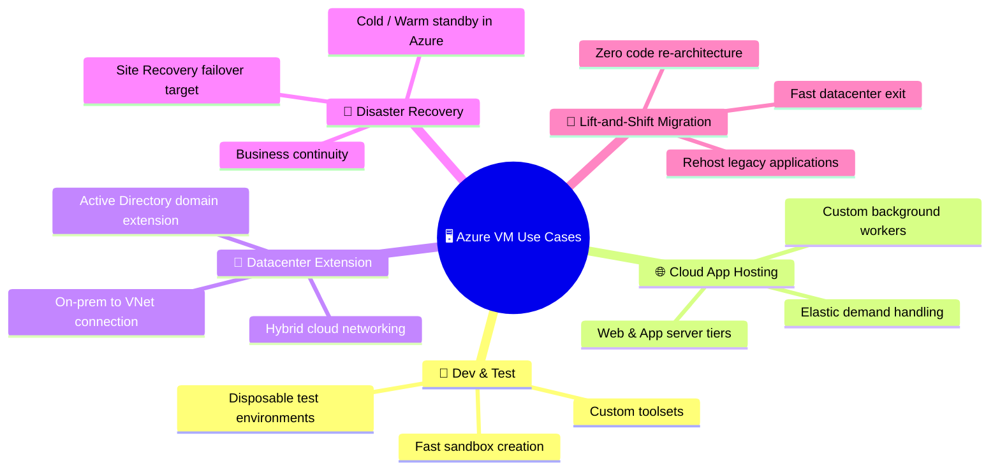
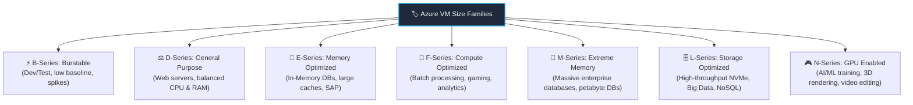
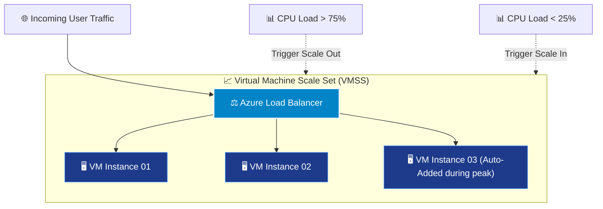
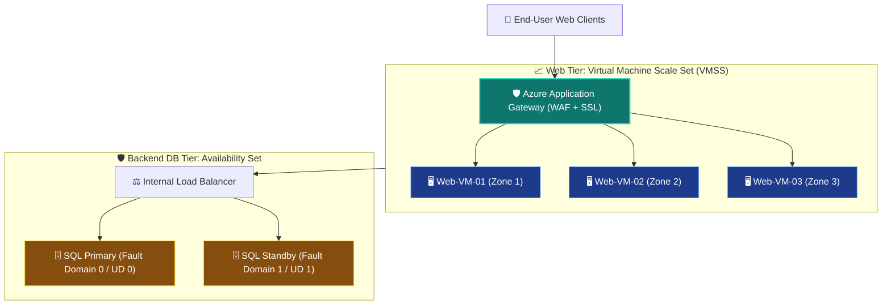

# Topic 1: Describe Azure Virtual Machines (VMs)

**Azure Virtual Machines (VMs)** are on-demand, scalable computing resources that provide virtualized servers in the cloud as an **Infrastructure as a Service (IaaS)** offering. Just like a physical on-premises server, an Azure VM gives you complete control over the operating system, storage disks, networking configurations, and installed software applications.

> 💡 **Core Definition:**  
> An **Azure Virtual Machine** is an **IaaS** compute service that allows you to provision and customize virtualized hardware (vCPUs, RAM, storage, and networking) in Azure. You eliminate the need to purchase or maintain physical server hardware, while retaining total administrative control over the guest OS and application stack.

---

## 🖥️ 1. What are Azure Virtual Machines?

In the Azure cloud hierarchy, Virtual Machines represent the baseline compute service for workloads requiring deep customizability and direct operating system access.

```text
┌────────────────────────────────────────────────────────────────────────┐
│              🏢 ON-PREMISES SERVER vs. ☁️ AZURE VIRTUAL MACHINE         │
├───────────────────────────────────┬────────────────────────────────────┤
│ 🏢 On-Premises Physical Server     │ ☁️ Azure Virtual Machine (IaaS)    │
├───────────────────────────────────┼────────────────────────────────────┤
│ • Buy physical server hardware    │ • Provision in seconds via Portal/CLI│
│ • Rack, stack, power, and cool    │ • Zero hardware maintenance        │
│ • Long procurement cycles (weeks) │ • Elastic hourly/per-second billing│
│ • Difficult to scale dynamically  │ • Instant resizing & auto-scaling  │
│ • You manage everything end-to-end│ • Microsoft manages physical infra │
└───────────────────────────────────┴────────────────────────────────────┘
```

### 🤝 The Shared Responsibility Model for Azure VMs (IaaS)

Because Azure VMs are an **IaaS** service:
* **☁️ Microsoft Manages:** Physical datacenters, server hardware, power, cooling, physical network switches, hypervisors, and virtualization hosts.
* **👤 You (Customer) Manage:** Guest operating system installation/configuration, OS security patches, software updates, antivirus/firewalls, network security rules (NSGs), data, and runtime applications.

### 🎯 When to Choose Azure VMs:
1. **Total Control Over the OS:** You require administrative (root/Administrator) privileges to customize low-level OS settings or registry keys.
2. **Custom Software & Dependencies:** You need to run proprietary legacy applications, specific software versions, or third-party packages not supported by managed platform services (PaaS).
3. **Custom Hosting & Network Configurations:** You need complex multi-NIC setups, customized network routing, or specific local file storage architectures.
4. **Prebuilt & Custom Images:** You can instantly deploy VMs from pre-configured **Azure Marketplace images** (e.g., Windows Server, Ubuntu, Red Hat Enterprise Linux, SQL Server on Windows) or your organization's own standardized custom golden images.

---

## 💼 2. Primary VM Use Cases & Workload Scenarios



### 📋 Detailed Use Case Breakdown

| Use Case | Scenario Description | Why Azure VMs are Ideal |
| :--- | :--- | :--- |
| 🧪 **Testing & Development** | Development teams need isolated, varied environments (different Linux distros, Windows builds) to test software builds. | Spin up VMs on demand, test the application, and shut down or delete them immediately to avoid wasted spend. |
| 🌐 **Cloud Application Hosting** | Running multi-tier enterprise web applications, background batch processors, or CRM engines in the cloud. | Scale compute power up or down dynamically as user traffic fluctuates. |
| 🏢 **Datacenter Extension (Hybrid)** | Extending an on-premises enterprise network directly into Azure using VPN Gateway or ExpressRoute. | Host domain controllers, file servers, or line-of-business applications seamlessly inside connected Virtual Networks (VNets). |
| 🔄 **Disaster Recovery (DR)** | Maintaining redundant failover infrastructure in the cloud if an on-premises datacenter suffers an outage. | Keep replica VMs or disk snapshots in Azure ready to boot up during a disaster without maintaining redundant physical datacenters. |
| 🚀 **Lift-and-Shift Migration (Rehosting)** | Moving legacy enterprise applications out of physical datacenters into the cloud quickly. | Migrate server images directly to Azure VMs with minimal application code changes or redesign. |

---

## ⚙️ 3. VM Resources & Sizing Dimensions

When you provision an Azure Virtual Machine, you assemble a composite cloud resource composed of compute, memory, storage, and networking:

```text
                               ┌───────────────────────────┐
                               │   🖥️ AZURE VIRTUAL MACHINE │
                               └─────────────┬─────────────┘
                                             │
      ┌──────────────────────┬───────────────┴───────────────┬──────────────────────┐
      ↓                      ↓                               ↓                      ↓
🎛️ Compute (vCPUs)     🧠 Memory (RAM)                 💾 Storage Disks        🌐 Networking
• Core count           • Capacity in GiB               • OS Disk (Boot)        • Virtual Network (VNet)
• Clock speed / Gen    • Memory-to-CPU ratio           • Data Disks (Persist)  • Network Interface (NIC)
• CPU architecture     • In-memory caching             • Temp Disk (Volatile)  • Public / Private IP
  (x64, ARM64)           performance                   • HDD / SSD / Ultra     • Network Security Group
```

### 📐 Key Sizing Dimensions

* **vCPU Count:** Virtual central processing units allocated to the VM; determines processing power for CPU-bound and concurrent workloads.
* **RAM (Memory):** Determines how much working data, database cache, or application state the VM can maintain in active memory.
* **Storage Disk Configuration:** Determines supported disk types (Standard HDD, Standard SSD, Premium SSD, Ultra Disk), maximum IOPS (Input/Output Operations Per Second), and throughput (MB/s).
* **Network Bandwidth:** Dictates maximum network throughput and support for Accelerated Networking (SR-IOV).
* **Premium SSD Support (`s` designation):** Indicates whether the VM size supports high-performance Premium SSD managed disks.
* **Hardware Generation:** Represents the underlying physical server architecture (e.g., `v3`, `v4`, `v5`), affecting clock speed, memory bandwidth, and power efficiency.

---

## 🏷️ 4. Azure VM Size Families & Naming Conventions

Azure groups virtual machine sizes into **Families**, each optimized for specific workload profiles:



### 📊 Comprehensive VM Families Reference Table

| Family | Category Focus | Key Characteristics | Typical Example Workloads |
| :--- | :--- | :--- | :--- |
| **B-Series** | ⚡ **Burstable** | Cost-effective; runs at low baseline CPU and accrues credits to burst up to 100% CPU during activity spikes. | Dev/test environments, low-traffic web servers, small proof-of-concepts, build servers. |
| **D-Series** | ⚖️ **General Purpose** | Balanced CPU-to-memory ratio; high-performance local storage. | Enterprise web servers, application tiers, small-to-medium relational databases. |
| **E-Series** | 🧠 **Memory Optimized** | High memory-to-CPU ratio; large RAM allocations per core. | In-memory caches (Redis), relational database servers, real-time analytics engines. |
| **F-Series** | 🚀 **Compute Optimized** | High CPU-to-memory ratio; higher clock speeds per core. | Compute-intensive batch jobs, web servers with heavy processing, analytics, video encoding. |
| **M-Series** | 🐘 **Memory Heavy** | Ultra-high memory capacities (up to multiple Terabytes of RAM). | Massive enterprise databases (e.g., SAP HANA, huge SQL Server data warehouses). |
| **L-Series** | 🗄️ **Storage Optimized** | Direct-attached low-latency local NVMe SSD storage with massive I/O throughput. | NoSQL databases (Cassandra, MongoDB), data warehousing, high-throughput log processing. |
| **N-Series** | 🎮 **GPU Enabled** | Integrated NVIDIA GPU hardware acceleration. | AI/ML training & inference, 3D CAD rendering, visual simulations, high-end video workstations. |

---

### 🔍 Decoding Azure VM Naming Conventions

Azure VM names follow a structured syntax that reveals key hardware capabilities at a glance:

```text
                          Standard_D2s_v5
                             │   ││ │  └── Generation (Version 5 hardware)
                             │   ││ └───── Feature: 's' = Premium SSD Storage Supported
                             │   │└────── Number of vCPUs (2 vCPUs)
                             │   └─────── Sub-family / Family Letter (D = General Purpose)
                             └─────────── VM Tier (Standard)
```

```text
┌──────────────────────────────────────────────────────────────────────────┐
│                   DECODING COMMON VM NAME MODIFIERS                      │
├───────────┬────────────────────────────┬─────────────────────────────────┤
│ Modifier  │ Meaning                    │ Example                         │
├───────────┼────────────────────────────┼─────────────────────────────────┤
│ **s**     │ Premium SSD Disk Capable   │ `Standard_D4s_v5`               │
│ **a**     │ AMD-based Processor        │ `Standard_D4as_v5`              │
│ **p**     │ ARM-based (Ampere) CPU     │ `Standard_D4ps_v5`              │
│ **d**     │ Includes Local Temp Disk   │ `Standard_D4ds_v5`              │
│ **m**     │ Memory Intensive Variant   │ `Standard_E64ms_v5`             │
│ **v#**    │ Hardware Generation Number │ `v3`, `v4`, `v5`                │
└───────────┴────────────────────────────┴─────────────────────────────────┘
```

> 📌 **Exam Tip:** Start by selecting the **family** that matches your workload type (e.g., *E-series* for high RAM, *F-series* for high CPU), then choose the specific **vCPU/RAM size**, and finally scale horizontally or vertically as performance requirements grow.

---

## 🔄 5. High Availability, Scalability & Resiliency for VMs

To build reliable enterprise architectures, Azure provides multiple levels of redundancy and scalability for virtual machines:

```text
┌─────────────────────────────────────────────────────────────────────────────────┐
│                          AZURE VM RESILIENCY SPECTRUM                           │
├───────────────────┬────────────────────┬───────────────────┬────────────────────┤
│ 1️⃣ Single VM      │ 2️⃣ Availability Set│ 3️⃣ Availability   │ 4️⃣ Virtual Machine │
│                   │                    │    Zones          │    Scale Sets      │
├───────────────────┼────────────────────┼───────────────────┼────────────────────┤
│ • Basic workload  │ • Protects against │ • Protects against│ • Auto-scaling     │
│ • No redundancy   │   hardware/power/  │   datacenter-level│ • Identical,       │
│ • SLA depends on  │   update failures  │   building outages│   load-balanced    │
│   Premium SSD     │   inside 1 data-   │ • Multi-datacenter│   VM clusters      │
│   disks (99.9%)   │   center (99.95%)  │   in 1 region     │ • Central config   │
└───────────────────┴────────────────────┴───────────────────┴────────────────────┘
```

---

### 📈 1. Virtual Machine Scale Sets (VMSS)

**Virtual Machine Scale Sets** let you deploy and manage an identical group of load-balanced virtual machines.



#### Key Capabilities of Scale Sets:
* **Centralized Management:** Deploy identical VM configurations from a single template without manual configuration per machine.
* **True Autoscaling:** Automatically **scale out (add instances)** when load increases and **scale in (remove instances)** when demand drops based on CPU, memory metrics, or preset schedules.
* **Integrated Load Balancing:** Automatically routes network traffic across all healthy active VM instances via Azure Load Balancer or Application Gateway.
* **Zero Additional Cost:** You only pay for the underlying VM compute, storage, and networking resources consumed; the scale set management layer is free.

---

### 🛡️ 2. Virtual Machine Availability Sets

An **Availability Set** is a logical grouping feature that ensures VMs are isolated from each other across physical hardware inside an Azure datacenter. This shields your application from single points of hardware failure and planned platform updates.

Availability sets distribute VMs across two core domains:

```text
                           🏢 AZURE DATACENTER RACK
 ┌─────────────────────────────────────────────────────────────────────────────┐
 │                                                                             │
 │   ⚡ FAULT DOMAIN 0 (Rack 1)                  ⚡ FAULT DOMAIN 1 (Rack 2)    │
 │   ┌─────────────────────────────┐           ┌─────────────────────────────┐ │
 │   │ 🖥️ Web-VM-01                │           │ 🖥️ Web-VM-02                │ │
 │   │ (Update Domain 0)           │           │ (Update Domain 1)           │ │
 │   ├─────────────────────────────┤           ├─────────────────────────────┤ │
 │   │ 🔌 Power Supply A           │           │ 🔌 Power Supply B           │ │
 │   │ 🌐 Network Switch A         │           │ 🌐 Network Switch B         │ │
 │   │ 🗄️ Physical Server Blade A  │           │ 🗄️ Physical Server Blade B  │ │
 │   └─────────────────────────────┘           └─────────────────────────────┘ │
 └─────────────────────────────────────────────────────────────────────────────┘
```

#### ⚡ Fault Domains (FD) vs. 🔄 Update Domains (UD)

| Domain Type | What it Protects Against | How it Works | Key Concept |
| :--- | :--- | :--- | :--- |
| ⚡ **Fault Domain (FD)** | **Unplanned Hardware Failures** | VMs share a physical rack, common power source, and network switch. Azure spreads VMs in an Availability Set across up to **3 Fault Domains**. | If Rack 1 loses power or hardware fails, VMs on Rack 2 remain operational. |
| 🔄 **Update Domain (UD)** | **Planned Azure Maintenance** | VMs are assigned to logical update groups (up to **20 Update Domains**). During host OS updates, Azure reboots **only one Update Domain at a time**. | While UD 0 reboots, UD 1 handles user traffic, preventing scheduled maintenance downtime. |

> 💡 **Cost Fact:** Availability Sets are **100% free**—you only pay for the individual VM instances running within them.

---

### ⚖️ 3. Resiliency Comparison: Availability Sets vs. Availability Zones vs. Scale Sets

| Feature | 🛡️ Availability Sets | 🌐 Availability Zones | 📈 VM Scale Sets (VMSS) |
| :--- | :--- | :--- | :--- |
| **Scope of Protection** | Hardware/rack failure inside **one datacenter** | Entire **datacenter building failure** in a region | Instance failures & fluctuating traffic spikes |
| **Isolation Level** | Separate server racks, power supplies, switches | Physically separate datacenters with independent facilities | Spans multiple racks or zones automatically |
| **SLA Guarantee** | **99.95%** uptime SLA | **99.99%** uptime SLA | Depends on single/multi-zone configuration |
| **Autoscaling Support** | ❌ Manual scaling | ❌ Manual (unless paired with VMSS) | ✅ **Built-in automated scaling** |
| **Workload Uniformity** | Can mix different VM sizes/configurations | Can mix different VM sizes/configurations | Requires **identical VM instances** |

---

## 🏗️ 6. Real-World Architecture: Multi-Tier Resilient VM Deployment

Here is how an enterprise deploys a fault-tolerant, scalable e-commerce application using Azure compute building blocks:



---

## ⚠️ 7. AZ-900 Exam Pitfalls & Watch-Outs

> [!WARNING]
> ### 🛑 Critical Exam Traps & Misconceptions:
> 
> 1. **"Who is responsible for applying OS updates and security patches to an Azure VM?"**  
>    👤 **The Customer!** Because Azure VMs are an **IaaS** service, the customer is responsible for guest OS maintenance, antivirus, patching, and configuration.
> 
> 2. **"Do Availability Sets protect against an entire datacenter outage?"**  
>    ❌ **NO!** Availability Sets protect against *rack-level/hardware failures* inside a single datacenter. For datacenter-level protection, use **Availability Zones** (physically separate buildings).
> 
> 3. **"Is there an extra charge to create an Availability Set or a Scale Set?"**  
>    ❌ **NO!** Both features are free management constructs. You only pay for the individual VM compute hours, storage disks, and networking resources used.
> 
> 4. **"What is the difference between Scaling Up vs. Scaling Out?"**  
>    * **Scale Up (Vertical):** Adding more vCPU/RAM to a *single* existing VM (e.g., resizing from D2s to D8s). Usually requires a brief restart.
>    * **Scale Out (Horizontal):** Adding *more VM instances* to share traffic (e.g., VM Scale Sets). Zero downtime.
> 
> 5. **"Can Virtual Machine Scale Sets run different operating systems or sizes in the same set?"**  
>    ❌ **NO!** VMSS instances are **identical** replicas deployed from a single base image.

---

## ⭐ 8. AZ-900 Exam Quick Reference & Key Takeaways

| Exam Question Trigger / Keyword | Correct Azure Concept | Memory Shortcut |
| :--- | :--- | :--- |
| **"Cloud service model providing total OS control & custom hosting"** | **IaaS (Virtual Machines)** | **VMs = IaaS = Maximum Control** |
| **"Fastest way to migrate legacy on-premises servers without re-architecting"** | **Lift-and-Shift (Rehosting to VMs)** | **Lift-and-Shift ➔ Azure VMs** |
| **"Automatically add or remove identical VM instances based on demand"** | **Virtual Machine Scale Sets (VMSS)** | **VMSS = Auto-scaling identical VMs** |
| **"Protect VMs from hardware failure & planned reboots inside 1 datacenter"** | **Availability Sets (FDs & UDs)** | **Availability Set = Rack & Reboot Protection** |
| **"Group of VMs rebooted together during planned Azure maintenance"** | **Update Domain (UD)** | **UD = Planned Maintenance / Reboots** |
| **"Group of VMs sharing physical power source and network switch"** | **Fault Domain (FD)** | **FD = Unplanned Physical Failure** |
| **"VM family optimized for burstable, low-cost dev/test workloads"** | **B-Series** | **B = Burstable / Budget** |
| **"VM family for GPU acceleration, AI training, 3D rendering"** | **N-Series** | **N = NVIDIA / GPU / Graphics** |
| **"VM family for massive RAM, in-memory databases, and SAP HANA"** | **E-Series & M-Series** | **E/M = Memory Optimized** |
| **"VM name modifier 's' in Standard_D2s_v5"** | **Premium SSD Managed Disk Support** | **'s' = SSD (Premium Storage)** |
