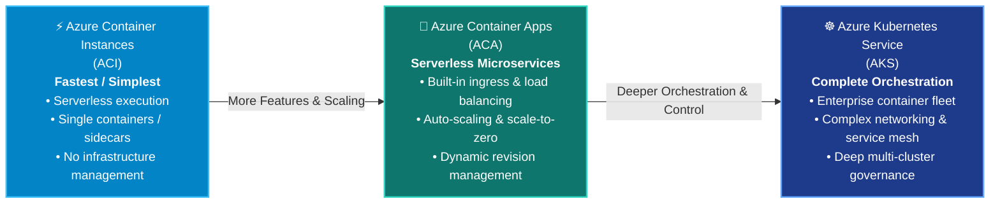
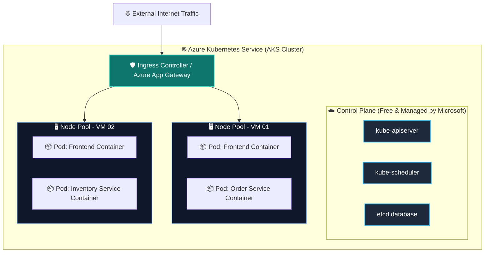
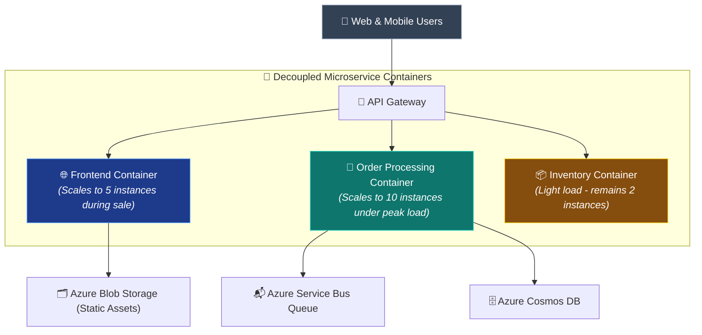
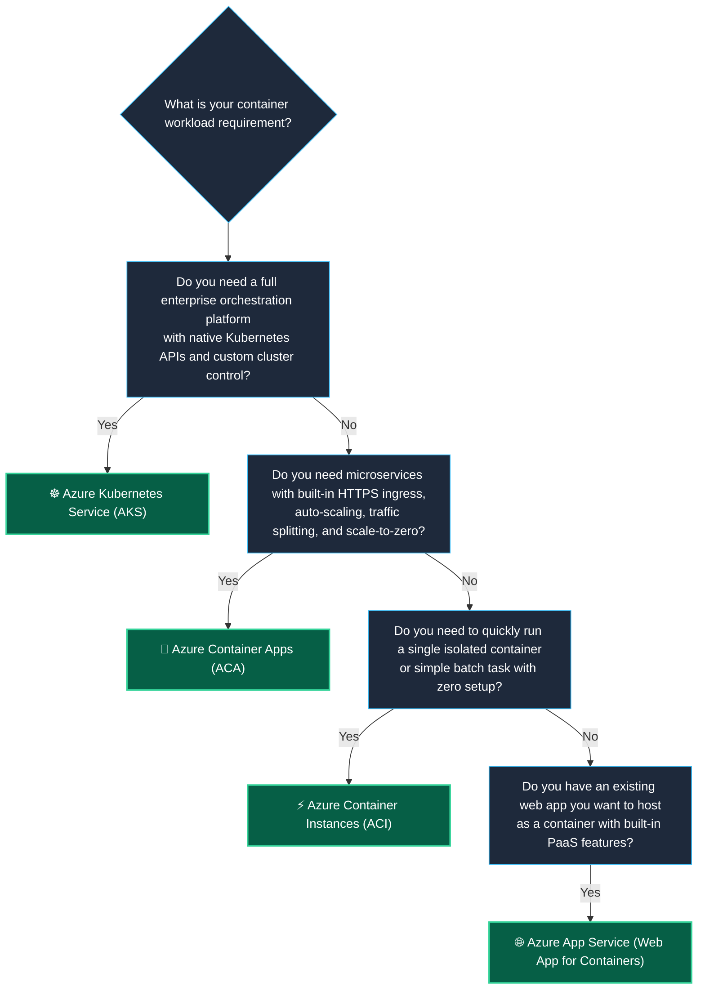

# Topic 2: Describe Azure Containers

**Azure Containers** are lightweight, standalone, and executable packages of software that bundle application code together with all of its dependencies, runtime libraries, and system tools. Containers provide an isolated virtualization environment that shares the host operating system kernel, enabling applications to run consistently, reliably, and rapidly across diverse computing environments.

> 💡 **Core Definition:**  
> A **Container** is an operating system-level virtualization environment that packages application code and its dependencies into a single deployable unit. Unlike Virtual Machines, containers share the host OS kernel and do not require a separate guest operating system, making them ultra-lightweight, fast to start (seconds), and highly portable. Azure provides multiple **Platform as a Service (PaaS)** and serverless container services including **Azure Container Instances (ACI)**, **Azure Container Apps (ACA)**, and **Azure Kubernetes Service (AKS)**.

---

## 📦 1. What are Containers?

Containers represent modern application virtualization. Instead of virtualizing the underlying physical hardware (like Virtual Machines do), containers virtualize the **operating system**.

```text
┌────────────────────────────────────────────────────────────────────────────┐
│                       📦 HOW CONTAINERS FUNCTION                           │
├────────────────────────────────────────────────────────────────────────────┤
│ • Packages Application Code + Runtime + Libraries + Dependencies           │
│ • Runs as an isolated process in user space on the host OS                 │
│ • Shares the host OS kernel with other containers                          │
│ • Starts in milliseconds or seconds (no OS boot cycle)                    │
│ • Highly portable: "Build once, run anywhere" (Local PC ➔ Azure Cloud)    │
│ • Built and managed using standard container engines (e.g., Docker)        │
└────────────────────────────────────────────────────────────────────────────┘
```

### 🔑 Core Container Concepts:
1. **Container Image:** An immutable, read-only template or snapshot containing the application code, libraries, binaries, environment variables, and configuration files required to run an application.
2. **Container Instance / Runtime:** A running, isolated instance of a container image. Multiple instances can be instantiated from a single image.
3. **Container Engine (e.g., Docker):** The software that builds, runs, manages, and isolates containers on top of the host operating system. Azure fully supports Docker-formatted containers.
4. **Container Registry (e.g., Azure Container Registry - ACR):** An enterprise repository used to store, manage, scan, and deploy private container images.

---

## ⚖️ 2. Comprehensive Comparison: Virtual Machines vs. Containers

Understanding the structural and operational differences between **Virtual Machines (VMs)** and **Containers** is one of the most critical topics tested on the AZ-900 exam.

### 🏗️ Architectural Comparison

```text
       🖥️ VIRTUAL MACHINES (Hardware Virtualization)              📦 CONTAINERS (OS Virtualization)
 ┌──────────────────────────────────────────────────┐     ┌──────────────────────────────────────────────────┐
 │ 📱 App A      │ 📱 App B      │ 📱 App C         │     │ 📱 App A      │ 📱 App B      │ 📱 App C         │
 ├───────────────┼───────────────┼──────────────────┤     ├───────────────┼───────────────┼──────────────────┤
 │ 📚 Bins/Libs  │ 📚 Bins/Libs  │ 📚 Bins/Libs     │     │ 📚 Bins/Libs  │ 📚 Bins/Libs  │ 📚 Bins/Libs     │
 ├───────────────┼───────────────┼──────────────────┤     ├──────────────────────────────────────────────────┤
 │ 🪟 Guest OS   │ 🐧 Guest OS   │ 🪟 Guest OS      │     │ 🐳 Container Engine (e.g., Docker)               │
 │ (Windows)     │ (Ubuntu)      │ (Windows)        │     │ (Shared User-space Isolation)                    │
 ├──────────────────────────────────────────────────┤     ├──────────────────────────────────────────────────┤
 │ 🎛️ Hypervisor (Type 1 / Type 2)                  │     │ 🖥️ Host Operating System (Linux / Windows)       │
 ├──────────────────────────────────────────────────┤     ├──────────────────────────────────────────────────┤
 │ 🖥️ Host Physical Infrastructure (CPU/RAM/Disk)   │     │ 🖥️ Host Physical Infrastructure (CPU/RAM/Disk)   │
 └──────────────────────────────────────────────────┘     └──────────────────────────────────────────────────┘
```

### 📊 Feature-by-Feature Matrix

| Comparison Dimension | 🖥️ Virtual Machines (VMs) | 📦 Containers |
| :--- | :--- | :--- |
| **Cloud Service Model** | **IaaS** (Infrastructure as a Service) | **PaaS / Serverless** (ACI, ACA, AKS) |
| **Virtualization Level** | **Hardware level** (Virtualizes hardware components) | **OS level** (Virtualizes the operating system) |
| **Operating System** | Each VM requires its own dedicated **Guest OS** | Containers **share the host OS kernel** |
| **OS Management & Patching** | **Customer must manage, update, and patch guest OS** | **Zero OS management** (managed by Azure platform) |
| **Startup Time** | Minutes (must boot full operating system) | **Milliseconds to seconds** (process startup) |
| **Resource Overhead** | Heavy (gigabytes of RAM and disk per OS) | **Ultra-lightweight** (megabytes of RAM and storage) |
| **Density per Host** | Low to moderate (limited by OS RAM overhead) | **High density** (run hundreds of containers per host) |
| **Portability** | Hypervisor dependent; larger image sizes (GBs) | **Universal portability** via OCI/Docker standards (MBs) |
| **Lifecycle & Agility** | Long-lived, slower provisioning and teardown | **Ephemeral**, disposable, rapid scale-out and restarts |
| **Primary Use Case** | Legacy monolithic apps, full OS control, custom network | **Microservices, CI/CD pipelines, elastic batch jobs** |

---

## ☁️ 3. Azure Container Services Spectrum

Azure offers three primary container hosting services, ranging from zero-management individual execution to full-scale enterprise container orchestration:



---

### ⚡ 1. Azure Container Instances (ACI)

**Azure Container Instances (ACI)** is the fastest and simplest way to run a container in Azure without managing any virtual machines, provisioning clusters, or adopting complex orchestration services.

```text
┌────────────────────────────────────────────────────────────────────────────┐
│                    ⚡ AZURE CONTAINER INSTANCES (ACI)                      │
├────────────────────────────────────────────────────────────────────────────┤
│ • Service Model: Platform as a Service (PaaS) / Serverless Compute         │
│ • Execution Speed: Starts in seconds on-demand                             │
│ • Infrastructure: No VMs, servers, or clusters to manage or patch          │
│ • Billing: Per-second billing based on exact vCPU & memory allocated       │
│ • Ideal For: Isolated containers, short batch jobs, CI/CD build agents     │
└────────────────────────────────────────────────────────────────────────────┘
```

#### Key Characteristics & Capabilities of ACI:
* **Instant Container Launch:** Upload your container image and Azure runs it immediately with an assigned public IP or VNet connection.
* **Serverless Execution:** You never configure, manage, patch, or maintain underlying VMs or hypervisors.
* **Elastic Bursts & Task Execution:** Ideal for tasks that do not need to run continuously 24/7 (e.g., nightly data processing, image resizing, automated testing jobs).
* **Sidecar Support (Container Groups):** Allows deploying multi-container groups that share the same lifecycle, local network, and storage volumes on a single host.

---

### 🚀 2. Azure Container Apps (ACA)

**Azure Container Apps (ACA)** is a fully managed serverless container service designed specifically for **microservices architectures** and modern web applications. Built on top of Kubernetes and open-source technologies (like KEDA, Dapr, and Envoy), ACA hides all Kubernetes infrastructure complexity.

```text
┌────────────────────────────────────────────────────────────────────────────┐
│                     🚀 AZURE CONTAINER APPS (ACA)                          │
├────────────────────────────────────────────────────────────────────────────┤
│ • Service Model: Serverless PaaS for Microservices                         │
│ • Autoscaling: Scale to zero (0 instances = $0 compute) up to N instances  │
│ • Traffic Routing: Built-in HTTP load balancing, SSL termination, ingress │
│ • Revisions & Split: Blue/Green deployments, Canary releases, traffic %    │
│ • Microservice Integrations: Built-in Dapr (Distributed Application Runtime)│
└────────────────────────────────────────────────────────────────────────────┘
```

#### Key Capabilities of Container Apps:
* **True Scale-to-Zero:** When there is no incoming traffic or message queue activity, Container Apps automatically scales to zero instances, eliminating idle compute costs.
* **Event-Driven Autoscaling (KEDA):** Scale dynamically based on HTTP traffic, CPU/memory usage, or event triggers (e.g., messages in an Azure Service Bus queue, Kafka stream).
* **Built-in Ingress & HTTPS:** No need to configure separate reverse proxies or API gateways; ACA provides automated SSL certificates and public/private HTTP routing out-of-the-box.
* **Application Revisions & Traffic Splitting:** Run multiple versions of your application simultaneously and route a percentage of traffic (e.g., 80% to v1.0, 20% to v2.0) for seamless zero-downtime updates.

---

### ☸️ 3. Azure Kubernetes Service (AKS)

**Azure Kubernetes Service (AKS)** is an enterprise-grade, fully managed **container orchestration** service based on the open-source Kubernetes platform. An orchestration service automates the deployment, scaling, health monitoring, self-healing, networking, and fleet management of hundreds or thousands of containerized workloads.

```text
┌────────────────────────────────────────────────────────────────────────────┐
│                   ☸️ AZURE KUBERNETES SERVICE (AKS)                         │
├────────────────────────────────────────────────────────────────────────────┤
│ • Service Model: Managed Kubernetes Orchestration (PaaS)                   │
│ • Control Plane (Master Nodes): 100% Managed & Provided FREE by Microsoft  │
│ • Worker Nodes (Agent Pool): VMs managed by customer in Azure subscription │
│ • Self-Healing: Automatically restarts failed containers and replaces nodes│
│ • Scaling: Horizontal Pod Autoscaler (HPA) + Cluster Autoscaler            │
│ • Ecosystem: Native Kubernetes API, Helm charts, Service Mesh, GitOps      │
└────────────────────────────────────────────────────────────────────────────┘
```



#### What Container Orchestration (AKS) Provides:
* **Automated Scheduling & Placement:** Decides the best physical nodes to run containers based on available CPU/RAM resources and affinity rules.
* **Self-Healing & Auto-Recovery:** Automatically detects dead or unresponsive containers and restarts them; replaces crashed worker nodes without service downtime.
* **Zero-Downtime Rolling Upgrades:** Updates container versions gradually one pod at a time so applications remain reachable during deployments.
* **Storage & Secret Orchestration:** Mounts persistent storage disks (Azure Disks, Azure Files) and mounts sensitive keys securely from Azure Key Vault.

---

### 🗄️ 4. Supporting Component: Azure Container Registry (ACR)

**Azure Container Registry (ACR)** is a managed, private Docker registry service hosted in Azure to store, manage, secure, and replicate container images and OCI artifacts.

```text
               ┌──────────────────────────────────────────────────┐
               │     🗄️ Azure Container Registry (Private ACR)    │
               │   • Encrypted storage (Rest & Transit)           │
               │   • Role-Based Access Control (Microsoft Entra)  │
               │   • Geo-replication across Azure regions         │
               └───────────┬──────────────┬──────────────┬────────┘
                           │              │              │
        ┌──────────────────┘              │              └──────────────────┐
        ↓                                 ↓                                 ↓
⚡ Azure Container Instances      🚀 Azure Container Apps       ☸️ Azure Kubernetes Service
```

* **Private & Secure:** Accessible only via authenticated credentials and integrated with Microsoft Entra ID (Azure AD) and Azure RBAC.
* **Geo-Replication:** Replicates container images globally across multiple Azure regions to reduce latency during multi-region deployments.

---

## 🧩 4. Microservices Architecture with Containers

Containers are the fundamental building block for **Microservices Architectures**. In a microservice design, a complex application is decomposed into small, independent, modular services that communicate with each other over lightweight APIs (e.g., HTTP/REST or message queues).

```text
 🏢 MONOLITHIC ARCHITECTURE                       🧩 MICROSERVICES ARCHITECTURE
┌──────────────────────────────────────┐       ┌─────────────────┐   ┌─────────────────┐
│          ONE GIANT APPLICATION       │       │ 🌐 Frontend UI  │   │ 🛒 Order Service│
│ ┌──────────────┬───────────────────┐ │       │   (Container)   │   │   (Container)   │
│ │ Frontend UI  │ Order Processing  │ │       └────────┬────────┘   └────────┬────────┘
│ ├──────────────┼───────────────────┤ │                │                     │
│ │ Inventory    │ User Identity     │ │                ▼                     ▼
│ └──────────────┴───────────────────┘ │       ┌─────────────────┐   ┌─────────────────┐
│ • Must scale entire app together     │       │ 📦 Inventory    │   │ 👤 Auth Service │
│ • Single bug crashes entire system   │       │   (Container)   │   │   (Container)   │
│ • Long, risky release cycles         │       └─────────────────┘   └─────────────────┘
└──────────────────────────────────────┘       • Scale stressed services independently
                                               • Update one container with zero downtime
```



### 🌟 Key Benefits of Microservices with Containers:
1. **Independent Scaling:** If order processing experiences high traffic during Black Friday, scale *only* the Order Processing container group without wasting compute resources scaling the entire application stack.
2. **Fault Isolation:** If the recommendations container crashes, the user checkout and login systems continue operating normally.
3. **Technology Agility:** Each microservice container can be written in a different programming language (e.g., Frontend in Node.js, Order engine in .NET, Machine Learning in Python) as long as they package into standard containers.
4. **Faster Time-to-Market (CI/CD):** Deploy bug fixes and feature updates to a single container in minutes without redeploying the entire codebase.

---

## 🎯 5. Decision Guide: Which Azure Container Service to Choose?

Use this decision matrix to determine the right container compute service for any scenario:



### 📋 Side-by-Side Comparison Matrix

| Feature | ⚡ Azure Container Instances (ACI) | 🚀 Azure Container Apps (ACA) | ☸️ Azure Kubernetes Service (AKS) |
| :--- | :--- | :--- | :--- |
| **Primary Focus** | Fastest, simplest single container run | Serverless microservices & modern APIs | Enterprise container fleet orchestration |
| **Complexity** | 🟢 Minimal (Zero infrastructure) | 🟡 Low to Moderate (Serverless PaaS) | 🔴 Moderate to High (Full Kubernetes) |
| **Kubernetes Access** | ❌ No | ❌ Hidden underneath (Kubernetes-powered) | ✅ Full direct access to Kubernetes API |
| **Autoscaling** | ❌ Manual or scheduled trigger | ✅ Automatic & **Scale-to-Zero (KEDA)** | ✅ Pod Autoscaler (HPA) & Cluster Autoscaler |
| **Built-in Ingress / SSL** | ❌ Basic IP / DNS name only | ✅ Built-in ingress, routing & traffic split | ⚙️ Configured via Ingress Controllers |
| **Best For** | Short-lived batch jobs, CI/CD runners | Microservices, REST APIs, event processors | Complex multi-tier apps, large fleets |

---

## 🤝 6. The Shared Responsibility Model for Containers (PaaS)

Unlike Virtual Machines (IaaS) where the customer manages the guest OS, Azure Containers operate under the **Platform as a Service (PaaS)** model:

```text
┌────────────────────────────────────────────────────────────────────────────┐
│             🤝 SHARED RESPONSIBILITY MODEL: VIRTUAL MACHINES vs. CONTAINERS │
├─────────────────────────────────────┬──────────────────────────────────────┤
│ 🖥️ Virtual Machines (IaaS)          │ 📦 Azure Containers (PaaS - ACI/ACA) │
├─────────────────────────────────────┼──────────────────────────────────────┤
│ 👤 Customer Manages:                │ 👤 Customer Manages:                 │
│ • Application Code & Data           │ • Application Code & Data            │
│ • Runtime & Software Stacks         │ • Container Image & Dependencies     │
│ • Guest OS (Updates, Patches)       │ • Container Configuration & Ports    │
│ • Firewalls & OS Antivirus          │                                      │
├─────────────────────────────────────┼──────────────────────────────────────┤
│ ☁️ Microsoft Manages:               │ ☁️ Microsoft Manages:                │
│ • Hypervisor & Host OS              │ • Host Operating System & Kernel     │
│ • Physical Server Hardware          │ • Container Engine & Runtime Platform│
│ • Datacenter Facilities & Power     │ • Physical Server Hardware & Infra   │
└─────────────────────────────────────┴──────────────────────────────────────┘
```

---

## ⚠️ 7. AZ-900 Exam Pitfalls & Watch-Outs

> [!WARNING]
> ### 🛑 Critical Exam Traps & Misconceptions:
> 
> 1. **"Do containers have their own dedicated operating system like virtual machines?"**  
>    ❌ **NO!** Containers share the host operating system kernel. They do not run a guest OS, which is why they are so lightweight and fast to start.
> 
> 2. **"Which Azure service provides the fastest and simplest way to run a container without managing any virtual machines?"**  
>    ✅ **Azure Container Instances (ACI)!** Whenever an exam question emphasizes *"fastest"*, *"simplest"*, *"no cluster management"*, and *"single container"*, the answer is **ACI**.
> 
> 3. **"What is a container orchestration service, and which Azure service provides it?"**  
>    ✅ **Container orchestration** manages the automated lifecycle, scaling, self-healing, and networking of a fleet of containers. The primary orchestration service in Azure is **Azure Kubernetes Service (AKS)**.
> 
> 4. **"Is Azure Container Instances an IaaS or PaaS offering?"**  
>    ✅ **PaaS (Platform as a Service)!** You do not configure or manage VMs or operating systems. You simply supply the container image and Azure runs it.
> 
> 5. **"Can Azure Container Apps scale to zero instances?"**  
>    ✅ **YES!** Azure Container Apps supports event-driven scaling to zero when no traffic or queue messages exist, saving costs.
> 
> 6. **"What Azure service is used to store and secure private Docker container images?"**  
>    ✅ **Azure Container Registry (ACR)**.

---

## ⭐ 8. AZ-900 Exam Quick Reference & Key Takeaways

| Exam Question Trigger / Keyword | Correct Azure Concept / Service | Memory Shortcut |
| :--- | :--- | :--- |
| **"Lightweight virtualization sharing the host OS kernel"** | **Containers** | **Containers = Shared OS Kernel** |
| **"Fastest & simplest way to run a container without managing VMs"** | **Azure Container Instances (ACI)** | **ACI = Fastest / Serverless Container** |
| **"Serverless container service for microservices with scale-to-zero"** | **Azure Container Apps (ACA)** | **ACA = Microservices + Scale-to-Zero** |
| **"Container orchestration service for managing fleets of containers"** | **Azure Kubernetes Service (AKS)** | **AKS = Kubernetes Orchestration** |
| **"Private repository for storing and managing Docker images in Azure"** | **Azure Container Registry (ACR)** | **ACR = Private Image Repository** |
| **"Architectural pattern splitting an app into small, independent pieces"** | **Microservices Architecture** | **Microservices = Decoupled & Independent** |
| **"Cloud service model classification for Azure Container Instances"** | **PaaS (Platform as a Service)** | **ACI / ACA / AKS = PaaS** |
| **"Main difference between VMs and Containers"** | **Containers do NOT manage or boot a guest OS** | **VM = Guest OS; Container = Shared Kernel** |
