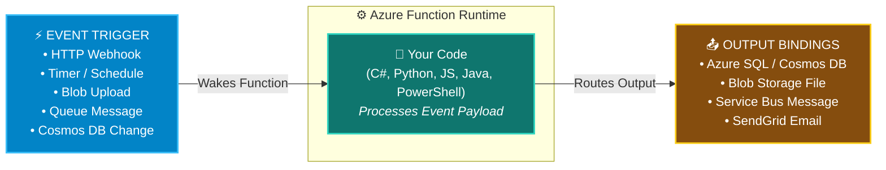

# Topic 3: Describe Azure Functions & Serverless Computing

**Azure Functions** is an event-driven, **serverless compute** service that enables you to run small pieces of code (called "functions") in the cloud without explicitly provisioning, configuring, or managing underlying virtual machines or container infrastructure.

> 💡 **Core Definition:**  
> **Azure Functions** is a **Function as a Service (FaaS)** / **Serverless** compute offering in Azure. It executes code in response to specific **events and triggers** (such as HTTP requests, file uploads, message queues, or timer schedules), automatically scales on demand from zero to thousands of instances, and charges only for the exact compute time and memory consumed during code execution. When there are no events, no code runs and compute costs drop to **zero ($0)**.

---

## ⚡ 1. What is Serverless Computing?

**Serverless computing** is a cloud execution model where the cloud provider (Microsoft Azure) dynamically manages the allocation, scaling, patching, and provisioning of servers. The term *"serverless"* does not mean servers do not exist; it means the servers are completely abstracted away and invisible to the developer.

```text
┌────────────────────────────────────────────────────────────────────────────┐
│                    🏛️ THE 3 CORE PILLARS OF SERVERLESS                     │
├────────────────────────────────────────────────────────────────────────────┤
│ 1️⃣ Abstraction of Servers:                                                │
│    • Never configure OS, VMs, web servers, or container clusters           │
│    • Focus 100% on writing business logic code                             │
│                                                                            │
│ 2️⃣ Event-Driven Dynamic Autoscaling:                                       │
│    • Scale instantly from 0 to thousands of concurrent executions          │
│    • Scale-out occurs per individual event/request                         │
│                                                                            │
│ 3️⃣ Micro-Billing / Consumption Pricing:                                    │
│    • Pay only for active execution duration (measured in milliseconds)     │
│    • Zero idle costs ($0 spent when your function is not executing)        │
└────────────────────────────────────────────────────────────────────────────┘
```

### 📊 Traditional Compute vs. Serverless Compute

```text
 🖥️ TRADITIONAL HOSTING (VMs / App Service)           ⚡ SERVERLESS (Azure Functions)
┌──────────────────────────────────────────┐       ┌──────────────────────────────────────────┐
│ • Server runs 24/7/365                   │       │ • Code executes ONLY when triggered      │
│ • Pay fixed hourly rate even if 0 users  │       │ • Scale to 0 when idle (Zero Cost)       │
│ • Manual scaling or rule-based VMSS      │       │ • Instant auto-scaling per incoming event│
│ • Responsible for OS / runtime hosting   │       │ • Azure manages all runtime & infra      │
│ • Long continuous execution              │       │ • Short-lived, focused micro-tasks       │
└──────────────────────────────────────────┘       └──────────────────────────────────────────┘
```

---

## ⚙️ 2. How Azure Functions Work: Triggers & Bindings

Azure Functions uses a declarative programming model based on **Triggers**, **Input Bindings**, and **Output Bindings**, allowing you to integrate seamlessly with other Azure and third-party services without writing tedious connection and SDK boilerplate code.



### 🔌 Core Components Breakdown:

1. **⚡ Triggers (What starts the function):**
   * Every function must have **exactly one trigger**.
   * The trigger defines how a function is invoked and provides associated payload data.
   * *Examples:*
     * **HTTP Trigger:** Executed when a REST API endpoint or webhook URL receives an HTTP GET/POST request.
     * **Timer Trigger:** Executed on a recurring schedule using CRON expressions (e.g., run every night at 2:00 AM).
     * **Blob Storage Trigger:** Executed immediately whenever a new file or image is uploaded to an Azure Blob Storage container.
     * **Queue / Service Bus Trigger:** Executed whenever a new message arrives in an Azure Queue or Service Bus.
     * **Cosmos DB Trigger:** Executed whenever a document is inserted, updated, or modified in an Azure Cosmos DB database.

2. **📥 Input Bindings (Declarative Data Ingestion):**
   * Declaratively connects your function to external data sources.
   * Pulls data into the function as input parameters without writing custom connection strings or query code.

3. **📤 Output Bindings (Declarative Data Delivery):**
   * Declaratively sends data produced by your function to destination services.
   * Automatically saves results to databases, queues, or notification services upon function completion.

---

## 🔄 3. Stateless vs. Stateful (Durable Functions)

Azure Functions can be designed to operate in two distinct architectural execution modes:

```text
┌────────────────────────────────────────────────────────────────────────────┐
│                    STATELESS vs. STATEFUL FUNCTIONS                        │
├─────────────────────────────────────┬──────────────────────────────────────┤
│ 🍃 Stateless Functions (Default)    │ 🪵 Stateful / Durable Functions      │
├─────────────────────────────────────┼──────────────────────────────────────┤
│ • Resets state on every run         │ • Maintains state & context across   │
│ • No memory of previous executions  │   multiple steps and executions      │
│ • Ideal for independent micro-tasks │ • Code-based workflow orchestration  │
│ • Restarts fresh for every trigger  │ • Handles long-running multi-step    │
│ • Fast, decoupled, disposable       │   processes & human approvals        │
└─────────────────────────────────────┴──────────────────────────────────────┘
```

### 🪵 What are Durable Functions?
**Durable Functions** is an extension of Azure Functions that lets you write **stateful workflows** and orchestrations programmatically in code (C#, JavaScript, Python, etc.) rather than using visual workflow designers:

* **State Tracking:** Automatically saves execution checkpoints and state behind the scenes.
* **Orchestrator Functions:** Coordinates the execution of multiple individual activity functions.
* **Common Durable Patterns:**
  * **Function Chaining:** Executing a sequence of functions in a specific order where output of Function 1 feeds into Function 2.
  * **Fan-Out / Fan-In:** Executing multiple functions concurrently in parallel and waiting for all results to aggregate before proceeding.
  * **Human Interaction & Approval:** Pausing a workflow to wait for an external webhook or human approval email before continuing.

---

## 💰 4. Azure Functions Hosting & Pricing Plans

Azure provides multiple hosting plans to match different performance, networking, and cost requirements:

```text
┌─────────────────────────────────────────────────────────────────────────────────┐
│                          AZURE FUNCTIONS HOSTING PLANS                          │
├───────────────────┬────────────────────────────────┬────────────────────────────┤
│ 1️⃣ Consumption    │ 2️⃣ Premium Plan (Elastic)       │ 3️⃣ Dedicated (App Service) │
│    Plan (Default) │                                │    Plan                    │
├───────────────────┼────────────────────────────────┼────────────────────────────┤
│ • Pure Serverless │ • Serverless with No Cold Start│ • Runs on dedicated VMs    │
│ • Automatic scale │ • Pre-warmed standby instances │ • Predictable monthly cost │
│   to zero ($0)    │ • Virtual Network (VNet) access│ • Continuous execution     │
│ • Pay per runtime │ • Enhanced CPU & memory options│ • Best when VMs already paid│
│   (GB-seconds)    │ • Higher SLA guarantee         │   for other web apps       │
└───────────────────┴────────────────────────────────┴────────────────────────────┘
```

### 📋 Hosting Plan Comparison Table

| Plan | Scaling Behavior | Billing Model | Cold Start? | VNet Integration? | Best For |
| :--- | :--- | :--- | :--- | :--- | :--- |
| **Consumption Plan** | **100% Serverless** (0 to 200 instances automatically) | **Pay-per-execution** (GB-seconds + execution count). 1M executions free/month! | ⚠️ Yes (brief delay on initial wake after idle) | ❌ No | Highly variable workloads, low traffic, intermittent batch jobs, cost minimization. |
| **Premium Plan** | **Elastic Serverless** (Auto-scales with pre-warmed instances) | Pay per allocated core & memory per second | ⚡ **Zero Cold Start** | ✅ **Yes (Full VNet support)** | Enterprise APIs requiring immediate response times, private VNet access, and long runs. |
| **Dedicated Plan** | **VM-based** (Runs on standard App Service VMs) | Fixed monthly cost based on VM App Service Plan tier | ⚡ **No** | ✅ **Yes** | Existing App Service environments with underutilized VM capacity; 24/7 continuous jobs. |

---

## 🏗️ 5. Real-World Use Cases & Architectural Scenarios

Azure Functions shines across modern cloud-native architectures that require rapid event reaction and elastic scaling:

```mermaid
graph TD
    subgraph Scenario1["🖼️ Scenario 1: Automated Image Resizing"]
        BlobUpload["📸 User Uploads Photo to Azure Blob"] --> Func1["⚡ Azure Function: ResizeImage"]
        Func1 --> Thumb["🖼️ Generates 3 Thumbnails & Saves to Storage"]
    end

    subgraph Scenario2["🛒 Scenario 2: E-Commerce Order Processing"]
        HTTPOrder["🛒 Mobile App Submits Order (HTTP POST)"] --> Func2["⚡ Azure Function: ProcessOrder"]
        Func2 --> DB["🗄️ Stores Record in Cosmos DB"]
        Func2 --> Queue["📬 Pushes to Azure Service Bus"]
    end

    subgraph Scenario3["⏰ Scenario 3: Scheduled Database Maintenance"]
        Timer["⏰ Timer Trigger (Every Night at 2 AM)"] --> Func3["⚡ Azure Function: DB_Cleanup"]
        Func3 --> Cleanup["🧹 Purges Expired Sessions & Logs"]
    end

    classDef s1 fill:#1e3a8a,stroke:#60a5fa,stroke-width:1px,color:#fff;
    classDef s2 fill:#0f766e,stroke:#2dd4bf,stroke-width:1px,color:#fff;
    classDef s3 fill:#854d0e,stroke:#facc15,stroke-width:1px,color:#fff;

    class BlobUpload,Func1,Thumb s1;
    class HTTPOrder,Func2,DB,Queue s2;
    class Timer,Func3,Cleanup s3;
```



### 🌟 Detailed Use Case Breakdown:
1. **Automated File & Data Processing:** A user uploads a raw `.csv` or high-resolution `.png` file to Azure Blob Storage. An event triggers an Azure Function to parse the data or generate thumbnails and save the output.
2. **Serverless Web APIs & Webhooks:** Build lightweight REST API backends that handle spikes in traffic without provisioning web servers.
3. **Real-Time Stream & IoT Processing:** Ingest telemetry data arriving from thousands of IoT devices via Azure IoT Hub / Event Hubs, filter anomalies, and write alerts.
4. **Scheduled Cloud Automation:** Automate routine operational maintenance, backup scripts, report generation, and resource cleanups without maintaining dedicated cron servers.

---

## 🎛️ 6. Azure Compute Landscape: VMs vs. Containers vs. Serverless Functions

To master Azure compute for the AZ-900 exam, understand how the level of abstraction, management responsibility, and scaling shift across services:

```text
 ⚙️ INFRASTRUCTURE CONTROL                                        🚀 CLOUD ABSTRACTION
┌────────────────────────────────────────────────────────────────────────────────────┐
│  🖥️ Azure VMs       📦 Azure Containers (ACI/ACA)       ⚡ Azure Functions         │
│  (IaaS)              (PaaS / Serverless Containers)      (FaaS / Serverless Code)  │
├───────────────────┬───────────────────────────────────┬────────────────────────────┤
│ • Full OS Control │ • Package app + dependencies      │ • Upload ONLY code / logic │
│ • Manage OS/Patch │ • No OS management                │ • No OS or container config│
│ • Long boot times │ • Seconds to launch               │ • Milliseconds execution   │
│ • Pay per VM hour │ • Pay per second of container run │ • Pay per execution & ms   │
│ • Max Flexibility │ • Portable microservices          │ • Maximum Agility & Value  │
└───────────────────┴───────────────────────────────────┴────────────────────────────┘
```

### 📋 Full Azure Compute Decision Matrix

| Compute Option | Service Model | Unit of Deployment | Management Overhead | Startup Speed | Billing Model | Best Workload Profile |
| :--- | :--- | :--- | :--- | :--- | :--- | :--- |
| **Azure Virtual Machines (VMs)** | **IaaS** | Entire Virtual Machine (Guest OS + App) | 🔴 High (Customer manages OS & patches) | Minutes | Per-second / Hourly VM rate | Legacy monolithic apps, custom OS configs, lift-and-shift migrations. |
| **Azure Virtual Machine Scale Sets (VMSS)** | **IaaS** | Group of identical VMs | 🔴 High (Customer manages OS image) | Minutes | Per-second / Hourly VM rate | Large-scale VM workloads requiring horizontal auto-scaling. |
| **Azure App Service** | **PaaS** | Web application code or container | 🟡 Low (Azure manages OS & web server) | Seconds | Monthly / Hourly App Service Plan | Full-fledged enterprise web applications, REST APIs, and mobile backends. |
| **Azure Container Instances (ACI)** | **PaaS / Serverless** | Individual Docker Container | 🟢 Minimal (No cluster management) | Seconds | Per-second (vCPU + RAM allocated) | Fast, isolated single container execution, simple batch jobs. |
| **Azure Container Apps (ACA)** | **PaaS / Serverless** | Containerized Microservices | 🟢 Minimal (Serverless container platform) | Seconds | Per-second + **Scale-to-Zero** | Microservices, API gateways, event-driven container fleets. |
| **Azure Kubernetes Service (AKS)** | **PaaS / Orchestration** | Kubernetes Pods / Clusters | 🟡 Moderate (Customer manages worker nodes) | Seconds | Free Control Plane + Worker VM costs | Enterprise container fleet orchestration, complex multi-cluster apps. |
| **Azure Functions** | **FaaS / Serverless** | Individual Function Code | 🟢 **Zero Infrastructure Management** | **Milliseconds** | **Micro-billing per execution (Scale to $0)** | Short-lived, event-triggered tasks, webhooks, background pipelines. |

---

## 🤝 7. The Shared Responsibility Model for Serverless (FaaS)

Under the **Function as a Service (FaaS)** serverless model, Microsoft assumes the vast majority of operational and security responsibilities:

```text
┌────────────────────────────────────────────────────────────────────────────┐
│            🤝 SHARED RESPONSIBILITY: SERVERLESS (AZURE FUNCTIONS)           │
├────────────────────────────────────────────────────────────────────────────┤
│ 👤 Customer Manages (Only 2 Things!):                                      │
│ • Application Code & Logic (The function code you write)                   │
│ • Function Trigger/Binding Configuration & Identity Access                 │
│                                                                            │
│ ☁️ Microsoft Azure Manages (Everything Else):                               │
│ • Hardware & Physical Datacenters                                          │
│ • Host Operating System & Hypervisor                                       │
│ • Runtime Platform, Language SDKs, & Security Patching                     │
│ • Dynamic Elastic Scaling & Load Balancing                                 │
│ • High Availability & Fault Tolerance                                      │
└────────────────────────────────────────────────────────────────────────────┘
```

---

## ⚠️ 8. AZ-900 Exam Pitfalls & Watch-Outs

> [!WARNING]
> ### 🛑 Critical Exam Traps & Misconceptions:
> 
> 1. **"Does Serverless mean there are no servers involved?"**  
>    ❌ **NO!** Physical servers still run the code in Microsoft datacenters, but they are **100% managed and abstracted away** from you. You never provision, configure, or manage them.
> 
> 2. **"Which Azure compute service executes code only when triggered by an event and costs $0 when idle?"**  
>    ✅ **Azure Functions (Serverless Compute)!** Whenever an exam question highlights *"event-driven"*, *"no infrastructure management"*, and *"pay only when running"*, the answer is **Azure Functions**.
> 
> 3. **"Can Azure Functions maintain state across executions?"**  
>    ✅ **YES, through Durable Functions!** By default, Azure Functions are **stateless**, but using the **Durable Functions** extension allows you to write stateful workflows and manage state in code.
> 
> 4. **"How does billing work for Azure Functions on the Consumption Plan?"**  
>    ✅ You are charged based on **execution count** and **consumed memory per second (GB-s)**. You pay **zero ($0)** when the function is not actively running.
> 
> 5. **"What is the difference between Azure Functions and Azure Logic Apps?"**  
>    * **Azure Functions:** **Code-first** serverless compute (write C#, Python, JavaScript code).
>    * **Azure Logic Apps:** **Low-code / No-code** serverless workflow orchestrator (visual designer with prebuilt SaaS connectors).

---

## ⭐ 9. AZ-900 Exam Quick Reference & Key Takeaways

| Exam Question Trigger / Keyword | Correct Azure Concept / Service | Memory Shortcut |
| :--- | :--- | :--- |
| **"Event-driven serverless compute service that runs code on demand"** | **Azure Functions** | **Functions = Event-driven code** |
| **"Cloud model with zero infrastructure management and scale-to-zero pricing"** | **Serverless Computing** | **Serverless = Zero server management** |
| **"Event that wakes up and executes an Azure Function"** | **Trigger** | **Trigger = Starts Function** |
| **"Declarative connection to input data sources or output destinations"** | **Bindings (Input / Output)** | **Bindings = Connect data without code** |
| **"Azure Functions extension used for stateful, long-running workflows"** | **Durable Functions** | **Durable = Stateful Workflows** |
| **"Hosting plan that scales to 0 and charges only during active code execution"** | **Consumption Plan** | **Consumption = Pay ONLY when running** |
| **"Code-first vs Low-code serverless workflow orchestration"** | **Functions (Code) vs Logic Apps (No-Code)** | **Functions = Code; Logic Apps = Visual** |
| **"Startup delay when a serverless function wakes up after being idle"** | **Cold Start** | **Cold Start = Initial wake latency** |
