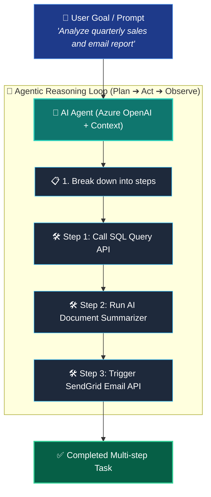
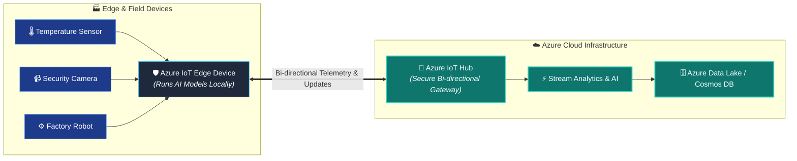
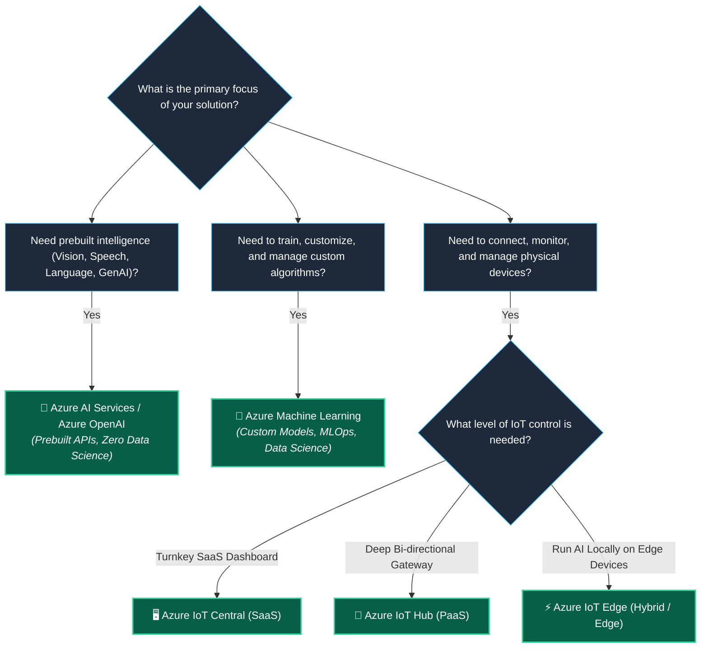

# Topic 4: Describe AI, Machine Learning, and IoT/Edge Services in Azure

Azure provides a comprehensive suite of intelligent cloud services that enable organizations to build smart, connected, and automated solutions without building infrastructure or complex machine learning models from scratch. These services span **Prebuilt AI APIs**, **Enterprise Generative AI**, **Custom Machine Learning Platforms**, and **Internet of Things (IoT) & Edge Computing**.

> 💡 **Core Definition:**  
> Azure's AI and IoT ecosystem provides building blocks for modern intelligent systems:
> * **Azure AI Services & Azure OpenAI:** Provide **prebuilt, API-driven artificial intelligence** (Vision, Speech, Language, Generative AI) that developers can integrate into apps without data science expertise.
> * **Azure Machine Learning:** A complete platform for data scientists to build, train, deploy, and manage **custom machine learning models**.
> * **Azure IoT Services (IoT Hub, IoT Central, IoT Edge):** Provide secure device connectivity, telemetry ingestion, remote device management, and local edge computing.

---

## 🤖 1. Azure AI Services (Prebuilt AI)

**Azure AI Services** (formerly Azure Cognitive Services & Applied AI) provides pre-trained, production-ready AI models exposed through simple REST APIs and SDKs. Developers can integrate vision, speech, language, and decision-making capabilities into applications without needing any prior machine learning or data science experience.

```text
┌────────────────────────────────────────────────────────────────────────────┐
│                      🧠 AZURE AI SERVICES CATEGORIES                       │
├───────────────────┬───────────────────┬───────────────────┬────────────────┤
│ 👁️ Vision         │ 🗣️ Speech         │ 📝 Language       │ 📑 Document &  │
│                   │                   │                   │    Decision    │
├───────────────────┼───────────────────┼───────────────────┼────────────────┤
│ • Image analysis  │ • Speech-to-text  │ • Sentiment       │ • Form & invoice│
│ • Optical Char    │ • Text-to-speech  │   analysis        │   data extract │
│   Recognition(OCR)│ • Real-time       │ • Translation     │ • Anomaly      │
│ • Spatial analysis│   translation     │ • Conversational  │   detection    │
│ • Face detection  │ • Voice recognizer│   understanding   │ • Content safety│
└───────────────────┴───────────────────┴───────────────────┴────────────────┘
```

### 🎯 Key Benefit:
* **Zero Model Training Required:** You do not gather training datasets or tune hyperparameters; you simply make an API call with your image, audio, or text, and receive structured JSON predictions immediately.

---

## 🌟 2. Azure OpenAI Service & Generative AI

**Azure OpenAI Service** brings OpenAI's advanced generative AI models (including GPT-4, GPT-4o, DALL-E, and Embeddings) into the enterprise security, compliance, and governance perimeter of Microsoft Azure.

```text
┌────────────────────────────────────────────────────────────────────────────┐
│                       🌟 AZURE OPENAI SERVICE PILLARS                      │
├────────────────────────────────────────────────────────────────────────────┤
│ • Generative Capabilities: Conversational AI, text summarization,          │
│   content creation, code generation, and semantic search                   │
│ • Enterprise-Grade Security: Role-Based Access Control (RBAC), private     │
│   virtual networks (VNets), managed identities, and customer data privacy  │
│ • Data Grounding (RAG): Connect models to proprietary company data         │
│   (e.g., Azure AI Search, enterprise databases) with Zero Training leakage │
│ • Responsible AI: Built-in content filtering to detect and block hate,     │
│   harmful content, violence, and self-harm                                │
└────────────────────────────────────────────────────────────────────────────┘
```

> 🔒 **Enterprise Privacy Guarantee:** Customer data, prompts, and completions submitted to Azure OpenAI are **never used to train or improve Microsoft or OpenAI foundation models**.

---

## 🕵️ 3. Agentic AI Application Patterns

**Agentic AI** is an advanced application pattern where an AI model is combined with explicit instructions, contextual memory, and autonomous tool/API execution to accomplish complex, multi-step goals.



> 📌 **Fundamental Concept for AZ-900:**  
> Treat **Agentic AI** as an **application architectural pattern** built by orchestrating Azure AI Services, Azure OpenAI, and custom application code—**not** as a separate compute hardware service.

---

## 🔬 4. Azure Machine Learning (Custom ML)

**Azure Machine Learning (Azure ML)** is a comprehensive enterprise platform designed for data scientists and ML engineers to build, train, evaluate, deploy, and manage **custom machine learning models** at scale throughout the entire **MLOps** (Machine Learning Operations) lifecycle.

```text
┌────────────────────────────────────────────────────────────────────────────┐
│                    🔬 AZURE MACHINE LEARNING LIFECYCLE                     │
├─────────────┬─────────────┬─────────────┬─────────────┬────────────────────┤
│ 1️⃣ Prepare   │ 2️⃣ Build     │ 3️⃣ Train     │ 4️⃣ Evaluate  │ 5️⃣ Deploy & Manage │
├─────────────┼─────────────┼─────────────┼─────────────┼────────────────────┤
│ • Connect   │ • Automated │ • Scalable  │ • Metric    │ • Deploy to AKS,   │
│   datasets  │   ML        │   GPU/CPU   │   tracking  │   Managed Endpoints│
│ • Data      │ • Drag-Drop │   Compute   │ • Model     │ • Monitor drift,   │
│   labeling  │   Designer  │   Clusters  │   benchmarks│   retrain models   │
│ • Pipelines │ • Notebooks │ • MLflow    │ • Auditing  │ • MLOps governance │
└─────────────┴─────────────┴─────────────┴─────────────┴────────────────────┘
```

### 🛠️ Key Capabilities:
* **Automated Machine Learning (AutoML):** Automatically iterates through various algorithms and hyperparameter combinations to find the best model for your data.
* **Azure ML Studio (Designer):** A visual, drag-and-drop web interface to build end-to-end data preparation, training, and scoring pipelines without writing code.
* **Jupyter Notebooks & Python SDK:** Full programmatic control for data science teams using standard frameworks (PyTorch, TensorFlow, Scikit-learn, MLflow).
* **Managed Compute Targets:** Dynamically provision and scale GPU/CPU clusters that automatically scale to zero when model training completes.

---

## ⚖️ 5. Comparison: Azure AI Services vs. Azure Machine Learning

| Comparison Dimension | 🤖 Azure AI Services | 🔬 Azure Machine Learning |
| :--- | :--- | :--- |
| **Model Type** | **Prebuilt / Pre-trained models** | **Custom models** built from scratch |
| **Target User** | Software Developers & App Builders | Data Scientists & ML Engineers |
| **Data Requirement** | No training dataset needed | Large labeled training datasets required |
| **Customization** | Low to Moderate (fine-tuning where supported) | **Complete customization** of algorithms & code |
| **Effort & Time** | Instant (ready to use via API in minutes) | Weeks to months (data prep, training, tuning) |
| **Typical Use Cases** | Text translation, OCR, sentiment, chat | Fraud detection, custom sales forecasting, proprietary ML |

---

## 📡 6. Azure IoT & Edge Services (Connected Devices)

The **Internet of Things (IoT)** refers to a network of physical devices, sensors, machines, and appliances equipped with electronics, software, and connectivity to collect and exchange telemetry data with cloud backends.



---

### 📡 1. Azure IoT Hub (PaaS)
* **What it is:** A central, managed cloud service that acts as a secure, bi-directional communication gateway between millions of IoT devices and cloud solutions.
* **Key Capabilities:**
  * **Bi-directional Communication:** Ingests high-throughput telemetry (device-to-cloud) and sends commands, firmware updates, and settings (cloud-to-device).
  * **Per-Device Identity & Security:** Authenticates each connected device with unique security credentials.

---

### 🖥️ 2. Azure IoT Central (SaaS)
* **What it is:** A fully managed, highly customizable **Software as a Service (SaaS)** solution that makes it easy to connect, monitor, and manage IoT assets at scale without deep cloud architecture expertise.
* **Key Capabilities:**
  * **Prebuilt Dashboard Templates:** Industry-specific templates (retail, energy, healthcare, government).
  * **No-Code Management:** Configure device rules, telemetry alerts, and device lifecycle management through an intuitive web UI.

---

### ⚡ 3. Azure IoT Edge (Hybrid / Edge Computing)
* **What it is:** A service that extends cloud intelligence, machine learning models, and custom business logic directly onto physical on-premises **edge devices**.
* **Key Capabilities:**
  * **Local Processing & Zero Latency:** Run computer vision or anomaly detection on factory floors in real time without round-trip network delays.
  * **Offline Operation:** Devices continue operating, processing data, and taking automated actions even when internet connectivity is severed.
  * **Bandwidth Reduction:** Filter and aggregate data locally; only send critical anomalies to the cloud instead of streaming raw gigabytes of telemetry.

---

## 🎯 7. The Decision Triad: Choosing the Right Azure Service



---

## ⚠️ 8. AZ-900 Exam Pitfalls & Watch-Outs

> [!WARNING]
> ### 🛑 Critical Exam Traps & Misconceptions:
> 
> 1. **"Should you use Azure Machine Learning or Azure AI Services to analyze user sentiment from product reviews?"**  
>    ✅ **Azure AI Services (Language Service)!** Because sentiment analysis is a standard, prebuilt capability available via an API, you do not need to build a custom model with Azure Machine Learning.
> 
> 2. **"What is the difference between Azure IoT Hub and Azure IoT Central?"**  
>    * **IoT Hub is PaaS:** Focuses on underlying secure device communication and data routing. You build the backend analytics and UI.
>    * **IoT Central is SaaS:** Provides an end-to-end, ready-to-use web portal with dashboards, device management, and alert rules out-of-the-box.
> 
> 3. **"Which service allows running machine learning models locally on physical devices even when disconnected from the internet?"**  
>    ✅ **Azure IoT Edge!** IoT Edge deploys containerized cloud workloads directly onto local physical devices.
> 
> 4. **"Does Azure OpenAI use customer enterprise data to train public foundation models?"**  
>    ❌ **NO!** Customer data in Azure OpenAI is private, protected by enterprise compliance boundaries, and never used to train OpenAI or Microsoft public models.
> 
> 5. **"Is Agentic AI a dedicated virtual machine or compute hosting service in Azure?"**  
>    ❌ **NO!** Agentic AI is an **application design pattern** where models are given tools, instructions, and context to execute multi-step workflows.

---

## ⭐ 9. AZ-900 Exam Quick Reference & Key Takeaways

| Exam Question Trigger / Keyword | Correct Azure Service | Memory Shortcut |
| :--- | :--- | :--- |
| **"Prebuilt AI models for vision, speech, language, and OCR via APIs"** | **Azure AI Services** | **AI Services = Prebuilt APIs** |
| **"Generative AI, GPT-4, and chat with enterprise security and data privacy"** | **Azure OpenAI Service** | **Azure OpenAI = Enterprise Generative AI** |
| **"Build, train, deploy, and manage custom machine learning models"** | **Azure Machine Learning** | **Azure ML = Custom Model Development** |
| **"Secure, bi-directional communication between cloud and IoT devices"** | **Azure IoT Hub (PaaS)** | **IoT Hub = Bi-directional Gateway** |
| **"Turnkey SaaS solution for connecting and managing IoT devices"** | **Azure IoT Central (SaaS)** | **IoT Central = Turnkey SaaS Portal** |
| **"Deploy cloud workloads and AI models locally onto physical devices"** | **Azure IoT Edge** | **IoT Edge = Local Compute on Devices** |
| **"AI pattern combining models with instructions and tools for multistep tasks"** | **Agentic AI Pattern** | **Agentic AI = Multi-step Goal Execution** |
