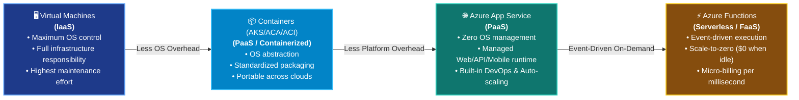
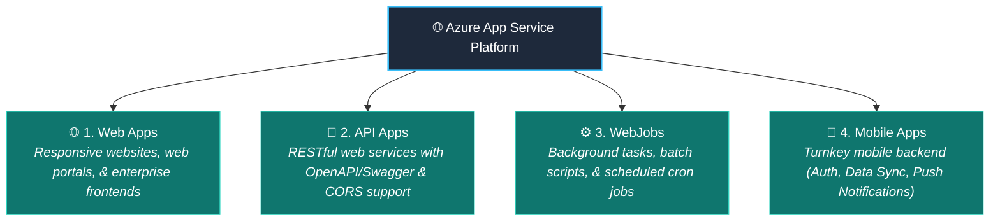
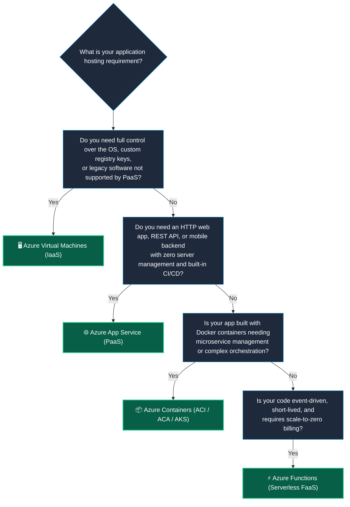

# Topic 5: Describe Application Hosting Options & Azure App Service

When hosting applications in Microsoft Azure, organizations can choose from a spectrum of compute and hosting options depending on the required level of control, operational management overhead, architectural style, and scalability needs. **Azure App Service** is Azure's premier **Platform as a Service (PaaS)** offering for hosting HTTP-based web applications, REST APIs, mobile back ends, and background tasks.

> 💡 **Core Definition:**  
> **Azure App Service** is an HTTP-based **Platform as a Service (PaaS)** hosting environment that enables developers to build, deploy, scale, and maintain web applications, RESTful APIs, and mobile back ends in their programming language of choice (.NET, Java, Node.js, Python, PHP) without configuring or managing underlying virtual machines, web servers, or operating systems.

---

## 🌈 1. The Azure Application Hosting Spectrum

Azure provides multiple tiers of application hosting, creating a continuous spectrum between **maximum infrastructure control (IaaS)** and **minimum operational effort (Serverless / PaaS)**:

```text
 ⚙️ MAXIMUM CONTROL / HIGHER EFFORT                  🚀 MINIMUM EFFORT / MAXIMUM AGILITY
┌───────────────────────────────────────────────────────────────────────────────────────┐
│ 🖥️ Virtual Machines │ 📦 Containers (AKS/ACA/ACI) │ 🌐 Azure App Service │ ⚡ Azure Functions │
│      (IaaS)         │     (PaaS / Serverless)     │       (PaaS)         │    (Serverless)   │
├─────────────────────┼─────────────────────────────┼──────────────────────┼───────────────────┤
│ • Full OS admin     │ • Package code + libs       │ • Upload code only   │ • Event-triggered │
│ • Customer patches  │ • No OS management          │ • Full PaaS features │ • Millisecond runs│
│ • Custom network    │ • Universal portability     │ • Auto-scaling & CI  │ • Scale-to-zero   │
│ • Manual setup      │ • Microservices fleets      │ • Web & REST APIs    │ • Micro-billing   │
└───────────────────────────────────────────────────────────────────────────────────────┘
```



---

## 🌐 2. What is Azure App Service?

**Azure App Service** is a fully managed cloud platform designed specifically for hosting web-facing and HTTP-accessible workloads. Azure takes care of operating system patching, web server configuration (IIS, Nginx, Apache), hardware maintenance, and network routing, allowing development teams to focus 100% on their application code.

```text
┌────────────────────────────────────────────────────────────────────────────┐
│                    🌟 CORE CAPABILITIES OF APP SERVICE                     │
├────────────────────────────────────────────────────────────────────────────┤
│ • Polyglot Runtime: .NET, .NET Core, Java, Ruby, Node.js, PHP, Python      │
│ • Operating System Choice: Deploy natively on Linux or Windows             │
│ • Container Support: Deploy raw code OR custom Docker container images     │
│ • Built-in Autoscaling: Scale horizontally (out) and vertically (up)       │
│ • DevOps Integration: Automated CI/CD from GitHub, Azure DevOps, Bitbucket │
│ • High Availability: 99.95% SLA with built-in load balancing & failover    │
│ • Security & Auth: Integrated Microsoft Entra ID, Google, Facebook, Apple  │
│ • Custom Domains & SSL: Free managed SSL/TLS certificates and DNS bindings │
└────────────────────────────────────────────────────────────────────────────┘
```

---

## 📱 3. The 4 Types of App Services

App Service provides a unified hosting engine that supports four distinct application styles:



### 📋 Detailed App Style Breakdown:

| App Service Type | Primary Purpose | Key Features & Frameworks | Example Scenarios |
| :--- | :--- | :--- | :--- |
| **🌐 Web Apps** | Hosting public or internal web applications and websites. | Full support for ASP.NET Core, Java (Tomcat/JBoss), Node.js, PHP, Python; Windows or Linux hosting. | Corporate websites, e-commerce stores, SaaS web portals. |
| **🔌 API Apps** | Exposing RESTful web APIs for web, desktop, and mobile clients. | Native **Swagger / OpenAPI** integration, package publishing to Azure Marketplace, CORS support. | Microservice API layers, backend data services, partner integration APIs. |
| **⚙️ WebJobs** | Running background batch processing and scripts inside the web app context. | Runs `.exe`, Java, Python, Node.js, PowerShell, `.cmd`, `.bat`, or Bash scripts continuously or on a schedule. | Nightly report generation, image compression, database maintenance scripts. |
| **📱 Mobile Apps** | Rapid backend development for iOS and Android mobile applications. | Turnkey social authentication (Google, Apple, Microsoft), offline data sync with SQL, push notification broadcasting. | Mobile gaming backends, customer self-service mobile apps, field service tools. |

---

## 🎛️ 4. Key Enterprise Features of Azure App Service

Azure App Service provides enterprise-grade capabilities built into the platform without requiring third-party tools:

```text
                               ┌─────────────────────────────┐
                               │   🌐 AZURE APP SERVICE      │
                               └──────────────┬──────────────┘
                                              │
       ┌──────────────────────┬───────────────┴───────────────┬──────────────────────┐
       ↓                      ↓                               ↓                      ↓
🔄 Deployment Slots     📈 Automatic Scaling            🛡️ Security & Auth      🌐 Custom Domains & SSL
• Staging vs Prod       • Scale Up (CPU/RAM)            • Entra ID, Google     • Free Managed SSL
• Zero-downtime swap    • Scale Out (Instances)         • IP Whitelisting      • Custom DNS CNAME
• Instant rollback      • Metric/Schedule rules         • Virtual Network Integ• Auto-renewal
```

### 🔄 1. Deployment Slots (Zero-Downtime Releases)
* Create separate staging environments (e.g., `dev`, `staging`, `production`).
* Deploy new code into a **Staging Slot** and test it against live backend resources.
* **Swap Slots with Zero Downtime:** Warm up the new code and instantly swap staging to production at the DNS level. If a bug is detected, swap back immediately for instantaneous rollback.

### 📈 2. Scaling Up vs. Scaling Out
* **Scale Up (Vertical):** Upgrading the underlying App Service Plan to a higher tier with more CPU cores, RAM, and dedicated features.
* **Scale Out (Horizontal):** Automatically adding more identical worker VM instances (e.g., from 1 to 20 instances) based on CPU percentage, memory consumption, or HTTP queue length.

### 🛡️ 3. Authentication & Authorization (Easy Auth)
* Built-in authentication module requires **zero code modifications**.
* Restrict access via Microsoft Entra ID (Azure AD), Google, Facebook, Apple, GitHub, or X.

---

## 💳 5. Understanding App Service Plans

Every Azure App Service web app runs inside an **App Service Plan (ASP)**. The App Service Plan defines the underlying compute infrastructure, region, hardware capacity, and cost structure.

```text
┌────────────────────────────────────────────────────────────────────────────┐
│                    💳 APP SERVICE PLAN (Compute Container)                 │
├────────────────────────────────────────────────────────────────────────────┤
│ • Region: Datacenter location (e.g., East US, West Europe)                 │
│ • Number of VM Instances: 1 to 100+ worker instances                       │
│ • VM Size: Dedicated vCPUs and RAM per instance                            │
│ • Pricing Tier: Free, Shared, Basic, Standard, Premium, Isolated          │
└────────────────────────────────────────────────────────────────────────────┘
         │
         ├─── Runs 🌐 Web-App-Frontend (Node.js)
         ├─── Runs 🔌 Web-App-API (ASP.NET Core)
         └─── Runs ⚙️ WebJob-SyncTask (Python)
         *(All apps in the same App Service Plan share the same compute resources!)*
```

### 📊 App Service Plan Pricing Tiers

| Tier Category | Pricing Tiers | Key Capabilities | Best For |
| :--- | :--- | :--- | :--- |
| **Shared Compute** | **Free & Shared** | Shared VMs with other Azure customers; limited CPU minutes; no custom domains. | Learning, experimentation, basic proof-of-concept testing. |
| **Dedicated Compute** | **Basic** | Dedicated VMs; custom domains; SSL bindings; manual scaling. | Low-traffic websites, internal test environments. |
| **Production Tier** | **Standard & Premium** | **Autoscaling**, **Deployment Slots**, Traffic Manager, VNet integration, daily backups. | Production enterprise web applications, e-commerce, high-traffic APIs. |
| **Isolated Tier** | **Isolated (ASE)** | Dedicated private hardware hosted inside a customer's private Virtual Network (VNet). | Strict compliance, military/banking workloads, ultra-high security. |

---

## 🎯 6. Decision Matrix: Azure Application Hosting Options

Use this decision matrix to evaluate which compute hosting option best fits your technical scenario:



### 📋 Side-by-Side Hosting Comparison

| Feature / Criteria | 🖥️ Azure VMs (IaaS) | 📦 Containers (ACA/AKS) | 🌐 Azure App Service (PaaS) | ⚡ Azure Functions (FaaS) |
| :--- | :--- | :--- | :--- | :--- |
| **Abstraction Level** | Hardware Virtualization | OS Virtualization | Application Platform | Serverless Event Runtime |
| **OS Management** | 👤 **Customer** (Patching, Antivirus) | ☁️ **Managed by Azure** | ☁️ **100% Managed by Azure** | ☁️ **100% Managed by Azure** |
| **Deployment Unit** | Full VM OS Image | Docker Container Image | Code files or Container | Individual Function Code |
| **Scaling** | VMSS (Minutes to boot) | Pod / Node autoscaling | Built-in Auto-scale | Instant Event Scale |
| **Idle Cost** | Fixed hourly VM rate | Fixed or Scale-to-Zero (ACA) | Monthly App Service Plan | **$0 when idle** |
| **Best For** | Monolithic legacy apps, full OS control | Multi-container microservice fleets | Web applications, REST APIs, mobile backends | Event-driven micro-tasks, webhooks |

---

## 🤝 7. Shared Responsibility Model for Azure App Service (PaaS)

Under the **PaaS** model of Azure App Service, operational complexity shifts almost entirely to Microsoft:

```text
┌────────────────────────────────────────────────────────────────────────────┐
│               🤝 SHARED RESPONSIBILITY: AZURE APP SERVICE (PaaS)            │
├────────────────────────────────────────────────────────────────────────────┤
│ 👤 Customer Manages:                                                       │
│ • Application Code & Business Logic                                        │
│ • Application Configuration & Environment Variables                        │
│ • Custom Domains & SSL Certificates                                        │
│ • User Authentication & Role-Based Access Control                          │
├────────────────────────────────────────────────────────────────────────────┤
│ ☁️ Microsoft Azure Manages:                                                │
│ • Operating System Installation, Security Patching, & Antivirus            │
│ • Web Server Software (IIS, Nginx, Kestrel, Apache) Configuration         │
│ • Physical Server Blades, Storage, Networking, & Power                     │
│ • High Availability, Load Balancing, & Platform Resiliency                │
└────────────────────────────────────────────────────────────────────────────┘
```

---

## ⚠️ 8. AZ-900 Exam Pitfalls & Watch-Outs

> [!WARNING]
> ### 🛑 Critical Exam Traps & Misconceptions:
> 
> 1. **"Which Azure service provides a fully managed HTTP-based platform for hosting web apps, REST APIs, and mobile back ends without managing infrastructure?"**  
>    ✅ **Azure App Service (PaaS)!** Whenever an exam question highlights *"web applications"*, *"PaaS"*, *"HTTP-based"*, or *"REST APIs with multiple language support"*, think **Azure App Service**.
> 
> 2. **"Do you have administrative (root/Administrator) access to the underlying operating system in Azure App Service?"**  
>    ❌ **NO!** Because App Service is a **PaaS** service, the underlying OS and web servers are managed entirely by Microsoft. If you require direct OS administration, choose **Azure Virtual Machines (IaaS)**.
> 
> 3. **"Can multiple web applications run inside a single App Service Plan?"**  
>    ✅ **YES!** An App Service Plan provides the compute instances; you can host multiple Web Apps, API Apps, and WebJobs within the same plan to share compute costs.
> 
> 4. **"What feature of Azure App Service allows you to test a new version of your web app and swap it into production with zero downtime?"**  
>    ✅ **Deployment Slots!**
> 
> 5. **"What is the difference between Scaling Up and Scaling Out in App Service?"**  
>    * **Scale Up:** Upgrading to a higher pricing tier with more CPU/RAM.
>    * **Scale Out:** Increasing the number of VM instances running the app.

---

## ⭐ 9. AZ-900 Exam Quick Reference & Key Takeaways

| Exam Question Trigger / Keyword | Correct Azure Service / Feature | Memory Shortcut |
| :--- | :--- | :--- |
| **"PaaS service for hosting web apps, REST APIs, and mobile back ends"** | **Azure App Service** | **App Service = Managed Web/API Hosting** |
| **"Swap staging and production environments with zero downtime"** | **Deployment Slots** | **Deployment Slots = Zero Downtime Swaps** |
| **"Run background tasks or batch scripts inside a Web App"** | **WebJobs** | **WebJobs = Background Script Tasks** |
| **"Compute container defining the region, VM size, and pricing tier for App Service"** | **App Service Plan** | **App Service Plan = Compute Engine** |
| **"Automatically increase the number of web app instances during traffic spikes"** | **Scale Out (Autoscaling)** | **Scale Out = Add more instances** |
| **"Upgrade an App Service Plan to get more CPU, RAM, and features"** | **Scale Up** | **Scale Up = Increase VM size/tier** |
| **"Prebuilt backend for mobile apps with social auth, push notifications, and data sync"** | **Mobile Apps (App Service)** | **Mobile Apps = Mobile Backend** |
| **"Host RESTful web services with built-in Swagger/OpenAPI support"** | **API Apps (App Service)** | **API Apps = REST APIs + Swagger** |
