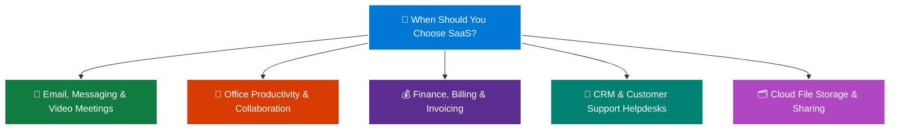

# Topic 3: Describe Software as a Service (SaaS)

**Software as a Service (SaaS)** is the most complete, fully developed, and ready-to-use cloud service model from a product perspective. 

With SaaS, you do not build or configure software—you simply **rent and use an existing application hosted on the cloud** over the internet, typically on a per-user subscription basis (e.g., monthly or annual fee).

> 💡 **Core Analogy:**  
> * **IaaS** is like building a house from raw materials (bricks, wood, and plumbing).  
> * **PaaS** is like renting an unfurnished apartment where utilities are handled, but you bring your own furniture (your code and data).  
> * **SaaS** is like booking a luxury hotel room where everything is completely provided, maintained, cleaned, and furnished—**you just check in and use the service.**

---

## 🧱 1. What is SaaS?

In a SaaS model, the cloud provider delivers a **finished end-user application**. The provider manages the entire underlying technology stack—including physical datacenters, servers, networking, operating systems, databases, runtime environments, application code, feature updates, and security patches.

```text
    ┌─────────────────────────────────────────────────────────┐
    │  👤 CUSTOMER RESPONSIBILITY (Minimal Overhead):         │
    │  • User Account Management & Role Assignment            │
    │  • Identity, Permissions & Multi-Factor Auth (MFA)      │
    │  • Organizational Data & Information Governance         │
    │  • Client Devices & Endpoint Access Settings            │
    ├─────────────────────────────────────────────────────────┤
    │  ☁️ SAAS PROVIDER MANAGES (Everything Else):            │
    │  • Complete Software Application & User Interface       │
    │  • Feature Updates, Bug Fixes & Code Upgrades           │
    │  • Databases, Runtimes & Middleware                     │
    │  • Operating System & Security Patching                 │
    │  • High Availability, Autoscaling & Disaster Recovery   │
    │  • Physical Datacenter Infrastructure, Power & Cooling  │
    └─────────────────────────────────────────────────────────┘
```

---

## 🤝 2. The Shared Responsibility Stack for SaaS

Under the **Shared Responsibility Model**, SaaS offers the **lowest operational maintenance and technical complexity** for the customer:

| Infrastructure Layer | Who Manages It in SaaS? | Details & Responsibilities |
| :--- | :---: | :--- |
| **Data & Information** | 👤 **You (Customer)** | Classifying data, granting file permissions, preventing data loss. |
| **User Identity & Access** | 👤 **You (Customer)** | Creating user accounts, enforcing MFA, setting Conditional Access. |
| **Client Devices & Posture** | 👤 **You (Customer)** | Ensuring employee laptops and phones comply with security policies. |
| **Application Code & Logic** | ☁️ **Provider (Microsoft)** | Microsoft builds, develops, tests, and updates application features. |
| **Database & Storage Engine** | ☁️ **Provider (Microsoft)** | Microsoft handles backend database storage, indexing, and backups. |
| **Runtime & Middleware** | ☁️ **Provider (Microsoft)** | Microsoft configures and updates web runtimes and service queues. |
| **Operating System (OS)** | ☁️ **Provider (Microsoft)** | Microsoft patches Windows/Linux server hosts automatically. |
| **Virtualization & Hardware** | ☁️ **Provider (Microsoft)** | Microsoft replaces failed CPUs, RAM, and physical servers. |
| **Datacenter Facilities** | ☁️ **Provider (Microsoft)** | Microsoft ensures 24/7 power, cooling, physical security, and SLAs. |

---

## 🛠️ 3. Popular Microsoft SaaS Solutions

```text
                           ☁️ MICROSOFT SaaS ECOSYSTEM
                                        │
         ┌───────────────────┬──────────┴──────────┬───────────────────┐
         ↓                   ↓                     ↓                   ↓
   📧 Productivity      👥 Business / CRM     📁 Cloud Storage     📊 Low-Code Apps
   • Microsoft 365     • Dynamics 365        • OneDrive           • Power Apps
   • Outlook & Teams   • Salesforce (3rd)    • SharePoint Online  • Power Automate
```

* 📧 **Microsoft 365 (formerly Office 365):** Complete cloud productivity suite including Outlook, Teams, Word, Excel, PowerPoint, Exchange Online, and OneDrive.
* 👥 **Microsoft Dynamics 365:** Cloud-based Enterprise Resource Planning (ERP) and Customer Relationship Management (CRM) for sales, marketing, and customer support.
* 📁 **SharePoint Online & OneDrive for Business:** Cloud-based document management, collaboration, and enterprise file sharing.
* ⚡ **Microsoft Power Platform:** SaaS-based business intelligence, workflow automation (Power Automate), and rapid custom app generation (Power Apps).

---

## 💼 4. Common Real-World Scenarios for SaaS



---

### 📧 1. Email, Communication, and Team Collaboration
* **Scenario:** A global company with 5,000 employees needs email, calendar scheduling, instant messaging, and HD video meetings across Windows, Mac, iOS, and Android.
* **Why SaaS:** The company subscribes to **Microsoft 365 (Exchange Online & Microsoft Teams)**. There are no on-premises mail servers (Exchange servers) to buy, install, or patch. Employees log in through a web browser or app immediately.

---

### 📑 2. Office Productivity and Real-Time Co-Authoring
* **Scenario:** Distributed marketing and finance teams need to work simultaneously on spreadsheets, presentation decks, and reports from different countries.
* **Why SaaS:** **Word, Excel, and PowerPoint Online** allow real-time multi-user editing with automatic version history stored in the cloud.

---

### 💰 3. Finance, Expense Tracking, and Invoicing
* **Scenario:** An accounting department needs software to track employee travel expenses, generate client invoices, and manage payroll.
* **Why SaaS:** Cloud finance solutions (e.g., Dynamics 365 Finance, QuickBooks Online) allow authorized accountants to manage financial ledgers securely from anywhere without hosting financial databases on physical on-premises servers.

---

### 👥 4. Customer Relationship Management (CRM)
* **Scenario:** A sales team needs a centralized system to track leads, log phone calls, manage customer support tickets, and analyze sales pipelines.
* **Why SaaS:** **Microsoft Dynamics 365 Sales** or **Salesforce** provides a complete ready-made CRM portal accessible instantly upon purchasing user licenses.

---

## ⚖️ Advantages and Trade-Offs of SaaS

### ✅ Key Advantages (Pros):
1. **Instant Onboarding & Fast Deployment:** Users can start working immediately through a web browser with zero software installation or server provisioning delay.
2. **Lowest Technical Overhead:** No need for dedicated database administrators, systems engineers, or hardware maintenance staff.
3. **Automatic Feature Updates & Patching:** Bug fixes, security patches, and new features roll out automatically with zero downtime.
4. **Predictable Subscription Costs:** Pay per user per month (OpEx model), making IT budgeting simple and scalable.
5. **Universal Accessibility:** Seamless access from any device (laptop, tablet, smartphone) anywhere in the world.

---

### ⚠️ Trade-Offs & Limitations (Cons):
1. **Least Amount of Flexibility:** You cannot modify the core application code, alter underlying databases, or customize low-level features beyond standard configuration settings.
2. **No Control Over Infrastructure:** You cannot choose which specific server hardware, operating system, or datacenter rack hosts the SaaS application.
3. **Data Portability & Vendor Lock-In:** Exporting complex workflows or proprietary data formats to switch providers can sometimes require migration tools.

---

## 🏆 The Ultimate Comparison: IaaS vs. PaaS vs. SaaS

This comparison is one of the **most tested concepts on the AZ-900 exam**:

```text
    ┌─────────────────────────────┬─────────────────────────────┬─────────────────────────────┐
    │     🖥️ IaaS (Infrastructure) │       🌐 PaaS (Platform)    │       📧 SaaS (Software)    │
    ├─────────────────────────────┼─────────────────────────────┼─────────────────────────────┤
    │  • You rent raw hardware    │  • You rent a dev platform  │  • You rent finished software│
    │  • You manage OS & Apps     │  • You manage Code & Data   │  • You manage Users & Data  │
    │  • Maximum Control          │  • Developer Friendly       │  • End-User Friendly        │
    │  • Maintenance      │  • Low Maintenance          │  • Minimal Maintenance      │
    │  • e.g., Azure VMs          │  • e.g., Azure App Service  │  • e.g., Microsoft 365      │
    └─────────────────────────────┴─────────────────────────────┴─────────────────────────────┘
```

| Detailed Layer | 🖥️ IaaS (e.g., Azure VM) | 🌐 PaaS (e.g., App Service) | 📧 SaaS (e.g., Microsoft 365) |
| :--- | :---: | :---: | :---: |
| **Data & Access** | 👤 Customer | 👤 Customer | 👤 Customer |
| **Applications** | 👤 Customer | 👤 Customer | ☁️ **Provider (Microsoft)** |
| **Runtime & Middleware** | 👤 Customer | ☁️ **Provider (Microsoft)** | ☁️ **Provider (Microsoft)** |
| **Operating System (OS)** | 👤 Customer | ☁️ **Provider (Microsoft)** | ☁️ **Provider (Microsoft)** |
| **Virtualization / Host** | ☁️ Provider (Microsoft) | ☁️ Provider (Microsoft) | ☁️ Provider (Microsoft)** |
| **Hardware & Datacenter** | ☁️ Provider (Microsoft) | ☁️ Provider (Microsoft) | ☁️ Provider (Microsoft)** |

---

## ⭐ AZ-900 Exam Quick Reference & Memory Shortcuts

| Exam Question Trigger | Correct Model | Key Reason / Memory Rule |
| :--- | :---: | :--- |
| **"Company uses Microsoft 365 or OneDrive for email and documents"** | **SaaS** | **SaaS = Ready-to-use software** |
| **"Provider manages application, OS, and infrastructure; customer manages users and data"** | **SaaS** | **SaaS = Provider manages app** |
| **"Requires the least amount of technical expertise to deploy"** | **SaaS** | **SaaS = Easiest setup** |
| **"Paid via per-user monthly/yearly subscription licensing"** | **SaaS** | **SaaS = Per-user subscription** |
| **"Deploy custom web app without managing OS or VM infrastructure"** | **PaaS** | **PaaS = Developer platform** |
| **"Full administrative control over operating system and software installation"** | **IaaS** | **IaaS = Maximum OS control** |
