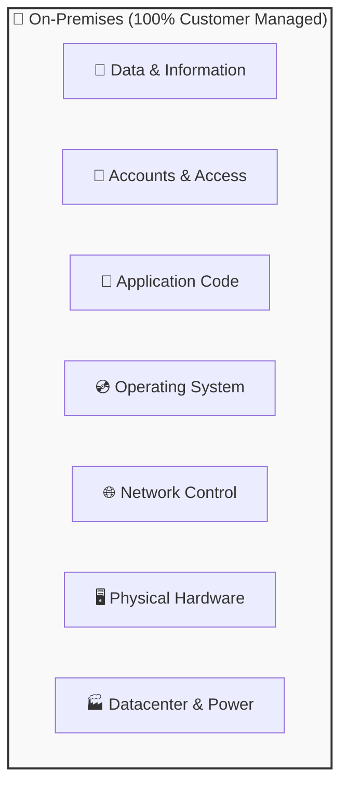

# Topic 4: What is the Shared Responsibility Model?

## Overview

The **Shared Responsibility Model** defines who is responsible for managing each part of a computing environment between the customer (you) and the cloud provider (Microsoft Azure).

> 💡 **Core Principle:**  
> As you move from **On-Premises** to **IaaS**, **PaaS**, and **SaaS**, Microsoft Azure takes on more operational responsibility. However, regardless of the deployment model, **your data, user accounts, and access security always remain 100% your responsibility.**

---

## 🏢 1. On-Premises Environment

### What is On-Premises?
**On-premises** (or private infrastructure) means a company owns, hosts, and operates its own physical datacenters. The company owns the physical building, servers, networking hardware, power supply, and cooling systems. 

Because the company owns the entire stack, it is **100% responsible** for maintaining everything—from the physical hardware up to the application code and customer data.

---

### When is On-Premises Used?
* **Strict Regulatory Compliance:** When legal regulations mandate that sensitive data cannot leave physical company premises.
* **Legacy System Integration:** When running older software that cannot be migrated to modern cloud platforms.
* **Complete Infrastructure Control:** When a business requires absolute control over hardware specifications and network configuration.

---

### 🏦 Real-Life Example
> **Banking Datacenter:**  
> A national bank operates its own private datacenter containing hundreds of physical server racks. The bank's in-house IT team is responsible for buying physical servers, installing operating system updates, replacing failed hard drives, maintaining power generators, securing physical access, and safeguarding customer financial records.

---

### 📋 Responsibilities Breakdown

| Infrastructure Layer | Managed By | Description |
| :--- | :---: | :--- |
| 🏭 **Physical Infrastructure** | **Company** | Buying and maintaining physical servers, network switches, cables, electricity, and cooling. |
| 💿 **Operating System (OS)** | **Company** | Installing, patching, configuring, and updating operating systems (Windows Server, Linux). |
| 📱 **Applications** | **Company** | Developing, testing, deploying, and maintaining software applications. |
| 🔐 **Data & Security** | **Company** | Storing, backing up, encrypting data, and implementing physical and digital security controls. |

---

### 📐 Infrastructure Hierarchy Diagram

```text
🏢 COMPANY (100% Responsible for Everything)
    │
    ├── 🏭 Data Center (Building, Security)
    ├── ⚡ Power + Cooling (Electrical & HVAC Systems)
    ├── 🖥️ Physical Servers (Racks, CPUs, RAM, Storage)
    ├── 🌐 Network (Routers, Switches, Firewalls)
    ├── 💿 Operating System (Windows Server, Linux)
    ├── 📱 Applications (Custom Code, Middleware)
    └── 🔐 Data + Security (User Access, Data Backups, Encryption)
```


